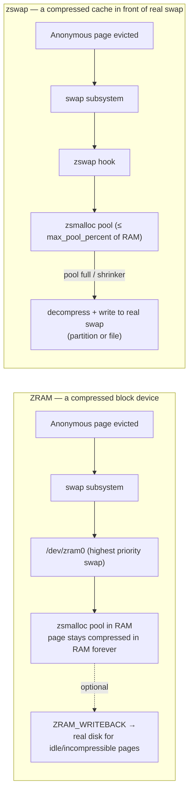
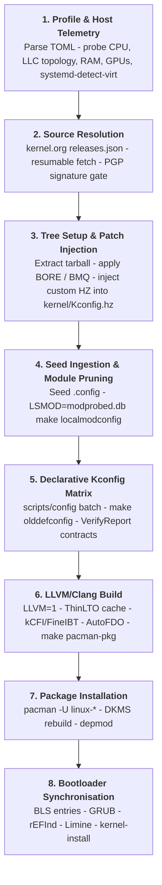
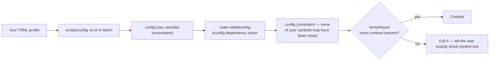
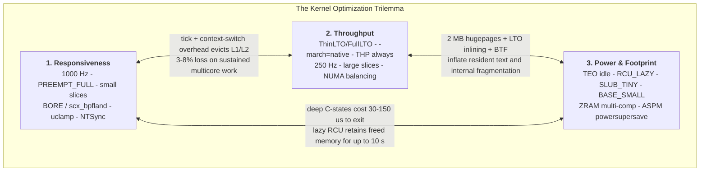
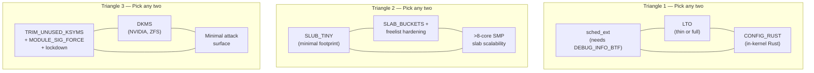
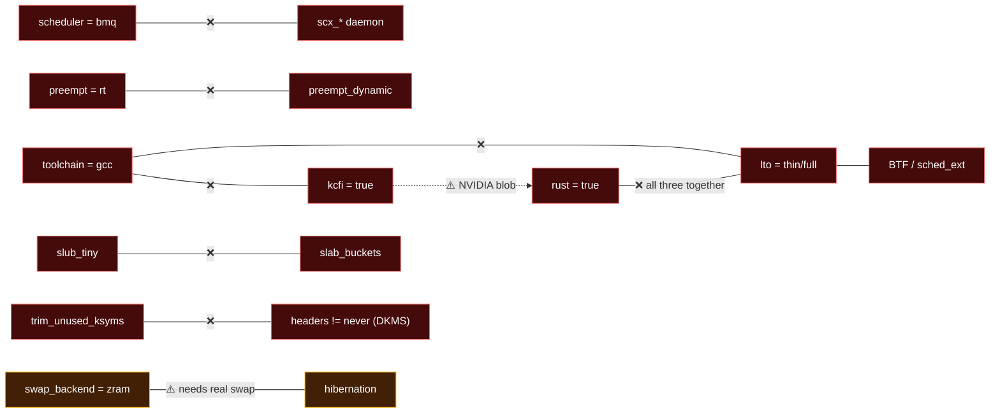
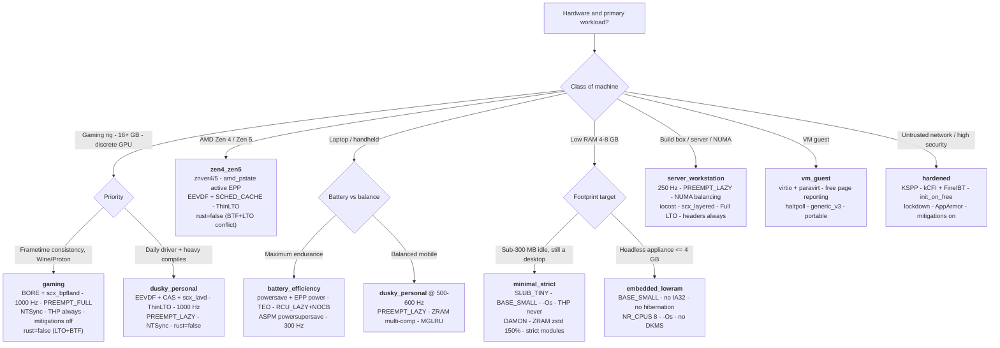
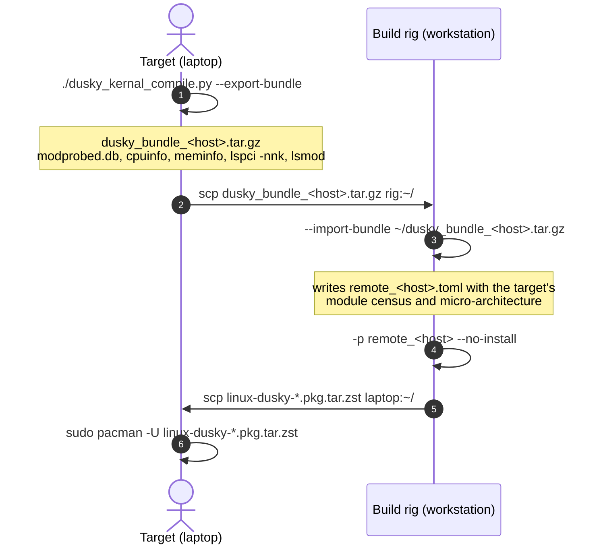
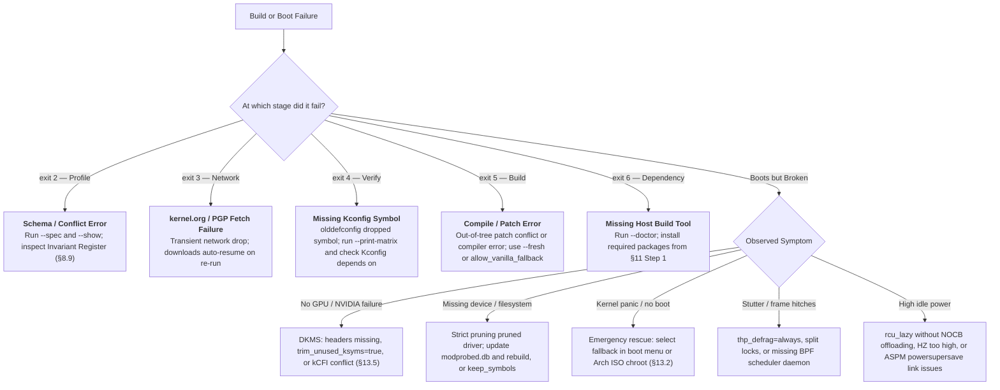

# Dusky Kernel Compiler (v6.1.0) — Architecture, Configuration & Profile Engineering Manual

> [!abstract] Executive Summary
> `dusky_kernal_compile.py` is a declarative kernel build engine for **Arch Linux** targeting **Linux 7.2 / 7.3-rc (September 2026 specification)**, **Clang/LLVM 21+**, **LLD**, and **Python 3.14.7+**.
> It replaces generic distribution kernels with **compile-time hardware tailoring** — a TOML profile is translated into an atomic `scripts/config` matrix, verified against invariant contracts, compiled with ThinLTO, and packaged as native `pacman` packages with synchronised bootloader entries.
> **Scope boundary:** this engine writes **Kconfig symbols, kernel command-line parameters, and bootloader entries. Nothing else.** Every `sysctl`, `sysfs`, `udev`, `systemd`, `zram-generator` and `scx_loader` setting is *runtime scope* and belongs to companion scripts (templates are provided in §12).

> [!warning] Read This Before Your First Build
> 1. **Never uninstall your fallback kernel.** Keep the Arch `linux` or `linux-lts` package installed at all times. A `modules.mode = "strict"` build is a kernel that contains drivers for *the hardware that was plugged in when you snapshotted `modprobed.db`* — and nothing else. If you boot it with a new NVMe controller, a new Wi-Fi card, or a different USB controller, it will panic with `Unable to mount root fs`. The fallback entry is your undo button.
> 2. **A kernel you cannot boot is not a bug, it is Tuesday.** Every option in this manual has a failure mode. They are all documented. Read the tradeoff column before you flip a switch.
> 3. **Nothing here is magic.** Every performance claim in this manual is stated with a measured or bounded magnitude. Where an effect is small, this manual says so, even when internet folklore says otherwise.

---

## How To Read This Manual (Zero-Knowledge Path)

If you have never compiled a kernel, read in this order and skip nothing:

| Order | Section | Why |
| :---: | :--- | :--- |
| 1 | **§2 Kernel Primer** | Learn what Kconfig, `y/m/n`, cmdline and sysctl actually are. Everything else depends on it. |
| 2 | **§3 Architecture Map** | See how the subsystems relate before you tune them. |
| 3 | **§4 Trilemma + §5 Archetypes** | Understand *which* kernel you want before choosing options. |
| 4 | **§11 Runbook** | Do a first build with a stock profile. Boot it. Prove the loop works. |
| 5 | **§7 Parameter Reference** | Now tune, one section at a time, rebuilding between changes. |
| 6 | **§8 Conflict Matrix** | Consult *every* time you change a knob. It explains why the engine silently rewrote your profile. |
| 7 | **§13 Troubleshooting + Appendix A** | When something breaks, and when you want to know what was wrong with the previous edition of this manual. |

---

## Quick Navigation

- [[#0. Audit Report v6.0.0 → v6.1.0|0. Audit Report v6.0.0 → v6.1.0 (Findings Register F-01–F-40 & 6 Mandated Deep Dives)]]
- [[#1. Engine Pipeline & Filesystem Topology|1. Engine Pipeline & Filesystem Topology]]
- [[#2. Kernel Primer — Internals, Scopes & Mental Models|2. Kernel Primer — Internals, Scopes & Mental Models]]
- [[#3. Subsystem Architecture Map & The 7.2 Baseline|3. Subsystem Architecture Map & The 7.2 Baseline]]
- [[#4. The Kernel Optimization Trilemma|4. The Kernel Optimization Trilemma]]
- [[#5. The Four Archetypes — Deep Architectural Breakdowns|5. The Four Archetypes — Deep Architectural Breakdowns]]
- [[#6. Command-Line Interface & Operational Modes|6. Command-Line Interface & Operational Modes]]
- [[#7. Complete Parameter Reference (18 Sections)|7. Complete Parameter Reference (18 Sections)]]
- [[#8. Conflict Matrix & Invariant Resolution|8. Conflict Matrix & Invariant Resolution]]
  - [[#8.12. Silent Traps — Interactions the Schema Cannot Forbid|8.12. Silent Traps — Interactions the Schema Cannot Forbid]]
- [[#9. Decision Tree & Profile Catalog|9. Decision Tree & Profile Catalog]]
- [[#10. Production TOML Profiles|10. Production TOML Profiles]]
- [[#11. Operational Runbook|11. Operational Runbook + Advanced Workflows (Bundles, AutoFDO, Uninstall)]]
- [[#12. Runtime Companion Layer (Out of Engine Scope)|12. Runtime Companion Layer (Out of Engine Scope)]]
- [[#13. Troubleshooting & Recovery|13. Troubleshooting & Recovery]]
- [[#Appendix A — Audit Errata|Appendix A — Audit Errata (What Changed and Why)]]
- [[#Appendix B — Kconfig Symbol Index|Appendix B — Kconfig Symbol Index]]
- [[#Appendix C — Glossary|Appendix C — Glossary]]
- [[#Appendix D — Version-Drift Verification Protocol|Appendix D — Version-Drift Verification Protocol]]

---

## 0. Audit Report v6.0.0 → v6.1.0

### 0.1. Findings Register

Severity legend: 🔴 **Critical** — the built kernel silently does *not* do what the profile claims, or the build breaks. 🟠 **Major** — misleading guidance, measurable performance/robustness loss, or missing dependency. 🟡 **Minor** — numerically wrong claim or imprecise wording. 🔵 **Gap** — missing information the user needs.

| # | Sev | Location in v6.0.0 | Defect | Correction applied in v6.1.0 |
| :--- | :---: | :--- | :--- | :--- |
| F-01 | 🔴 | `[compiler].debug_info = "reduced"` (default) | Upstream `lib/Kconfig.debug`: `config DEBUG_INFO_BTF … depends on !DEBUG_INFO_SPLIT && !DEBUG_INFO_REDUCED`. With `reduced`, **BTF cannot be generated**, so `sched_ext`, CO-RE eBPF, `bpftrace` and `verify.require_btf` all die. `reduced` was also described as "required for BTF/eBPF" — the exact inverse of reality. | Default changed to **`full`**. `debug_info` semantics rewritten in §7.9. `verify` now cross-checks `debug_info != "reduced"` whenever BTF is required. |
| F-02 | 🔴 | `[cpu] amd_pstate="active"` + `governor="schedutil"` | Under `amd_pstate=active` the driver is `amd-pstate-epp` and the **only** governors the policy exposes are `performance` and `powersave`; `schedutil`, `ondemand`, `conservative` do not exist on that policy. Every profile pairing `active` + `schedutil` silently boots `powersave` + EPP. | New invariant **I-17** (§8.2). §7.6 documents the three amd_pstate modes and which governor set each exposes. |
| F-03 | 🔴 | `[memory].mglru_mask` — "1 = anon, 2 = file, 4 = page-table scan" | Wrong. `/sys/kernel/mm/lru_gen/enabled` is: `0x0001` MGLRU core, `0x0002` batched clearing of the **accessed bit in leaf PTEs via page-table walks**, `0x0004` clearing the accessed bit in **non-leaf PMD** entries. Nothing to do with anon/file. | Corrected and explained mechanically in §7.8. |
| F-04 | 🔴 | "`CONFIG_LRU_GEN=y`. Multi-Gen LRU replacement…" | `LRU_GEN=y` only **builds** MGLRU. It is **off at runtime** unless `CONFIG_LRU_GEN_ENABLED=y` (the "Enable by default" symbol) or userspace writes `y` to `/sys/kernel/mm/lru_gen/enabled`. | `memory.mglru = true` now documented to set **both** `LRU_GEN=y` **and** `LRU_GEN_ENABLED=y`. |
| F-05 | 🔴 | `[memory].zram_algo` / `zram_recomp_algo` | Modern ZRAM splits algorithms into per-backend symbols (`ZRAM_BACKEND_ZSTD`, `ZRAM_BACKEND_LZ4`, `ZRAM_BACKEND_LZ4HC`, `ZRAM_BACKEND_LZO`, `ZRAM_BACKEND_DEFLATE`, `ZRAM_BACKEND_842`). `ZRAM_DEF_COMP_ZSTD` is **unselectable** unless its backend is enabled. Idle-page recompression additionally needs `ZRAM_TRACK_ENTRY_ACTIME`. | §7.8 documents the full ZRAM symbol chain, plus `ZRAM_WRITEBACK` for incompressible pages. |
| F-06 | 🔴 | Shipped `battery_efficiency.toml`: `swap_backend="zram"` + `hibernation=true` | You **cannot hibernate into ZRAM** — the image must survive power loss, and the resume device must be block-addressable at resume time. A ZRAM-only machine with `hibernation=true` builds a hibernation-capable kernel that can never hibernate (no `resume=`). | New invariant **I-18** (warn + guidance). Template rewritten in §9.3 with an explicit swapfile note. |
| F-07 | 🔴 | `[compiler].optimize = "o3"` description | The flag list mixes toolchains: `-fmodulo-sched`, `-fmodulo-sched-allow-regmoves`, `-fivopts` are **GCC-only** and make Clang fail (`-Werror=unknown-argument`). `-mllvm -enable-pipeliner` targets VLIW back-ends and is a no-op on x86-64. `-mno-avx2 -fno-tree-vectorize` are redundant: kbuild already forces `-mno-sse -mno-mmx -mno-sse2 -mno-3dnow -mno-avx` for all kernel C code. Upstream x86 has **no** `CC_OPTIMIZE_FOR_PERFORMANCE_O3` choice. | §7.9 rewritten: `o3` = out-of-tree kbuild patch **or** plain `KCFLAGS=-O3`, with realistic expectations (±1%, occasionally negative) and the correct Clang-only flag set. |
| F-08 | 🟠 | `[storage].io_scheduler` "sets Kconfig defaults" | blk-mq has **no** upstream "default elevator" Kconfig. The kernel picks `none` for multi-queue devices and `mq-deadline` for single-queue ones; changing it is a **udev** job (`ELEVATOR`/`queue/scheduler`). | Redefined: the key **compiles the elevators** (`IOSCHED_BFQ`, `MQ_IOSCHED_KYBER`, `MQ_IOSCHED_DEADLINE`) and records the desired default for the runtime layer. Optional out-of-tree `MQ_IOSCHED_DEFAULT_*` noted. |
| F-09 | 🟠 | `[memory].thp="never"`, `thp_shmem` | `thp="never"` still **compiles** THP (`TRANSPARENT_HUGEPAGE=y` + `_NEVER` default); it does not remove the code. `thp_shmem` has **no Kconfig** — it is `/sys/kernel/mm/transparent_hugepage/shmem_enabled` or the `transparent_hugepage_shmem=` / `thp_shmem=` boot parameters. | Both corrected; §7.8 adds "how to actually remove THP" and the mTHP boot-parameter family. |
| F-10 | 🟠 | `[power].rcu_lazy` | `RCU_LAZY` only acts on **offloaded (NOCB)** callbacks. Without `RCU_NOCB_CPU=y` **and** offloading active (`RCU_NOCB_CPU_DEFAULT_ALL=y` or `rcu_nocbs=all`), it saves exactly nothing. | Dependency chain documented; the engine now emits `rcu_nocbs=all` alongside `rcutree.enable_rcu_lazy=1`. |
| F-11 | 🟠 | `[security].apparmor` / `selinux` | Building an LSM does not activate it. The LSM must appear in `CONFIG_LSM="…"` (or the `lsm=` cmdline), and AppArmor additionally honours `SECURITY_APPARMOR_BOOTPARAM_VALUE` / `apparmor=1`. | §7.10 documents the ordered LSM stack and the exact `CONFIG_LSM` string Arch expects. |
| F-12 | 🟠 | `[compiler].kcfi` | Missing three real constraints: (1) proprietary blobs (`nvidia.ko`'s pre-compiled `nv-kernel.o_binary`) lack kCFI preambles → indirect-call violations; (2) upstream `RUST` `depends on !CFI_CLANG \|\| HAVE_CFI_ICALL_NORMALIZE_INTEGERS_RUSTC`; (3) FineIBT pulls in `CALL_PADDING`, and `RUST depends on !CALL_PADDING \|\| RUSTC_VERSION >= 108100`. | All three added as invariants **I-19/I-20** and explained in §7.9/§7.10. |
| F-13 | 🟠 | `[network].nf_conntrack_procfs` "eliminating lock contention on gigabit links" | False. The `/proc/net/nf_conntrack` file costs nothing while unread; the expense is in *reading* it (a full hash-table walk). Disabling it removes an interface, not contention. | Rewritten as an attack-surface/compat item. |
| F-14 | 🟠 | `gaming.toml` `qdisc = "cake"` | CAKE is a **shaper**. On an endpoint whose NIC link (1/2.5 GbE) is far faster than the WAN, it cannot control the bottleneck queue, which lives in the ISP router. It adds per-packet cost for no latency gain. FQ is the correct endpoint qdisc and provides the pacing BBR wants. | `gaming` template switched to `fq`; CAKE guidance moved to "this box is the router" in §7.14. |
| F-15 | 🟠 | `[scheduler].sched_core` "incurs 10–25% throughput loss" | Only when core scheduling is **actively used** (tasks tagged via `prctl(PR_SCHED_CORE)`). Compiled-in-but-unused costs ~0 (static key off) plus a small `struct rq` growth. | Reworded with both numbers. |
| F-16 | 🟠 | `[gaming].uclamp` | `uclamp` influences **frequency selection through schedutil** and EAS placement. Under `amd_pstate=active`/`intel_pstate` HWP the hardware chooses the P-state and uclamp has no frequency effect. | Documented; §5.4 explains the correct pairing (`passive`/`guided` + `schedutil` + uclamp, or `active` + EPP and skip uclamp). |
| F-17 | 🟠 | `gaming.toml` `energy_model = true` | EAS requires **asymmetric CPU capacity** plus a populated Energy Model. On a symmetric x86 desktop it is inert; it only matters on ARM big.LITTLE and (partially) Intel hybrid P/E parts. | Set to `false` in the gaming template; explained in §7.13. |
| F-18 | 🟠 | `[scheduler]` BORE + SCX | Not a conflict, but **functionally redundant**: when an SCX scheduler attaches without `SCX_OPS_SWITCH_PARTIAL`, *all* `SCHED_NORMAL/BATCH/IDLE` tasks migrate into the ext class and BORE's burst heuristics in the fair class stop running. BORE then only matters as the fallback after `scx_*` exits/crashes. | Explained in §0.2.2 and §7.3. |
| F-19 | 🟡 | `slub_tiny` "Saves 20–60 MB RAM" | Overstated by an order of magnitude. Realistic: ~0.3–1 MB of text/metadata plus avoided per-CPU partial-slab slack — single-digit MB on a many-core box, well under 1 MB on a 4-core one. | Corrected; the real reason to use it (and not to) is scalability, documented in §5.3. |
| F-20 | 🟡 | `numa = false` "saves 15–35 MB" | Overstated. `CONFIG_NUMA=n` removes node structures, `mempolicy` and some per-node arrays: roughly **0.5–2 MB** on a single-socket machine. | Corrected. |
| F-21 | 🟡 | Trilemma "3% to 8% penalty" for 1000 Hz | On modern out-of-order x86 with `NO_HZ_IDLE`, 1000 Hz vs 250 Hz costs roughly **0.3–2%** on sustained multi-core builds. The 3–8% figure belongs to the pre-tickless era. | Corrected, with the missing insight: **HZ bounds `PREEMPT_LAZY` latency** (§5.4). |
| F-22 | 🟡 | `init_on_free` "5%–12%" | Typically **1–5%** on desktop workloads (worst case higher for allocation-churn microbenchmarks). `init_on_alloc` is ~0.3–1%. | Corrected. |
| F-23 | 🟡 | `watermark_scale_factor` | Units never explained: the value is **per 10 000** of the zone (125 → 1.25%). Default upstream is 10 (0.1%). | Explained with the formula. |
| F-24 | 🟠 | `[cpu].nr_cpus` range `0–8192` | On x86-64 the Kconfig range ends at **512** unless `CPUMASK_OFFSTACK=y` (pulled in by `MAXSMP`); above that the symbol is out of range and `olddefconfig` clamps it. | Documented. |
| F-25 | 🟠 | `[memory].base_small` | In modern kernels `BASE_SMALL` is **not user-selectable**; it is derived from `BASE_FULL`. The engine must set `CONFIG_BASE_FULL=n`. | Corrected. |
| F-26 | 🟠 | `[memory].memcg` | Disabling `MEMCG` breaks systemd resource control (`MemoryMax=`, `MemoryHigh=`), `systemd-oomd`, and most container tooling. Never disable on a systemd host. | Hard warning added. |
| F-27 | 🟠 | `[compiler].modversions` | `RUST depends on !MODVERSIONS \|\| GENDWARFKSYMS`, and MODVERSIONS under LTO needs `GENDWARFKSYMS` too (genksyms cannot read bitcode). `GENDWARFKSYMS` needs `DEBUG_INFO`. | Invariant **I-21** added. |
| F-28 | 🟠 | `[security].lockdown_early` | Lockdown *integrity* blocks unsigned module loading (kills DKMS unless you sign), `/dev/mem`, unsigned kexec, and **hibernation**; *confidentiality* additionally cripples `perf`, `kprobes` and BPF. Only meaningful with Secure Boot + signed modules. | Invariant **I-22**; §7.10 rewritten. |
| F-29 | 🟡 | `tickless = "full"` | Correct that `nohz_full=` is required, but the cost was unstated: context tracking on every kernel entry/exit (~1–2% syscall overhead), plus mandatory housekeeping CPU and `rcu_nocbs`. Wrong choice for desktops. | Fully explained in §7.7. |
| F-30 | 🟠 | `[boot].cmdline = "bake"` | `CONFIG_CMDLINE` requires `CONFIG_CMDLINE_BOOL=y`; on x86 the built-in string is **prepended** and the bootloader's arguments follow (last occurrence wins for most parameters) unless `CMDLINE_OVERRIDE=y`. UKI users must bake or use `ukify`. | Documented precisely in §7.16. |
| F-31 | 🔵 | `[gaming].ntsync` | Building `NTSYNC=m` is not sufficient for Wine: `/dev/ntsync` needs permissive access, i.e. a udev rule in the **runtime** layer. The manual's "no udev rules" statement left users stranded. | The exact rule is now given in §5.4 and §12 (clearly labelled runtime-layer, not engine). |
| F-32 | 🔵 | Packaging | Never explained that upstream `make pacman-pkg` names packages from `PACMAN_PKGBASE`, and that the `/usr/lib/modules/<ver>/pkgbase` file is what triggers Arch's mkinitcpio/dracut hooks. | Added to §1 and §11. |
| F-33 | 🟠 | `preempt_dynamic` | Correct outcome, no reasoning: upstream `PREEMPT_DYNAMIC depends on HAVE_PREEMPT_DYNAMIC && !PREEMPT_RT`. Also unstated: which strings `preempt=` accepts and the debugfs path. | Proven and expanded in §0.2.1 / §7.7. |
| F-34 | 🟠 | `[memory].kexec` | `KEXEC` (legacy) vs `KEXEC_FILE` (signature-verifying, required under lockdown) never distinguished; `CRASH_DUMP` dependency unstated. | Split in §7.8. |
| F-35 | 🟡 | `trim_unused_ksyms` | Correct about DKMS, but also: it makes the kernel **unable to build any future out-of-tree module**, and forces a full rebuild to undo. | Expanded. |
| F-36 | 🔵 | `security.profile = "hardened"` under LLVM | `STACKLEAK` is a **GCC plugin** and is unavailable with Clang; `RANDSTRUCT` *is* available with Clang but `RUST depends on !RANDSTRUCT` and it breaks binary blobs. A "hardened" LLVM build is therefore not KSPP-complete. | Trade-off table added in §7.10. |
| F-37 | 🟡 | `[memory].swap_backend = "zswap"` | `zbud`/`z3fold` are gone; `zsmalloc` is the only zpool. Also unstated: **zswap in front of a ZRAM device is an anti-pattern** (double compression, no real backing store). | Documented in §5.3/§7.8. |
| F-38 | 🔵 | `[network].tcp_fastopen` | There is no Kconfig symbol; it is purely `net.ipv4.tcp_fastopen` (bitmask 1=client, 2=server, 3=both). Middlebox blackholing caveat unstated. | Clarified as runtime-only. |
| F-39 | 🔵 | Non-standard HZ | Unstated that `USER_HZ` stays 100 (no userspace ABI change) and that HZ only quantises jiffies-based timers — hrtimers are unaffected. | Added in §7.7. |
| F-40 | 🔵 | Bleeding-edge symbols | `SCHED_CACHE`, `RSEQ_SLICE_EXTENSION`, non-standard HZ, `MQ_IOSCHED_DEFAULT_*`, uarch symbols beyond `X86_NATIVE_CPU` and per-vuln `MITIGATION_*` are young or out-of-tree; symbol names drift between -rc trees. | **Appendix B** adds a mandatory verification protocol (`scripts/config -s`, `grep` in Kconfig, `make menuconfig /search`). |

> [!important] The single most consequential fix
> If you take one thing from this audit: **`debug_info = "reduced"` and `sched_ext` are mutually exclusive.** BTF is generated by `pahole` from the vmlinux DWARF, and `DEBUG_INFO_REDUCED` (`-femit-struct-debug-baseonly`) throws away exactly the struct member information BTF encodes — so upstream forbids the combination outright. Any profile that wants `scx_*`, CO-RE eBPF, `bpftrace`, or `verify.require_btf = true` **must** use `debug_info = "full"`.

---

### 0.2. Mandated Deep Dives

#### 0.2.1. Preemption — is `PREEMPT_LAZY` switchable at boot? Is `PREEMPT_RT`?

**What preemption means.** When a task becomes runnable (a key press wakes your compositor), the kernel must decide whether to interrupt whatever is currently on that CPU. "Preemptible" kernels allow that interruption even while executing kernel code. The trade-off is eternal: interrupting early lowers latency; interrupting less preserves cache locality and throughput.

**The 7.x model set** (a Kconfig `choice`, exactly one is the *built-in default*):

| Symbol | Behaviour | Who wants it |
| :--- | :--- | :--- |
| `PREEMPT_NONE` | Only preempt at explicit reschedule points; kernel code runs to completion. | Batch compute, HPC. |
| `PREEMPT_VOLUNTARY` | Adds `might_sleep()` reschedule points. | Legacy servers. |
| `PREEMPT` (full) | Kernel code is preemptible almost everywhere. | Pro audio, competitive gaming. |
| `PREEMPT_LAZY` | **Two-flag** model: urgent (RT/DL) wakeups set `TIF_NEED_RESCHED` and preempt immediately; ordinary fair-class wakeups set `TIF_NEED_RESCHED_LAZY`, which is honoured at the next return-to-userspace or the next scheduler tick. | Desktops — the 7.x default. |
| `PREEMPT_RT` | Spinlocks become `rt_mutex`es, IRQ handlers become threads, almost everything becomes preemptible. | Hard real-time. |

**Dynamic switching.** `CONFIG_PREEMPT_DYNAMIC` compiles the reschedule hooks behind **static calls/static keys** that are patched at boot, so a single binary can behave as `none`, `voluntary`, `full` — and, in 7.x, `lazy`. Selection: `preempt=<model>` on the kernel command line, or at runtime:

```bash
cat /sys/kernel/debug/sched/preempt        # -> none voluntary (full) lazy
echo full | sudo tee /sys/kernel/debug/sched/preempt
```

**So: is LAZY dynamically switchable?** Yes — `lazy` is one of the models the dynamic machinery can patch to, provided the kernel was built with `PREEMPT_DYNAMIC=y` and a non-RT base model. `timing.preempt = "lazy"` + `preempt_dynamic = true` gives you a kernel that boots lazy and can be flipped to `full` for a mastering session without rebooting.

**Is RT dynamically switchable?** **No, and it cannot be.** Upstream: `config PREEMPT_DYNAMIC … depends on HAVE_PREEMPT_DYNAMIC && !PREEMPT_RT`. The reason is structural, not political: `PREEMPT_RT` changes **data-structure semantics at compile time**. `spinlock_t` becomes a sleeping `rt_mutex`; `local_lock` changes meaning; hardirq handlers are threaded; `raw_spinlock_t` becomes the only true spinning lock. You cannot static-call your way between "this lock spins" and "this lock sleeps" — the calling contexts (whether it is legal to sleep) differ. Hence invariant **I-03**: `preempt = "rt"` forces `preempt_dynamic = false`, and `preempt=` on the cmdline is ignored by an RT kernel.

**The under-documented interaction (new in this revision):** with `PREEMPT_LAZY`, a lazy resched request is consumed at the *next scheduler tick* if the task does not return to userspace first. Therefore **`CONFIG_HZ` is the upper bound on lazy preemption latency**: 1000 Hz → ≤1 ms; 300 Hz → ≤3.3 ms. This is the missing link between §7.7's two tables and the reason a 1000 Hz + lazy desktop feels like full preemption while keeping most of its throughput.

#### 0.2.2. Schedulers — BORE with SCX? Why never BMQ with SCX?

**The class hierarchy.** Linux dispatches by scheduling class, strictly ordered: `stop` → `deadline` → `rt` → **`ext`** → `fair` → `idle`. A CPU picks from the highest non-empty class.

- **EEVDF** *is* the fair class in 7.x. Each task has a virtual runtime `v_i`; it is *eligible* when `V(t) ≥ v_i` (it has not consumed more than its fair share of virtual time), and among eligible tasks the one with the earliest **virtual deadline** `d_i = v_i + q_i / w_i` runs. Short-slice (interactive) tasks therefore get earlier deadlines and preempt long-slice hogs without any heuristic "interactivity bonus".
- **BORE** (Burst-Oriented Response Enhancer) is a *patch to the fair class*. It measures each task's recent CPU burst length and scales its effective weight/slice so that short-burst (interactive) tasks are favoured. It does **not** add a class.
- **sched_ext** (`CONFIG_SCHED_CLASS_EXT`) adds the `ext` class, whose policy is a **BPF program** loaded from userspace (`scx_lavd`, `scx_bpfland`, …).

**BORE + SCX: legal, mostly pointless.** They live in different classes, so the build is fine. But when a full SCX scheduler attaches, it takes over *all* `SCHED_NORMAL`, `SCHED_BATCH` and `SCHED_IDLE` tasks (unless it opted into `SCX_OPS_SWITCH_PARTIAL`). Those tasks leave the fair class, so BORE's burst accounting no longer influences anything. BORE remains valuable as the **fallback**: if the BPF scheduler exits, errors out, or hits its watchdog, the kernel instantly reverts every task to fair — and you land on BORE rather than stock EEVDF. Treat `type = "bore"` + `scx = "scx_*"` as "BPF scheduler with a tuned safety net", not as stacked optimisation.

**BMQ + SCX: impossible.** Project C's BMQ/PDS does not patch the fair class — it **replaces** it. `kernel/sched/alt_core.c` substitutes the entire `fair_sched_class` with a bitmap-indexed O(1) runqueue, and `kernel/sched/fair.c` is not built. `sched_ext` is not a standalone island: it is wired into the core through hooks that live in the fair/core scheduler (task enqueue/dequeue paths, the balance and `pick_next_task` fallbacks, `scx_` call sites in `core.c`, and the "give the task back to fair" path used when a BPF scheduler unloads or is disabled by the watchdog). With `fair.c` gone those hooks have no home, `SCHED_CLASS_EXT` fails to build or the resulting kernel has no safe fallback path. Hence invariant **I-04**: `type = "bmq"` forces `scx = "none"` and `scx_enable_class = false`. This is also why BMQ builds cannot use `scx_loader`, and why `verify.require_sched_ext` must be `false` in a BMQ profile.

#### 0.2.3. Rust — why does it vanish when BTF and LTO are both on?

Upstream `init/Kconfig` (verified against current trees):

```
config RUST
	bool "Rust support"
	depends on HAVE_RUST
	depends on RUST_IS_AVAILABLE
	select EXTENDED_MODVERSIONS if MODVERSIONS
	depends on !MODVERSIONS || GENDWARFKSYMS
	depends on !GCC_PLUGIN_RANDSTRUCT
	depends on !RANDSTRUCT
	depends on !DEBUG_INFO_BTF || (PAHOLE_HAS_LANG_EXCLUDE && !LTO)
	depends on !CFI_CLANG || HAVE_CFI_ICALL_NORMALIZE_INTEGERS_RUSTC
	select CFI_ICALL_NORMALIZE_INTEGERS if CFI_CLANG
	depends on !CALL_PADDING || RUSTC_VERSION >= 108100
	depends on !KASAN_SW_TAGS
```

Read the BTF line as a sentence: *Rust is allowed if BTF is off; or if BTF is on **and** pahole can exclude Rust **and** LTO is off.*

**Mechanism.** BTF is not emitted by the compiler. `link-vmlinux.sh` runs **pahole** over the linked `vmlinux`'s DWARF and converts it to BTF. Rust's DWARF uses type constructs (and a different `DW_AT_language`) that pahole's C-oriented converter mis-encodes, producing BTF that the kernel BPF verifier then rejects or, worse, silently mis-types. The fix upstream was `pahole --lang_exclude=rust` (advertised to Kconfig as `PAHOLE_HAS_LANG_EXCLUDE`): skip every compilation unit whose language is Rust.

**Why LTO defeats that.** With ThinLTO/Full LTO the compiler emits **bitcode**, and the linker merges and re-optimises across translation-unit boundaries before generating final code and debug info. Compilation units are fused, inlined into one another and re-attributed; the clean 1:1 mapping "this CU is Rust" is destroyed. pahole can no longer reliably identify and exclude Rust CUs, so upstream refuses the combination rather than emit corrupt BTF.

**The practical squeeze.** `sched_ext` requires `DEBUG_INFO_BTF=y`. So the moment you ask for `scx = "scx_lavd"` **and** `lto = "thin"`, Kconfig drops `RUST` — silently, because `olddefconfig` just resolves the dependency. You get three coherent exits:

| Goal | `lto` | `scx` / BTF | `rust` | Notes |
| :--- | :--- | :--- | :--- | :--- |
| BPF schedulers + Rust drivers | `none` | BTF on | `y` | Lose ~1–3% LTO codegen; keep everything else. **Recommended when you need both.** |
| BPF schedulers + max codegen | `thin`/`full` | BTF on | **`n`** | The default Dusky choice. You lose Rust in-tree drivers (`nova`, `nvme` Rust bits, `binder`). |
| Rust + max codegen, no BPF tooling | `thin` | BTF **off** | `y` | Breaks `bpftrace`, CO-RE, `scx_*`, most eBPF observability. Rarely worth it. |
| GCC toolchain | forced `none` | BTF on | `y` | GCC has no ThinLTO/kCFI; see I-01. |

Two neighbours from the same block: `RUST` also requires a rustc new enough for kCFI integer normalisation when `CFI_CLANG=y`, and — because **FineIBT selects `CALL_PADDING`** — rustc ≥ 1.81 whenever you enable IBT-based CFI. Old rustc + kCFI = Rust silently disappears again.

#### 0.2.4. Allocator — why `SLUB_TINY` kills `SLAB_BUCKETS`, and why it hurts >8 cores

**SLUB in one paragraph.** The slab allocator hands out small fixed-size kernel objects (`struct file`, `dentry`, network skbs) from pages carved into slabs. SLUB's speed comes from a **per-CPU fast path**: each CPU owns an active slab plus a short list of *partial* slabs (`SLUB_CPU_PARTIAL`), so the common alloc/free is a lock-free `this_cpu` freelist pop with a `cmpxchg`. Only when the per-CPU cache is exhausted does it take the per-node `list_lock`.

**What `SLUB_TINY` removes.** It is a *size-optimised* build for memory-constrained systems: it disables per-CPU partial slab lists (`SLUB_CPU_PARTIAL depends on !SLUB_TINY`), disables the SLUB sysfs/debug surface (`SLUB_DEBUG depends on … !SLUB_TINY`), forgoes the bulk-allocation optimisations, and shrinks internal metadata and order heuristics.

- **Why it breaks `SLAB_BUCKETS`:** `config SLAB_BUCKETS … depends on !SLUB_TINY`. SLAB_BUCKETS is a *hardening* feature that creates **separate `kmalloc` bucket sets** for allocations whose size is attacker-controlled (`memdup_user()` and friends), so a heap spray from userspace cannot land in the same cache as a sensitive kernel object (the "cross-cache" exploitation primitive). Extra bucket sets mean extra `kmem_cache` structures, extra per-CPU state and extra partial lists — precisely the memory SLUB_TINY exists to reclaim. Upstream therefore forbids the pair. Invariant **I-10**.
- **Why >8 cores suffer:** with per-CPU partial slabs gone, every time a CPU's active slab is exhausted or a free empties a slab, the operation escalates to the per-node `list_lock`. That is a **single shared cacheline per NUMA node under contention**. At 4 cores you rarely notice; at 16–32 cores a network-heavy or fork-heavy workload turns that lock into the bottleneck, with cacheline ping-pong across CCX/LLC boundaries. Expect double-digit percentage regressions on `hackbench`, packet forwarding and heavy `open()/close()` loops.

**Rule of thumb:** `slub_tiny = true` only for ≤4 GB RAM **and** ≤8 threads. Above that, use `footprint = "lean"` and keep full SLUB. (See §5.3 for the honest memory numbers — F-19.)

#### 0.2.5. ZRAM vs zswap — architecture, and why recompression needs in-kernel tracking

They are **not** two flavours of the same thing.



- **ZRAM** creates a block device backed by compressed RAM. You `mkswap` it and give it the highest swap priority. A swapped page is compressed once and **stays in RAM**; there is no disk tier unless you configure `ZRAM_WRITEBACK`. Result: swapping costs CPU, never I/O. This is why `swappiness` can be pushed to 150–180 with ZRAM — "swap" is now a memcpy + compress, roughly 1–3 GB/s with LZ4 or ~500 MB/s–1 GB/s with zstd, versus ~50 µs+ for NVMe. ZRAM is a **terminal tier**: when it is full, you OOM.
- **zswap** is a *write-behind cache* on the path to a **real** swap device. Pages are compressed into a zsmalloc pool; when the pool exceeds `max_pool_percent`, the LRU-coldest entries are decompressed and written out to the actual partition/file. It needs real swap to exist, and it degrades gracefully to disk instead of OOMing.
- **Never stack them.** zswap in front of a ZRAM device compresses twice, wastes CPU, and gives zswap a "backing store" that is itself RAM. Choose one. Invariant **I-06** covers the Kconfig side; §7.8 states the policy.

**Multi-compression and why the kernel must track pages.** `ZRAM_MULTI_COMP` lets you register up to four algorithms at different priorities — e.g. **LZ4 as the primary** (fast, ~2:1) so the swap-out path stays cheap, and **zstd (or deflate) as a secondary** for *recompression* of pages that turn out to be cold. Recompression is triggered from userspace:

```bash
echo "type=idle" | sudo tee /sys/block/zram0/recompress
echo "type=huge_idle threshold=3000 algo=zstd" | sudo tee /sys/block/zram0/recompress
```

For `type=idle` to mean anything the kernel must know **when each stored object was last accessed**, which is exactly what `CONFIG_ZRAM_TRACK_ENTRY_ACTIME` adds (an access timestamp per zram entry). Without it, the idle selector has no data and the recompression request is rejected/ineffective. Userspace cannot supply this: it never sees the per-entry access events, which occur inside `zram_bio_read()`/lookup paths. Hence: **multi-comp is a Kconfig + kernel-tracking feature; the *policy* (when to recompress) is a runtime timer.** The Dusky engine builds the capability (`ZRAM_MULTI_COMP`, backends, `TRACK_ENTRY_ACTIME`); a systemd timer in the runtime layer performs the sweeps.

#### 0.2.6. DKMS — how `trim_unused_ksyms` destroys out-of-tree modules

The kernel exposes functions to modules by *explicit export*: `EXPORT_SYMBOL(foo)` / `EXPORT_SYMBOL_GPL(foo)`. At build time these become entries in the kernel symbol table (`__ksymtab`), and at `insmod` time the loader resolves each module's undefined references against it.

`CONFIG_TRIM_UNUSED_KSYMS` performs a whole-tree analysis: it collects the symbols required by **the modules being built in this configuration**, then re-builds the kernel with every *other* export removed. On a `modules.mode = "strict"` build — where `localmodconfig` has already deleted thousands of drivers — the surviving set is tiny. Symbols like `__vmalloc_node_range`, `dma_buf_export`, `drm_gem_object_init`, `sched_set_fifo`, or `zstd_*` may have **no in-tree consumer left**, and are deleted.

Now DKMS builds `nvidia.ko` / `zfs.ko` / `v4l2loopback.ko`. Two failure modes:

1. `modpost` during the DKMS build fails: *"ERROR: modpost: 'symbol' undefined!"* — the header/symbol table simply does not contain it.
2. Rarer and nastier: the module links but `insmod` fails with *"Unknown symbol in module"*, because the exported symbol was trimmed while `Module.symvers` was stale.

There is no runtime remedy: exports are baked into `vmlinux`. Fixing it means editing the config and **recompiling the whole kernel**. Hence invariant **I-11**: `compiler.headers != "never"` (i.e. you intend to build external modules) forces `trim_unused_ksyms = false`. The reciprocal is also true and worth stating plainly: **a `trim_unused_ksyms = true` kernel can never gain a new out-of-tree module for the rest of its life** — not just DKMS, but any `make -C /lib/modules/$(uname -r)/build M=…` build. Use it only for sealed appliance images where the module set is frozen. `modules.keep_symbols` (which forces specific drivers to `=m`) can partially rescue you, but only for symbols consumed by an in-tree module you deliberately keep.

---

---

## 1. Engine Pipeline & Filesystem Topology

The pipeline produces two native Arch packages: `linux-<meta.suffix>` and `linux-<meta.suffix>-headers`. With the conventional `suffix = "dusky-gaming"` that yields `linux-dusky-gaming` and `linux-dusky-gaming-headers`.



### 1.1. Stage Detail

| Stage | What Actually Happens | Failure Mode |
| :---: | :--- | :--- |
| **1** | Reads `/proc/cpuinfo`, `/sys/devices/system/cpu/cpu*/cache/index3/` (LLC size + shared CPU mask), `/proc/meminfo`, PCI class `0x03` devices, `systemd-detect-virt`. Merges profile TOML over schema defaults. | Exit `2` — schema violation. |
| **2** | `GET https://www.kernel.org/releases.json`, resolves channel → version → tarball URL, downloads `.tar.xz` + `.tar.sign`, verifies with the kernel.org release keys via `gpg --verify`. | Exit `3` (network) / Exit `4` (bad signature). |
| **3** | Extracts to the build root. Applies out-of-tree scheduler patch series. Rewrites `kernel/Kconfig.hz` to add `HZ_500`, `HZ_600`, `HZ_750` choices when a non-standard tick is requested. | Exit `5` — patch reject (unless `allow_vanilla_fallback`). |
| **4** | Seeds `.config` (snapshot → Arch GitLab → `/proc/config.gz` → headers → `defconfig`). Runs `make LSMOD=<modprobed.db> localmodconfig` to demote every unreferenced driver to `n`. | Silent over-pruning — see §13. |
| **5** | Emits hundreds of `scripts/config -e/-d/-m/--set-val/--set-str` calls in one batch, then `make olddefconfig` to let Kconfig resolve dependencies, then re-reads `.config` and asserts every contract. | Exit `4` — invariant violation. |
| **6** | `make LLVM=1 -j<jobs> pacman-pkg` with `KCFLAGS`, `KBUILD_LDFLAGS` (`--thinlto-cache-dir`), `KBUILD_BUILD_{USER,HOST,TIMESTAMP}`. | Exit `5`. |
| **7** | `pacman -U` both packages; `dkms autoinstall` runs from the Arch alpm hook. | Non-fatal DKMS warnings — see §13.4. |
| **8** | Writes BLS `.conf` entries, or runs `grub-mkconfig` / `limine-update` / `kernel-install add`. | Non-fatal; entries can be regenerated. |

> [!important] The Initramfs Question
> The upstream `make pacman-pkg` target installs the kernel image at `/usr/lib/modules/<kernelrelease>/vmlinuz`. On Arch this path is exactly what the `mkinitcpio` alpm hook (`90-mkinitcpio-install.hook`) and `kernel-install(8)` watch, so an initramfs **is** generated automatically *provided* `mkinitcpio` (or `dracut`) is installed and `/etc/kernel/install.conf` is sane. Always confirm with `ls -l /boot/initramfs-*` after installing, before rebooting. If no initramfs exists and your root filesystem needs one, the machine will not boot.

### 1.2. Filesystem Layout & Storage Topology

| Path Category | Default Location | Environment Override | Purpose |
| :--- | :--- | :--- | :--- |
| **Engine Script** | `~/user_scripts/kernel/dusky_kernal_compile.py` | — | Kconfig + cmdline + bootloader only |
| **System Profiles** | `~/user_scripts/kernel/kernel_profiles/` | `DUSKY_PROFILES_DIR` | Shared TOML recipes |
| **User Profiles** | `~/.config/dusky-kernel/kernel_profiles/` | — | User-authored profiles (win on name collision) |
| **Config Snapshots** | `~/.config/dusky-kernel/configs/` | — | Per-profile `.config` snapshots for the `snapshot` seed |
| **Build Root** | `/mnt/zram1/dusky_kernel` or `~/.cache/dusky-kernel/` | `DUSKY_BUILD_DIR` | `src/`, `tarballs/`, `seeds/` |
| **Patch Cache** | `~/.cache/dusky-kernel/patches/` | `DUSKY_PATCH_CACHE` | Cached BORE / BMQ series |
| **ThinLTO Cache** | `~/.cache/dusky-kernel/thinlto-cache/` | `DUSKY_THINLTO_CACHE` | Persistent LLVM bitcode object store |
| **Package Output** | `~/.cache/dusky-kernel/packages/` | `DUSKY_PKGDEST` | `.pkg.tar.zst` artifacts |
| **State & Logs** | `~/.local/state/dusky-kernel/logs/` | `XDG_STATE_HOME` | Build journals & history |
| **Hardware DB** | `~/.config/modprobed.db` | — | `modprobed-db` module census |
| **FDO Profiles** | `~/.cache/dusky-kernel/fdo/` | — | `kernel.afdo` / Propeller `.propeller` files |

> [!tip] Build On ZRAM, Not On Your SSD
> A full kernel tree plus objects is 15–30 GB of mostly-write traffic per build. If the engine finds `/mnt/zram1`, it builds there: RAM-backed, compressed, and it saves your SSD's endurance budget. Rule of thumb: you need **~1.6 GB of RAM per parallel job** with ThinLTO, plus the tree. A 16-thread / 32 GB machine should cap `compiler.jobs` around `12`–`16`, not `32`.

### 1.3. Arch Packaging Contract & Hooks

- Upstream's `make pacman-pkg` uses `scripts/package/PKGBUILD`, whose `pkgbase` comes from the **`PACMAN_PKGBASE`** environment variable (default `linux-upstream`). Dusky sets `PACMAN_PKGBASE=linux-dusky-<suffix>`, which makes `pacman -Q` show clean names and allows multiple Dusky kernels to coexist safely.
- The package installs `/usr/lib/modules/<kernelrelease>/pkgbase`. **That file is the direct trigger** for Arch's `90-mkinitcpio-install.hook` (or dracut/booster equivalents). If initramfs generation does not happen automatically after installation, verifying the existence and contents of that file is the first triage step.
- `CONFIG_LOCALVERSION` (derived from `meta.suffix`) becomes part of `uname -r`, e.g. `7.2.4-dusky-gaming`. Keep it short: it appears in module directory paths, BLS entry filenames, and `/usr/lib/modules/`.
- Headers packages exist for exactly one reason: **out-of-tree module builds** (DKMS: `nvidia`, `zfs`, `v4l2loopback`, `virtualbox`, `xone`). `compiler.headers = "auto"` automatically inspects `dkms status` on the host to determine need.

---

## 2. Kernel Primer — Internals, Scopes & Mental Models

> [!info] Read this once if you have never configured a kernel
> Everything in this manual builds upon the foundational concepts below. They take five minutes to absorb and are the difference between blindly copying profiles and *engineering* them.

### 2.1. What You Are Actually Building (The Five Artifacts)

`vmlinuz` is a compressed executable that the firmware/bootloader hands control to. It contains the scheduler, memory manager, filesystem code, network stack and every driver you compiled **into** it. Around it:

| Artefact | What it is | Where it lives |
| :--- | :--- | :--- |
| `vmlinuz-<release>` | The compressed kernel image | `/boot` (or the ESP) |
| **Modules** (`*.ko.zst`) | Drivers compiled separately, loaded on demand | `/usr/lib/modules/<release>/` |
| **initramfs** | A tiny throwaway root filesystem containing just enough modules to find and mount your real root | `/boot/initramfs-<release>.img` |
| **`System.map` / BTF** | Symbol table / type metadata for tracing and eBPF | `/boot`, embedded in the image |
| **Headers package** | Build system + headers so DKMS can compile modules later | `/usr/lib/modules/<release>/build` |

### 2.2. Kconfig Tristates: `y`, `m`, `n` — And Why Dependencies Matter

Every kernel feature is a **Kconfig symbol**. A symbol is either boolean (`y`/`n`) or **tristate** (`y`/`m`/`n`):

- **`y`** — compiled *into* `vmlinuz`. Always present, costs RAM forever (kernel text is never swapped), available before the initramfs mounts anything.
- **`m`** — compiled as a **module**. Costs disk, loaded only when the hardware appears (udev matches a device to a module alias). Ideal for drivers.
- **`n`** — not compiled at all. Zero cost, zero possibility.

Symbols have **dependencies** (`depends on`) and **reverse dependencies** (`select`). If you enable `A` whose `depends on B` is unmet, Kconfig will *refuse* and silently leave `A=n`. This is the single most common reason a profile "didn't work": you asked, `olddefconfig` said no, and the symbol was dropped without error. That is what `--print-matrix` and `verify.strict` exist for.

```bash
# The three commands that answer "is it really on?"
./scripts/config -s CONFIG_SCHED_CLASS_EXT     # prints y/m/n/undef in a build tree
zgrep CONFIG_LRU_GEN /proc/config.gz           # on a running kernel (needs ikconfig)
grep -rn "config SLAB_BUCKETS" -A8 mm/Kconfig  # read the dependency block yourself
```

### 2.3. Boot Flow: In The Order Things Can Break

```mermaid
sequenceDiagram
    participant FW as UEFI Firmware
    participant BL as Bootloader (systemd-boot/GRUB/Limine)
    participant K as vmlinuz
    participant IR as initramfs
    participant SD as systemd (PID 1)
    FW->>BL: Load loader from ESP
    BL->>K: Load vmlinuz + initramfs, pass cmdline
    Note over K: CONFIG_CMDLINE (built-in) is prepended;<br>bootloader args follow and usually win
    K->>K: Decompress, init memory, enumerate CPUs,<br>apply mitigations, start sched/RCU
    K->>IR: Mount initramfs as temporary root
    IR->>IR: udev loads storage/crypto modules,<br>assembles LVM/LUKS/RAID
    IR->>SD: switch_root to real /, exec systemd
    SD->>SD: Apply sysctl.d, udev rules, units,<br>zram-generator, scx_loader (RUNTIME LAYER)
```

Two consequences worth memorising:

1. **A missing storage driver = unbootable.** If `strict` module pruning drops your NVMe/AHCI/dm-crypt module and it is not in the initramfs, the kernel panics with `Unable to mount root fs`. Recovery: pick the previous fallback kernel in the bootloader menu (§13.1).
2. **Everything in layers 3–4 happens *after* PID 1.** So "my swappiness didn't change" is never a kernel-build bug — it is a userspace runtime configuration issue.

### 2.4. The Four Configuration Scopes

> [!note] If you already know Kconfig, skip to §3. If you do not, this section is mandatory — 90% of "my setting did nothing" reports are scope confusion.

The Linux kernel is a single program (`vmlinuz`) plus a set of loadable plugins (`.ko` modules). What that program *contains* and how it *behaves* is decided in four different places, at four different times.

#### 2.4.1. Scope 1 — Kconfig (compile time, immutable)

`.config` is a plain-text list of ~14,000 symbols. Each symbol is one of:

| Value | Meaning | Consequence |
| :---: | :--- | :--- |
| `y` | **Built in.** Code is linked into `vmlinuz`. | Always present, always resident in RAM, available before the initramfs. |
| `m` | **Module.** Code is compiled to a separate `.ko` file. | Loaded on demand by `udev`; costs disk, not RAM, until loaded. |
| `n` | **Absent.** Code is not compiled at all. | Zero cost. Zero possibility of enabling it later without a rebuild. |
| *value* | Integer or string (e.g. `CONFIG_HZ=1000`, `CONFIG_CMDLINE="..."`). | Baked constant. |

Symbols have **dependencies** (`depends on`) and **reverse dependencies** (`select`). You cannot simply write `CONFIG_X=y` — if `X depends on Y` and `Y=n`, then `make olddefconfig` will silently reset `X` to `n`. **This silent reset is the single most common source of "the engine ignored my setting".** It is exactly why the engine runs a verification pass after `olddefconfig` and aborts with exit `4` instead of shipping a kernel that does not contain what you asked for.



#### 2.4.2. Scope 2 — Kernel command line (boot time, per-boot)

A string handed to the kernel by the bootloader, e.g. `mitigations=off amd_pstate=active preempt=lazy`. It can:
- switch between behaviours that were **compiled in as options** (`preempt=lazy` only works if `CONFIG_PREEMPT_DYNAMIC=y`);
- set module parameters before modules load (`nvme.poll_queues=4`);
- disable features that are compiled in (`mitigations=off`).

It **cannot** add code that was compiled out. `zswap.enabled=1` does nothing if `CONFIG_ZSWAP=n`.

Dusky writes it in one of three ways, controlled by `boot.cmdline`:

| Mode | Mechanism | When to use |
| :--- | :--- | :--- |
| `bake` | `CONFIG_CMDLINE="..."` + `CONFIG_CMDLINE_BOOL=y` — compiled *into* the image. | Simplest, survives bootloader breakage, but changing a parameter means recompiling. |
| `entry` | Written into the BLS/GRUB entry. | Editable at the boot menu, best for experimentation. |
| `print` | Printed to the terminal. | You manage your bootloader by hand. |

> [!warning] `CONFIG_CMDLINE` and `CONFIG_CMDLINE_OVERRIDE`
> With `bake`, the baked string is **prepended** to whatever the bootloader passes, unless `CONFIG_CMDLINE_OVERRIDE=y` (which discards the bootloader string entirely — including your `root=` UUID). Dusky never sets `CONFIG_CMDLINE_OVERRIDE`. Duplicate parameters resolve last-wins, so a bootloader entry always beats a baked default.

#### 2.4.3. Scope 3 — sysctl / sysfs / debugfs (runtime, mutable)

Live knobs under `/proc/sys/`, `/sys/`, `/sys/kernel/debug/`. Examples: `vm.swappiness`, `/sys/kernel/mm/lru_gen/enabled`, `/sys/kernel/mm/transparent_hugepage/enabled`. Changing them takes effect immediately, and reverts on reboot unless persisted through `/etc/sysctl.d/`, `udev` rules or `systemd` units.

> [!important] Dusky Does Not Touch Scope 3
> Every profile key that maps to a sysctl/sysfs value is **stored, never applied**. The engine's job ends at Kconfig + cmdline + bootloader. §12 gives you drop-in files for the runtime layer. The keys that are storage-only are listed exhaustively in §7.0.

#### 2.4.4. Scope 4 — Out-of-tree patches (source time)

Code that is not in Linus' tree: BORE, Project C BMQ, the `pcie_acs_override` patch, the `-march=` micro-architecture table (graysky2 `more-uarches`), the Clear Linux PCIe-PME timeout patch. Dusky fetches and applies these before configuration. If a patch does not apply cleanly against 7.2/7.3-rc, the build either falls back to vanilla (`allow_vanilla_fallback = true`) or aborts (`require_patch = true`).

### 2.5. Where Each Popular Knob Actually Lives

| Knob | Scope | Reality Check |
| :--- | :--- | :--- |
| `CONFIG_HZ=1000` | Kconfig | Immutable after build. |
| `preempt=lazy` | cmdline | Needs `CONFIG_PREEMPT_DYNAMIC=y`. |
| `vm.swappiness=180` | sysctl | **Not applied by Dusky.** |
| `transparent_hugepage=always` | cmdline | Dusky passes it; sysfs can override live. |
| `/sys/kernel/mm/lru_gen/enabled=7` | sysfs | Needs `CONFIG_LRU_GEN=y`; defaults to on only if `CONFIG_LRU_GEN_ENABLED=y`. |
| `net.core.default_qdisc=cake` | sysctl | **No Kconfig default exists for cake.** Runtime only. |
| `/dev/ntsync` permissions | udev | **Not applied by Dusky.** See §12.3. |
| `scx_lavd` running | systemd | **Not applied by Dusky.** See §12.5. |

### 2.6. How to Read a Trade-Off in This Manual

Every knob in §7 is documented with the same four questions, because that is the only honest way to tune:

1. **What does it do mechanically?** (which code path changes)
2. **What does it cost?** (CPU cycles, RAM, latency, build time, compatibility)
3. **When does the benefit appear?** (workload shape, hardware class)
4. **How do I verify it is live?** (a command that prints the truth)

If a knob cannot answer #4, it is folklore. This manual removes folklore.

---

## 3. Subsystem Architecture Map & The 7.2 Baseline

### 3.1. Subsystem Map

```mermaid
%%{init: {'theme': 'base', 'themeVariables': {'darkMode': true, 'primaryTextColor': '#ffffff', 'lineColor': '#60a5fa'}}}%%
flowchart TD
    ROOT(["<b>Dusky Kernel Architecture — Linux 7.2+ / 7.3-rc</b><br>Declarative Kconfig matrix over a hardware-tailored tree"]):::rootNode

    subgraph CPU["1. CPU & Scheduling Core"]
        direction TB
        C1["<b>Base scheduling class</b><br>EEVDF (CONFIG_SCHED_FAIR, upstream default)<br>BORE burst penalty overlay (out-of-tree)<br>BMQ / Project C full replacement (SCHED_ALT)"]
        C2["<b>sched_ext BPF classes</b><br>CONFIG_SCHED_CLASS_EXT + BPF_JIT + BTF<br>scx_lavd - scx_bpfland - scx_layered<br>scx_rusty - scx_flash - scx_p2dq - scx_cosmos"]
        C3["<b>Cache-aware scheduling</b><br>CONFIG_SCHED_CACHE<br>Per-process preferred LLC tracking<br>llc_aggr_tolerance / llc_aggr_cap (debugfs)"]
        C4["<b>Frequency autonomy</b><br>amd-pstate-epp / intel_pstate HWP (CPPC v2)<br>schedutil (PELT-driven, passive drivers only)<br>ITMT preferred-core ranking (SCHED_MC_PRIO)"]
    end

    subgraph TIMING["2. Clock, Preemption & RCU"]
        direction TB
        T1["<b>Tick cadence CONFIG_HZ</b><br>1000 - 750 - 600 - 500 - 300 - 250 - 100<br>Bounds lazy-preemption worst case = 1/HZ"]
        T2["<b>Preemption models</b><br>PREEMPT_LAZY (7.x desktop default)<br>PREEMPT (full) - PREEMPT_RT - PREEMPT_DYNAMIC"]
        T3["<b>Tickless & RCU offload</b><br>NO_HZ_IDLE - NO_HZ_FULL + nohz_full=<br>RCU_NOCB_CPU - RCU_LAZY (10 s batching)"]
        T4["<b>Userspace slice extension</b><br>CONFIG_RSEQ_SLICE_EXTENSION<br>Defer preemption inside rseq critical sections"]
    end

    subgraph MEMORY["3. Memory, Reclaim & Block I/O"]
        direction TB
        M1["<b>Reclaim engine</b><br>MGLRU: LRU_GEN + LRU_GEN_ENABLED<br>PER_VMA_LOCK concurrent faults<br>DAMON access monitoring + proactive reclaim"]
        M2["<b>Compressed memory</b><br>ZRAM block device + ZRAM_MULTI_COMP<br>ZRAM_TRACK_ENTRY_ACTIME (idle recompress)<br>zswap cache in front of real swap (zsmalloc only)"]
        M3["<b>Paging & allocator</b><br>THP / mTHP + thp_anon= tuning<br>SLUB (+SLUB_TINY) - SLAB_BUCKETS hardening<br>BASE_SMALL hash-table shrink"]
        M4["<b>Block layer</b><br>blk-mq - NVMe poll queues (io_uring IOPOLL)<br>BFQ / mq-deadline / Kyber / none<br>BLK_WBT writeback throttling - iocost"]
    end

    subgraph TOOLCHAIN["4. Toolchain, Hardening & Interop"]
        direction TB
        S1["<b>LLVM 21+ pipeline</b><br>ThinLTO + persistent --thinlto-cache-dir<br>Full LTO - Polly - AutoFDO + Propeller<br>Rust-for-Linux (mutually exclusive with BTF+LTO)"]
        S2["<b>Exploit mitigation</b><br>CFI_CLANG + FineIBT (CET-IBT hardware)<br>HARDENED_USERCOPY - STACKPROTECTOR_STRONG<br>RANDOMIZE_KSTACK_OFFSET - UBSAN_BOUNDS - lockdown"]
        S3["<b>Gaming & Windows interop</b><br>NTSYNC (/dev/ntsync) NT primitives<br>UCLAMP_TASK (schedutil-only effect)<br>split_lock_detect=off - controller HID drivers"]
        S4["<b>Network</b><br>TCP BBR + fq pacing<br>CAKE / fq_codel / fq_pie AQM<br>MPTCP - AF_XDP - conntrack"]
    end

    ROOT ==> CPU
    ROOT ==> TIMING
    ROOT ==> MEMORY
    ROOT ==> TOOLCHAIN

    classDef rootNode fill:#1e1b4b,stroke:#818cf8,stroke-width:3px,color:#ffffff,font-size:15px;
    classDef cpuCard fill:#0f172a,stroke:#38bdf8,stroke-width:2px,color:#ffffff;
    classDef timeCard fill:#0f172a,stroke:#fbbf24,stroke-width:2px,color:#ffffff;
    classDef memCard fill:#0f172a,stroke:#c084fc,stroke-width:2px,color:#ffffff;
    classDef toolCard fill:#0f172a,stroke:#34d399,stroke-width:2px,color:#ffffff;

    class C1,C2,C3,C4 cpuCard;
    class T1,T2,T3,T4 timeCard;
    class M1,M2,M3,M4 memCard;
    class S1,S2,S3,S4 toolCard;
```



### 3.2. Modern 7.2+ Architecture vs. Obsolete Pre-7.0 Paradigms

> [!important] Hard Version Floor
> Dusky refuses trees below **7.2**. No pre-7.0 interfaces, no legacy SLAB, no `elevator=` boot parameter, no CFS latency heuristics, no `/sys/kernel/mm/transparent_hugepage/khugepaged/*` guesswork inherited from 5.x guides.

| Subsystem | Obsolete Paradigm | 7.2+ Architecture | Why It Is Better |
| :--- | :--- | :--- | :--- |
| **CPU scheduling** | CFS with `sched_latency_ns` / `sched_min_granularity_ns` heuristics. | **EEVDF** (`CONFIG_SCHED_FAIR`) + **sched_ext** (`CONFIG_SCHED_CLASS_EXT`). | EEVDF gives each task a *virtual deadline* `d_i = v_i + q_i / w_i` and always runs the eligible task with the earliest deadline, so latency is a property of the requested slice instead of a global tunable. sched_ext lets a userspace BPF program *be* the scheduler, hot-swappable, with a watchdog that reverts to EEVDF if the BPF scheduler stalls. |
| **Cache balancing** | NUMA-node granularity only; blind to L3/CCX splits inside one socket. | **Cache-aware scheduling** (`CONFIG_SCHED_CACHE`). | Tracks each process's *preferred LLC* and biases wakeups/balancing to keep a thread group inside one L3 slice. On a dual-CCD Ryzen the cross-CCD penalty is roughly **+70–110 ns** per cache-line transfer through Infinity Fabric; keeping a game's worker threads on one CCD removes that from the hot path. |
| **Preemption** | Binary choice: `PREEMPT_VOLUNTARY` (throughput) vs `PREEMPT` (latency). | **`PREEMPT_LAZY`** plus runtime switching via `PREEMPT_DYNAMIC`. | Two flags instead of one: `TIF_NEED_RESCHED` (preempt *now* — RT and deadline tasks) and `TIF_NEED_RESCHED_LAZY` (preempt at the next exit-to-user or tick — ordinary tasks). You keep near-`PREEMPT_FULL` wakeup latency for what matters while avoiding a context switch for every trivial wakeup. |
| **Windows synchronisation** | `wineserver` IPC round-trip per wait object. | **NTSync** (`CONFIG_NTSYNC`, `/dev/ntsync`). | NT semaphores, mutexes, auto/manual-reset events and `WaitForMultipleObjects` implemented in-kernel. Removes a context-switch pair and a socket round-trip per wait; the win is largest in engines that spam thousands of waits per frame (DX11 deferred contexts, DX12 fences). |
| **Memory reclaim** | Two-list active/inactive LRU with global `lru_lock` contention. | **MGLRU** (`CONFIG_LRU_GEN` **+ `CONFIG_LRU_GEN_ENABLED`**). | Generational aging with page-table walks instead of rmap scans. Under pressure it costs far less `kswapd` CPU and produces far fewer "frozen desktop" episodes. **Note both symbols are required** — `LRU_GEN` alone compiles MGLRU but leaves it off at boot. |
| **Slab allocator** | `CONFIG_SLAB` (deleted upstream in 6.8) and SLOB (deleted in 6.4). | **SLUB only**, optionally `SLUB_TINY`, optionally `SLAB_BUCKETS`. | One allocator, per-CPU fast paths, and an opt-in hardening mode that gives userspace-controllable allocations their own `kmalloc` buckets to break cross-cache heap-spray primitives. |
| **Frequency control** | `acpi-cpufreq` + `ondemand` polling at 10 ms. | **`amd-pstate-epp` / `intel_pstate` HWP** (autonomous CPPC v2). | The hardware picks the P-state in microseconds from its own performance counters, guided by an Energy-Performance-Preference hint. The kernel stops guessing. **Consequence:** in `active` mode the only cpufreq "governors" that exist are `performance` and `powersave`, which are just EPP presets — `schedutil` is unavailable. |
| **Compiler / LTO** | GCC whole-program LTO: huge RAM, serial link, fragile with modules. | **Clang ThinLTO** (`CONFIG_LTO_CLANG_THIN`) with `--thinlto-cache-dir`. | Per-module summaries plus parallel importing: ~95–99% of full-LTO codegen quality with a parallel, incrementally cacheable link. Full LTO remains available for benchmark builds. |
| **Control-flow integrity** | GCC plugins, or nothing. | **kCFI** (`CONFIG_CFI_CLANG`) + **FineIBT** on CET-IBT hardware. | Every indirect call checks a 4-byte type hash. FineIBT moves the check to the callee's ENDBR landing pad, combining hardware IBT with CFI at ~1–2% cost. |
| **Compressed swap** | Single-algorithm ZRAM, or `zbud`/`z3fold` zswap pools. | **`ZRAM_MULTI_COMP` + `ZRAM_TRACK_ENTRY_ACTIME`**; zswap on **`zsmalloc` only** (`zbud`/`z3fold` were removed upstream). | Hot pages stay in a fast codec (LZ4/zstd level 1); idle pages get recompressed with a slow high-ratio codec. Idle detection needs per-entry access timestamps, which only exist when `ZRAM_TRACK_ENTRY_ACTIME=y`. |
| **Boot elevator** | `elevator=deadline` on the kernel command line. | Removed in 5.0. blk-mq picks `none` for multi-queue devices and `mq-deadline` for single-queue devices; overrides are **udev rules**. | The engine can only choose which elevators are *compiled in*. Selection is runtime. |
| **Page faults** | `mmap_lock` write/read serialised faults. | **`PER_VMA_LOCK`** per-VMA RCU-protected fault path. | Multi-threaded fault storms (game load, JVM start, `fork`-heavy builds) scale cleanly with cores. |
| **Mitigations** | One global `mitigations=` sledgehammer. | Per-vulnerability `CONFIG_MITIGATION_*` symbols (retpoline, IBPB entry, SRSO, RFDS, BHI, PTI…). | Disable only what does not apply to *your* silicon instead of disabling everything. |

---

## 4. The Kernel Optimization Trilemma

Every knob in this manual trades one of three finite resources for another. There is no configuration that wins all three.



### 4.1. Responsiveness vs. Throughput

A 1000 Hz tick fires the scheduler tick on every non-idle CPU 1000 times per second. Each tick is an interrupt: pipeline flush, cache pollution, a walk of the runqueue, timer wheel processing, and possibly a context switch. Under `PREEMPT_FULL` a wakeup can additionally preempt a running task at any kernel preemption point.

- **Cost:** measured sustained-throughput loss of a 1000 Hz + `PREEMPT_FULL` kernel versus 250 Hz + `PREEMPT_VOLUNTARY` on multi-threaded compile/render workloads is typically **3–8%**, concentrated in workloads with many short-lived tasks. On a pure single-threaded loop it is closer to **0.2–0.5%**.
- **Benefit:** worst-case scheduling delay for a woken interactive task drops from tens of milliseconds to the sub-millisecond range, and audio callback deadlines at 128-frame/48 kHz buffers (2.6 ms) stop being missed.

### 4.2. Throughput vs. Footprint

`THP=always` backs anonymous memory with 2 MB pages. The TLB has a fixed number of entries; one 2 MB entry covers what 512 4 KB entries would. On large-heap workloads (game engines, JVM, databases, compilers) this removes a measurable fraction of total cycles spent in page walks.

- **Cost:** a mapping that touches one byte of a 2 MB region consumes 2 MB. On a 4 GB machine this is fatal. Compaction (`kcompactd`) also burns CPU building free 2 MB blocks, and direct compaction inside a page fault is the classic source of multi-millisecond stalls — which is exactly why `defer+madvise` exists.
- **Benefit:** typically **1–5%** on large-footprint workloads, occasionally **>10%** for pointer-chasing workloads with huge working sets.

### 4.3. Responsiveness vs. Power

Deep package C-states (C8/C10 on Intel, CC6/PC6 on AMD) flush and power-gate caches. Entering and exiting costs energy and time; exit latency is typically **30–150 µs** for the deepest states.

- Anything that wakes a core — a timer tick, an unbound workqueue, an RCU callback, a watchdog — resets the residency clock.
- A 1000 Hz kernel with a watchdog and non-offloaded RCU can add **1.5–4 W** of idle draw on a laptop compared with a 300 Hz kernel using `RCU_LAZY`, `wq_power_efficient` and `nowatchdog`. On a 50 Wh battery that is roughly **1–2 hours** of idle runtime.

---

## 5. The Four Archetypes — Deep Architectural Breakdowns

These four archetypes are the ends of the design space. Every shipped profile is a point between them.

---

### 5.1. Archetype A — Maximum Battery Endurance

**Goal:** maximise the fraction of wall-clock time the CPU package spends in its deepest C-state, and minimise the number of times it is dragged out.

#### The idle problem

A core enters a C-state when the idle loop decides no work is imminent. Deeper states power down more: C1 halts the core clock; C6 flushes and powers off the core's L1/L2 and saves its state; C8/C10 additionally flush the LLC, drop voltage rails and let the package enter its own low-power state. Two costs govern everything:

- **Exit latency** (a few µs for C1, 50–200+ µs for C10). If you wake early, you paid the flush without earning the residency.
- **Break-even residency** — the minimum time asleep for the energy saved to exceed the energy spent entering and leaving.

Crucially, **package** C-states require *all* cores to be in a deep core C-state simultaneously. One core waking at 1000 Hz keeps the whole package awake. This is why battery tuning is fundamentally about *wakeup elimination*, not frequency.

#### The TEO cpuidle governor (`CONFIG_CPU_IDLE_GOV_TEO`)

When a CPU has nothing to run it calls `cpuidle_select()`, which must answer: *how deep do I sleep?* Sleep too shallow and you waste power; sleep too deep and you pay a wake-up latency the workload cannot afford, plus the energy of a cache flush/refill.

**TEO (Timer Events Oriented)** answers it in two steps:

1. **Deadline from timers.** It knows exactly when the next *timer* will fire (`tick_nohz_get_sleep_length()`). That is a hard upper bound on idle duration.
2. **Intercept correction.** Real idle periods are usually cut short by *non-timer* events — a network IRQ, a keystroke, an IPI. TEO keeps per-CPU histograms of how often past idle periods in each duration bucket were "intercepted" early. If the recent history says "idle periods that looked like 5 ms actually ended after 200 µs, 8 times out of 10", TEO refuses the deep state and picks a shallow one.

The older `menu` governor mixed in a load-average correction factor and a "typical interval" estimator that behaved poorly with `NO_HZ_IDLE` because it repeatedly mis-predicted long sleeps. **TEO is the correct choice for any tickless machine.** Use `haltpoll` only inside a VM guest (see §5.1 tradeoffs and §7.13).

#### `RCU_LAZY` — batching the callback flood

RCU (Read-Copy-Update) lets readers run lock-free; the memory a writer replaces is freed later, once every CPU has passed through a quiescent state. Freeing is deferred via `call_rcu()` callbacks. On an idle laptop the kernel still queues thousands of these per second (dentry/inode teardown, network structures, file descriptor churn).

Normally each batch forces a **grace period**, which requires waking every CPU that has pending callbacks. That is the classic "idle machine that never actually idles".

`CONFIG_RCU_LAZY` marks non-urgent callbacks (`call_rcu()`, not `call_rcu_hurry()`) as lazy and holds them in a per-CPU list for up to **`rcutree.lazy_jiffies` (default 10 s)** or until a memory-pressure/urgent event flushes them early.

> [!warning] RCU_LAZY Is Inert Without Callback Offloading
> `CONFIG_RCU_LAZY` **depends on `CONFIG_RCU_NOCB_CPU`**, and lazy batching only applies to CPUs whose callbacks are actually offloaded to `rcuo` kthreads. You need:
> - `CONFIG_RCU_NOCB_CPU=y`, and
> - `CONFIG_RCU_NOCB_CPU_DEFAULT_ALL=y` **or** `rcu_nocbs=all` on the command line, and
> - `rcutree.enable_rcu_lazy=1` (Dusky adds this automatically when `power.rcu_lazy = true`).
>
> If any of those three are missing you get zero benefit. This is the most commonly mis-configured power knob in the entire kernel.

**Tradeoff:** up to 10 seconds of freed-but-not-yet-returned memory. On a 4 GB machine under pressure this is real; the reclaim path force-flushes lazy callbacks, so it degrades gracefully, but pair `rcu_lazy = true` with `footprint = "minimal"` only if you have measured it.

#### Tick rate and display harmonics

The scheduler tick is the heartbeat that (a) accounts runtime, (b) triggers load balancing, and (c) **enforces lazy preemption**. Under `PREEMPT_LAZY`, a fair task flagged `TIF_NEED_RESCHED_LAZY` keeps running until the next exit-to-user or the next tick — so **worst-case added preemption latency ≈ 1/HZ**.

| HZ | Tick period | Divides evenly into common frame rates | Character |
| :---: | :---: | :--- | :--- |
| `1000` | 1.000 ms | 25, 50, 100, 125, 200, 250, 500 fps | Lowest lazy-preempt bound. Highest wake count. |
| `750` | 1.333 ms | 25, 30, 50, 75, 125, 150 | Compromise; not harmonic with 24 or 120. |
| `600` | 1.667 ms | 24, 25, 30, 40, 50, 60, 75, 100, 120, 150, 200, 300 | **The most harmonic rate** — the only common choice that divides by 24, 25, 30, 50, 60 *and* 120. |
| `500` | 2.000 ms | 25, 50, 100, 125, 250 | Half the tick interrupts of 1000 Hz for 2 ms worst case. |
| `300` | 3.333 ms | 25, 30, 50, 60, 75, 100, 150 | Battery sweet spot; harmonic with 30/60 Hz video and 50 Hz PAL. |
| `250` | 4.000 ms | 25, 50, 125 | Throughput/server default. |
| `100` | 10.000 ms | 25, 50 | Only for headless batch appliances. |

"Harmonic" matters because a periodic media workload waking on a tick boundary that is *not* a divisor of its own period experiences beat frequencies — a slow drift of the wake-up phase producing periodic hitches. It is a second-order effect, but it is free to choose correctly.

#### `wq_power_efficient` (`CONFIG_WQ_POWER_EFFICIENT_DEFAULT`)

Workqueues declared `WQ_POWER_EFFICIENT` (most housekeeping ones) normally run **per-CPU**: the work runs on the CPU that queued it, which wakes that CPU. With this option they become **unbound**, so the scheduler places them on a CPU that is already awake. Idle cores stay idle.

**Tradeoff:** slightly worse cache locality and a small added latency for those work items. Irrelevant for housekeeping; do not enable on a latency-critical audio workstation. Runtime override: `workqueue.power_efficient=1`.

#### Additional battery levers

| Lever | Mechanism | Tradeoff |
| :--- | :--- | :--- |
| `pcie_aspm.policy=powersupersave` | Allows PCIe links to enter L1 and L1.2 substates. | Adds link-retrain latency (a few µs to ~100 µs) to the first access; a minority of NVMe drives and Realtek NICs are buggy under L1.2 and drop off the bus. |
| `hda_power_save=1..10` | Powers down the HD-audio codec after N idle seconds. | Audible relay/pop on some codecs, and a truncated first ~200 ms of playback. |
| `cpu.epp = "power"` | Biases the hardware P-state governor to the low end. | Slower burst response; interactive latency suffers noticeably below `balance_power`. |
| `nowatchdog nmi_watchdog=0` | Removes a per-CPU hrtimer and the perf-based NMI watchdog. | You lose automatic hard-lockup detection and the associated kernel splat. |
| `power.energy_model` | Populates EM tables for EAS. | **On x86 this is dead weight** — EAS requires asymmetric CPU capacity domains, which x86 does not expose. Leave it `false` on all x86 profiles. |

> [!tip] Battery Archetype Summary
> `governor=powersave` + `amd_pstate=active` + `epp=power` + `cpu_idle_governor=teo` + `rcu_lazy=true` (with `rcu_nocbs=all`) + `wq_power_efficient=true` + `hz=300` + `tickless=idle` + `nowatchdog=true` + `pcie_aspm=powersupersave`.
> Expected result versus a stock Arch kernel: **1.5–4 W** lower idle package power, roughly **20–45%** longer idle battery life on a thin-and-light. Interactive latency worsens by single-digit milliseconds — perceptible in fast window switching, invisible in reading and typing.

---

### 5.2. Archetype B — Maximum Compute Throughput (Workstation)

**Goal:** maximise instructions retired per second on long-running multi-threaded work. Latency is expendable.

#### Link-Time Optimization

Ordinary compilation is per-translation-unit: `sched/core.c` cannot inline a function from `mm/page_alloc.c`, and every cross-file call is a real call through the PLT-free but still opaque symbol boundary.

- **ThinLTO** (`CONFIG_LTO_CLANG_THIN`) emits LLVM bitcode plus a **module summary index** per object. At link time LLD builds a global call graph, decides which functions are worth importing across modules, then optimises each module **in parallel**. Cross-module inlining, whole-program devirtualisation of indirect calls, better constant propagation and dead-code elimination follow.
- **Full LTO** (`CONFIG_LTO_CLANG_FULL`) merges everything into one giant module and optimises serially. It finds slightly more (1–3% better codegen in the best case), but the link step is single-threaded and needs **8–20 GB of RAM** on a full config.

**The ThinLTO cache** (`--thinlto-cache-dir`) stores per-function post-import objects keyed by a content hash. On a rebuild where you changed one driver, the vast majority of cache entries hit, and the link drops from minutes to seconds. Budget **10–30 GB** (`thinlto_cache_size_gb`).

**Tradeoff:** ThinLTO adds roughly **20–40%** to build wall time on a cold cache; Full LTO can double it and risks OOM. LTO also makes `objtool`/ORC unwinding stricter and interacts with `MODVERSIONS` (see §8).

#### Native micro-architecture targeting

`-march=native` lets Clang emit AVX2/AVX-512/BMI2/ADX and schedule for your exact pipeline. Kernel code is not vectorisable in the way userspace numeric code is (the kernel cannot freely use FPU/SIMD registers — it must wrap them in `kernel_fpu_begin()`), so **do not expect the 10–30% you would get in userspace**. Realistic kernel-side gain: **0.5–3%**, coming mostly from better instruction selection (`shlx`, `andn`, `tzcnt`), improved scheduling, and elimination of dynamic CPU feature branches.

Where it matters far more is **DKMS modules**: `nvidia-drm`, `zfs`, `v4l2loopback`, `wireguard` compiled against your headers inherit the same `-march`, and ZFS in particular gains real throughput from proper checksum/AVX code paths.

> [!danger] `-march=native` Builds Are Not Portable
> A kernel built with `-march=native` on Zen 5 contains AVX-512 instructions. Booting it on a Zen 2 machine produces `#UD` (invalid opcode) — usually a triple fault before a single line of console output. `meta.portable_package = true` makes this combination a fatal `ProfileError`, by design.

#### Preemption strategy for throughput

Counter-intuitively, **`PREEMPT_LAZY` is the right throughput choice**, not `PREEMPT_VOLUNTARY`:

- A woken ordinary task sets `TIF_NEED_RESCHED_LAZY`. The running task is *not* interrupted; it continues to its slice boundary or the next tick.
- Real-time and deadline tasks still set `TIF_NEED_RESCHED` and preempt immediately, so audio and IRQ threads are unaffected.
- Result: you get `PREEMPT_VOLUNTARY`-class context-switch counts with `PREEMPT_FULL`-class RT latency. Pair with `hz = 250` or `300` to bound the lazy delay at 3–4 ms, which no batch workload notices.

#### THP for throughput

With `thp = "always"` and `thp_defrag = "defer+madvise"`:
- `always` — every eligible anonymous mapping gets 2 MB pages when they are cheaply available.
- `defer+madvise` — if a hugepage is not immediately available, allocate 4 KB pages **now** and wake `kcompactd` to build hugepages **in the background**, *except* for regions the application explicitly `madvise(MADV_HUGEPAGE)`d, where the kernel will compact synchronously because the application asked for it.

This combination is the entire point: you get hugepage benefits without the multi-millisecond direct-compaction stall that `defrag = always` inflicts on every allocation.

#### Additional throughput levers

| Lever | Mechanism | Tradeoff |
| :--- | :--- | :--- |
| `optimize = "o3"` | `CONFIG_CC_OPTIMIZE_FOR_PERFORMANCE_O3`: more aggressive inlining, unrolling, loop transforms. | +5–15% kernel text size (worse I-cache pressure). Real-world kernel gain is frequently **zero or negative**; measure, do not assume. |
| `polly = true` | LLVM polyhedral loop nest optimiser. | The kernel has very few affine loop nests. Expect ~0%. Build-time cost is real. Enable only to experiment. |
| `fdo = "autofdo_propeller"` | Real branch profiles from LBR drive inlining and basic-block layout. | Genuinely worth **2–10%** on the profiled workload; the profile must be re-recorded whenever the workload or kernel version changes. See §11.7. |
| `numa_balancing = true` | Periodically unmaps pages to trap access and migrate them to the accessing node. | On a **single-socket** desktop this is pure overhead with no upside — NUMA balancing only pays on genuine multi-socket or CXL-attached memory. Leave `false` unless you have >1 memory node in `numactl -H`. |
| `sched_core = false` | SMT core scheduling off. | Compiling `SCHED_CORE=y` in is nearly free (a static branch); the 10–25% loss appears only when tasks are actually *tagged* for core isolation. The claim that merely enabling it costs throughput is false. |

> [!tip] Throughput Archetype Summary
> `arch=native` + `lto=thin` (or `full` on a ≥64 GB build box) + `optimize=o2` + `hz=250..300` + `preempt=lazy` + `thp=always/defer+madvise` + `numa_balancing` only on real multi-socket + `governor=performance` (or `amd_pstate=active` + `epp=performance`) + `mitigations` per your threat model.

---

### 5.3. Archetype C — Maximum Memory Savings (≤4–8 GB, sub-300 MB idle)

**Goal:** minimise resident kernel memory and survive severe pressure without freezing.

#### Where kernel memory actually goes

On a stock Arch kernel, `MemAvailable` after boot is reduced by roughly:

| Consumer | Typical size | How to inspect | Removable by |
| :--- | :--- | :--- | :--- |
| `vmlinuz` text + rodata (decompressed) | 25–45 MB | `dmesg \| grep -i "Memory:"`, `size vmlinux` | `localmodconfig` pruning, `optimize=size`, `kallsyms_all=false` |
| Loaded modules | 20–150 MB | `lsmod \| wc -l`, `/proc/meminfo: Slab` | `modules.mode = "strict"` (prunes unneeded drivers) |
| BTF blob (`.BTF` in vmlinux, kept resident) | 4–8 MB | `readelf -S vmlinux \| grep BTF` | `debug_info = "none"` (loses sched_ext, BPF CO-RE) |
| Page tables | 5–40 MB | `/proc/meminfo: PageTables` | Proportional to mapped address space |
| Per-CPU allocations, cpumasks | 2–10 MB | `/proc/meminfo: Percpu` | `nr_cpus` right-sizing |
| Slab (dentry, inode, kmalloc caches) | 40–200 MB | `slabtop -o`, `/proc/meminfo: Slab` | `vfs_cache_pressure`, `SLUB_TINY` |
| Kernel vmalloc (module text, kernel stacks) | 20–80 MB | `/proc/vmallocinfo` | Pruning, smaller kernel stacks |
| `struct page` array (`memmap`) | **~1.6% of RAM** (64 B / 4 KB page) | Inherent to physical RAM | Nothing. It is strictly proportional to RAM capacity. |
| Kernel hash tables (dentry, inode, pid, futex, TCP) | 4–32 MB | `dmesg \| grep -i "hash table"` | `BASE_SMALL` |
| Log ring buffer | 128 KB @ `LOG_BUF_SHIFT=17` | `/proc/kmsg` buffer size | `log_buf_shift=15` (→32 KB) |

> [!important] The single biggest lever is module pruning, not SLUB_TINY
> `modules.mode = "strict"` with a populated `modprobed.db` typically removes **thousands** of drivers. That is tens of MB of module text plus the associated init data — an order of magnitude more than every allocator micro-tweak combined. Do this first, measure, then consider the rest.

#### `SLUB_TINY` — what it really does

`CONFIG_SLUB_TINY` (`depends on EXPERT`) is not a magic diet. It forces off, by Kconfig dependency:

- `SLUB_CPU_PARTIAL` — the per-CPU list of partially-full slabs. **This is the real saving.** Each CPU normally caches several partial slabs per cache so it can allocate without touching a shared lock. That memory is "free but held". The amount scales with `nr_cpus × number_of_active_kmem_caches`.
- `SLUB_DEBUG`, `SLUB_STATS`, and the `/sys/kernel/slab/` sysfs tree — ~30–60 KB of text plus per-cache metadata.
- `SLAB_FREELIST_RANDOM` and `SLAB_FREELIST_HARDENED` — **both `depend on !SLUB_TINY`**. Enabling `SLUB_TINY` therefore *silently disables two KSPP hardening features*. It also `select`s `SLAB_MERGE_DEFAULT`, so unrelated caches of the same size share slabs (good for footprint, bad for cross-cache exploit resistance).

**Honest magnitude:** on a 4-core / 4 GB system expect **2–8 MB** recovered, not the "20–60 MB" folklore figure. The saving grows with core count — but so does the cost, because every allocation now contends on the per-node list. **Do not use `SLUB_TINY` above ~8 cores**: the per-CPU partial cache is precisely the mechanism that makes SLUB scale, and removing it turns `kmalloc()` into a cross-core cache-line ping-pong under load.

#### `BASE_SMALL`

`CONFIG_BASE_SMALL` (also `depends on EXPERT`; it became a plain bool upstream in 6.10) shrinks compile-time-sized core structures: the PID hash, the futex hash table, `PIDMAP` sizing, and several other "size for a big server" tables. Combined with the runtime `dhash_entries`/`ihash_entries` boot parameters, expect **1–4 MB** on a small machine.

**Tradeoff:** smaller hash tables mean longer collision chains. On a many-core box under futex-heavy load this is measurable. On a 2–4 core appliance it is not.

#### Dropping 32-bit compatibility

`CONFIG_IA32_EMULATION=n` removes the 32-bit syscall entry path, the compat syscall table, `compat_` wrappers throughout the kernel, and `vdso32`. That is **~0.5–1.5 MB** of text plus a genuinely valuable attack-surface reduction (the compat entry path has a long CVE history).

> [!danger] This Breaks Steam
> Steam's client is 32-bit. Almost all Proton/Wine prefixes need 32-bit support. Many older native Linux games are 32-bit. `compat32 = false` means those binaries cannot execute at all (`ENOEXEC`). Only use it on headless appliances, servers, and embedded targets. `memory.footprint = "embedded"` forces it off *for you* — which is why the embedded tier is not a desktop tier.

#### Surviving pressure: ZRAM + MGLRU

On a 4 GB machine you will run out of RAM. The question is whether the machine *swaps smoothly* or *freezes for 40 seconds*.

1. **ZRAM** (`swap_backend = "zram"`) creates a compressed RAM block device used as swap. zstd gives roughly **2.8:1–3.5:1** on typical anonymous pages, so a 150%-of-RAM zram device on 4 GB provides ~6 GB of swap that physically occupies ~1.7–2.1 GB. Compression/decompression costs ~1–3 µs per 4 KB page — three orders of magnitude faster than a disk fault.
2. **High swappiness** (`150`–`180`). `vm.swappiness` is the *relative cost* the kernel assigns to reclaiming anonymous memory versus page cache. The default `60` assumes swap is a spinning disk. With zram, swapping an anon page is *cheaper* than evicting a page-cache page you will have to re-read from the SSD. High swappiness is not "swap more aggressively", it is "stop throwing away my executable pages first".
3. **`vm.page-cluster = 0`** — **critical and almost always forgotten.** The default `3` makes every swap-in read 8 contiguous pages. That is a hard-disk readahead heuristic. With zram each page is independently compressed, so readahead decompresses 7 pages you did not ask for. Setting it to `0` measurably reduces swap-in latency.
4. **MGLRU** with `min_ttl_ms` — generational aging keeps the true working set identifiable under pressure so reclaim stops evicting hot executable text (the classic "everything is swapped out, every keystroke faults" thrash).

> [!warning] `mglru_min_ttl_ms` Can Trigger the OOM Killer
> `/sys/kernel/mm/lru_gen/min_ttl_ms` says: *if the oldest generation is younger than this, the working set does not fit — invoke the OOM killer instead of thrashing.* That is intentional. Set it too high (e.g. 5000 on a machine that is merely busy) and you will get OOM kills where you previously had a brief slowdown. `1000` ms is a safe desktop value; `0` disables the behaviour entirely.

#### Additional footprint levers

| Lever | Saving | Tradeoff |
| :--- | :--- | :--- |
| `modules.mode = "strict"` | **20–120 MB** — by far the biggest lever | New hardware will have no driver. Keep a fallback kernel. |
| `kallsyms_all = false` | 0.5–3 MB (only data symbols are dropped; function symbols remain) | Slightly worse `perf`/kprobe coverage of data symbols. |
| `debug_info = "none"` | 4–8 MB resident (no BTF blob) | **Kills sched_ext, BPF CO-RE, bpftrace.** |
| `nr_cpus` right-sized | 0.5–2 MB | Extra physical CPUs beyond the limit are simply ignored at boot. |
| `numa = false` | **< 1 MB** on a single-socket box — the "15–35 MB" claim is false | Loses `numactl`/mempolicy; a few page-allocator branches removed. |
| `hugetlbfs = false` | ~100 KB text | Breaks DPDK, some databases, `/dev/hugepages`. **Does not affect THP.** |
| `ikconfig = false` | ~30–60 KB | No `/proc/config.gz`; you must keep the `.config` yourself. |
| `kexec = false` | ~100–200 KB | No `kexec`, no crash dumps. |
| `log_buf_shift = 15` | 96 KB | Boot logs truncate; painful when debugging a boot failure. |

> [!danger] Do Not Disable `memcg`
> `memory.memcg = false` removes the cgroup v2 memory controller. **systemd depends on it** for `MemoryMax=`, `MemoryHigh=`, `systemd-oomd`, and per-unit accounting. On a systemd distribution this produces a running-but-broken system. The footprint saving (~1 MB) is not worth it.

---

### 5.4. Archetype D — Ultra-Low-Latency Competitive Gaming

**Goal:** minimise the *variance* of frame time (the 1% and 0.1% lows) and the input-to-photon path. Average FPS is largely a GPU property; everything below is about the tail.

#### 1000 Hz + `PREEMPT_FULL`

- **1000 Hz** bounds the scheduler tick at 1 ms. Under `PREEMPT_LAZY` this bounds the worst-case delay before a lazily-flagged task is forced off a CPU. The mathematical link is rigorous:
  $$\text{worst-case lazy preemption delay} \approx \frac{1}{\text{CONFIG\_HZ}}$$
  At 1000 Hz, that delay is bounded by $\le 1\text{ ms}$. At 250 Hz, the delay is $\le 4\text{ ms}$ — which at 240 FPS is an entire display frame! HZ also quantises jiffies-based timeouts throughout the kernel (`schedule_timeout`, many driver waits). Note (F-39): `USER_HZ` remains 100 regardless, so `times()` and `/proc` accounting semantics do not change — there is no userspace ABI break from non-standard HZ values. Under `PREEMPT_FULL` the tick matters less for preemption but still governs timer resolution for `nanosleep`-style frame pacing and load balancing responsiveness.
- **`PREEMPT_FULL`** (`CONFIG_PREEMPT=y`, or `preempt=full` with `PREEMPT_DYNAMIC`) makes almost all kernel code preemptible. When the compositor or the game's render thread wakes, it can displace a kernel-mode task *immediately* rather than at the next voluntary preemption point.
- **Cost:** more context switches, more IPIs, more cache pollution — the 3–8% throughput loss from §4.1, plus higher idle power.

#### BORE and `scx_bpfland` — why "interactive" schedulers help

EEVDF is *fair*: over a window, every task of equal weight gets equal CPU. A game has an inherently unfair need — the render and input threads must run *now*, briefly, and often; the shader-compile worker pool can wait 5 ms.

- **BORE (Burst-Oriented Response Enhancer)** measures each task's recent *burst time* (how long it runs before voluntarily sleeping) and applies a penalty to the vruntime/deadline of tasks with long bursts. Short-burst tasks — input handlers, audio callbacks, render submit threads — therefore get scheduled sooner. It is an overlay on EEVDF, not a replacement; it adds `/proc/sys/kernel/sched_bore*` tunables.
- **`scx_bpfland`** is a BPF scheduler loaded through `sched_ext`. It explicitly classifies tasks as interactive by voluntary-context-switch rate, gives them a dedicated priority queue, and keeps them on cores that share an L3 with their waker. Because it is userspace BPF you can swap it live: `scx_lavd` (latency-criticality-aware, designed for handhelds), `scx_flash` (deadline-driven), `scx_p2dq`/`scx_cosmos` (cache/topology-aware).

> [!important] BORE + SCX Is Redundant, Not Broken
> They do not conflict — but while an SCX scheduler is attached, **every `SCHED_NORMAL` task runs in the `ext` class, not the fair class**, so BORE's heuristics are bypassed entirely. BORE only governs behaviour when the SCX scheduler is unloaded or has exited. Treat BORE as your *fallback* scheduler, and choose it deliberately: `type = "bore"` + `scx = "scx_bpfland"` means "bpfland while the daemon runs, BORE if it dies".
>
> **BMQ is different.** Project C replaces the entire fair class (`SCHED_ALT`), and `SCHED_CLASS_EXT` depends on the upstream fair class being present. The engine therefore forces `scx = "none"` whenever `type = "bmq"`. This is a hard structural incompatibility, not a policy choice.

#### NTSync (`/dev/ntsync`)

Windows programs synchronise with NT primitives: semaphores, mutexes (with ownership and abandonment semantics), auto/manual-reset events, and `WaitForMultipleObjects` (wait-any / wait-all across up to 64 objects atomically).

Without NTSync, Wine emulates these in the `wineserver` process. Every wait, signal and timeout is an IPC round trip: write to a socket, block, wineserver wakes, updates state, wakes the waiter. That is two context switches plus scheduler latency **per synchronisation operation** — and a DX11 game with a deferred-context renderer can perform thousands per frame.

`CONFIG_NTSYNC=m` provides these objects as kernel objects behind `/dev/ntsync`. A wait becomes a single `ioctl` that sleeps in the kernel and is woken directly by the signaller. Measured results on synchronisation-heavy titles: **substantially improved 1% lows** and, in the worst pre-existing cases, large average FPS gains; on titles that were never wineserver-bound, near zero. It is not a universal speed-up — it removes a specific bottleneck.

> [!warning] NTSync Needs A udev Rule That Dusky Does Not Write (F-31)
> The engine compiles the driver (`CONFIG_NTSYNC=m`). It does **not** create `/etc/udev/rules.d/` entries or `/etc/modules-load.d/`. Without a rule, `/dev/ntsync` is root-only and Wine silently falls back to wineserver. In your **runtime** companion layer:
> ```
> # /etc/udev/rules.d/70-ntsync.rules
> KERNEL=="ntsync", MODE="0660", TAG+="uaccess"
> ```
> ```
> # /etc/modules-load.d/ntsync.conf
> ntsync
> ```
> Verify with `ls -l /dev/ntsync` and `WINEDEBUG=+ntsync wine ...` (or check Proton logs for `ntsync: up and running`). See §12.3.

#### Split-lock mitigation — the 10–20 ms stutter

A **split lock** is an atomic operation whose operand straddles a cache line. The CPU cannot use normal cache-coherency locking, so it asserts a **bus lock**, stalling *every core* for the duration. One misaligned atomic in a game or emulator can cost hundreds of microseconds of whole-system stall.

The kernel's mitigation (`split_lock_detect=warn`, the default on capable Intel parts; AMD Zen 3+ exposes an analogous bus-lock trap) traps `#AC`, logs, and **rate-limits the offending task by forcibly sleeping it**. That rate-limiting is what turns a microsecond hardware hiccup into a **10–20 ms frame drop**. Windows-targeted binaries and emulators (notably some anti-cheat modules and JIT'd code) do this routinely.

`gaming.split_lock_mitigate = false` emits `split_lock_detect=off`: the hardware still pays the bus-lock cost, but the kernel stops adding punitive sleeps. On a single-user gaming box this is nearly free. On a shared/multi-tenant machine it is a denial-of-service vector — one tenant can stall all cores.

#### `uclamp` — and when it does nothing

`CONFIG_UCLAMP_TASK` lets a task (or cgroup) declare a minimum utilisation floor, so the frequency governor treats a lightly-loaded-but-latency-critical thread as if it were busy, and raises the clock immediately instead of ramping.

> [!warning] uclamp Only Affects `schedutil`
> `uclamp_min` feeds the **schedutil** frequency selection path (and EAS task placement). With `amd_pstate=active` or `intel_pstate` HWP active mode, **the hardware chooses the frequency** and the kernel's utilisation signal is not in that loop. With `governor = "performance"` the clock is already pinned. In both cases uclamp does approximately nothing — while still costing a small per-enqueue/dequeue bookkeeping overhead.
> Enable `uclamp` when you use `amd_pstate=guided`/`passive` + `schedutil`. Otherwise it is decoration.

#### Additional gaming levers

| Lever | Mechanism | Tradeoff |
| :--- | :--- | :--- |
| `rt_group = false` (`CONFIG_RT_GROUP_SCHED=n`) | With RT group scheduling on, non-root cgroups get an RT bandwidth budget of **0** by default, so PipeWire's `SCHED_FIFO` threads in `user.slice` are refused RT and fall back to `SCHED_OTHER` → audio crackle. | Loses RT bandwidth partitioning (irrelevant outside multi-tenant RT systems). |
| `mitigations = "off"` | Removes retpoline/IBRS/IBPB/MDS-clear/L1TF work from every kernel entry and context switch. | **Real gain is architecture-dependent:** typically **3–12%** on syscall-heavy loads on older Intel, but often **<2%** on Zen 4/5 where most mitigations are hardware-resolved. It disables protection against cross-process speculative attacks — never on a shared or untrusted machine. |
| `max_map_count` | Wine/DXVK create tens of thousands of VMAs; the historical 65530 limit causes hard crashes. | Each VMA costs ~200 B of kernel memory; a runaway process can now consume more before failing. systemd ≥255 already defaults this to 1048576 — the extreme 2147483642 is rarely necessary. |
| `nvme_poll_queues` | io_uring `IORING_SETUP_IOPOLL` on `O_DIRECT` avoids the completion IRQ entirely. | Saves **~3–10 µs** per I/O, not the "sub-2 µs total completion" claim — consumer NAND takes 40–90 µs regardless. Only helps applications that actually use io_uring polled mode; DirectStorage-style asset streaming does. Polled queues are carved out of the normal queue pool and burn CPU while polling. |
| `tickless = "idle"`, **never `"full"`** | `NO_HZ_FULL` adds user/kernel context tracking to **every** syscall on **every** CPU, not just isolated ones. | A pure loss for gaming — see §7.7. |

> [!tip] Gaming Archetype Summary
> `hz=1000` + `preempt=full` + `type=bore` + `scx=scx_bpfland` + `ntsync=true` (+ udev rule) + `split_lock_mitigate=false` + `rt_group=false` + `thp=always/defer+madvise` + `sched_cache=true` + `mitigations=off` (accepting the risk) + `governor=performance`.
> Expect: meaningfully tighter 1% lows and fewer traversal hitches. Expect *not*: a large average-FPS increase on a GPU-bound title.

#### Trade-offs & Verification (Archetype D)

| You gain | You pay |
| :--- | :--- |
| 1 ms bounded scheduling latency; far better 1%/0.1% lows | 0.3–2% multi-core throughput; higher idle power (worse for laptops) |
| NTSync removes IPC from the frame path | Needs Wine/Proton with ntsync enabled + a udev rule |
| No split-lock punishment stalls | Misbehaving code can bus-lock all cores (DoS on shared systems) |
| `mitigations=off` recovers 3–15% syscall throughput | **Genuine security exposure**; unacceptable on shared/hosting machines |
| BORE/`scx_bpfland` prioritise your game over shader compiles | Background compile/encode jobs finish measurably slower |
| `PREEMPT_FULL` | More context switches; slightly worse batch cache locality |

```bash
# Verify Archetype D runtime status
cat /sys/kernel/debug/sched/preempt         # (full) expected
grep CONFIG_HZ= /proc/config.gz | tail -1
ls -l /dev/ntsync
cat /sys/kernel/cpu_split_lock_detect 2>/dev/null; dmesg | grep -i "split lock"
cat /proc/cmdline
sudo cyclictest -m -p 80 -i 250 -h 400 -q -D 60   # tail latency histogram
```

---

## 6. Command-Line Interface & Operational Modes

### Syntax

```bash
./dusky_kernal_compile.py [MODES] [OVERRIDES] [BEHAVIOUR]
```

### 6.1. Core Execution Modes

| Flag | Description |
| :--- | :--- |
| `-p`, `--profile NAME` | Selects the profile to build. Omitting it launches the interactive picker. |
| `-l`, `--list-profiles` | Lists discovered profiles with priority, channel and scheduler class. |
| `--show` | Prints the fully resolved configuration (after defaults, overrides and invariant normalisation). |
| `--dump-toml` | With `--show`: emits the resolved profile as clean, round-trippable TOML. |
| `--spec` | Prints the entire profile schema: every key, type, default, and bound. |
| `--doctor` | Full host diagnostics: toolchain versions, `pahole`, `rustc`/`bindgen`, microcode, LLC topology, bootloader, ESP free space, `modprobed.db` health. |
| `--print-matrix` | Evaluates the Kconfig matrix and prints the diff against the seed config **without touching the tree**. |
| `--configure-only` | Runs stages 1–5 and stops after contract verification. The configured tree is left in place. |
| `--clean [WHAT]` | Prunes `all`, `src`, `tarballs`, `patches`, `packages`, `thinlto`, `logs`, `seeds`. |
| `--write-default-profiles` | Writes the built-in reference profiles into the user profile directory. |
| `--export-bundle [FILE]` | Exports host telemetry, `modprobed.db`, `lspci -nnk`, `lsmod`, `cpuinfo`, `meminfo` for a remote build. |
| `--import-bundle FILE` | Ingests a bundle and synthesises a `remote_<host>` profile. |
| `--uninstall FLAVOR` | Removes `linux-<flavor>` and `linux-<flavor>-headers` plus their bootloader entries. |
| `--fdo-record SECONDS` | Records LBR branch profiles with `perf` for Clang AutoFDO. |
| `--fdo-propeller` | With `--fdo-record`: also produces Propeller basic-block layout profiles. |
| `--menu` | Full-screen interactive management TUI. |

> [!tip] The Two Commands You Should Run Before Every Real Build
> `--doctor` (is the host sane?) and `--print-matrix` (what exactly will change?). `--print-matrix | grep -E '^\\-'` shows you every symbol being *removed* from the seed — that is where boot failures come from.

### 6.2. Command-Line Overrides

Overrides mutate the in-memory profile only; the TOML on disk is never rewritten.

```bash
--cpu-arch ARCH          # native | generic_v2 | generic_v3 | generic_v4 | znver4 | znver5 | alderlake | ...
--modules-mode MODE      # strict | expanded
--toolchain TC           # llvm | gcc
--lto TYPE               # none | thin | full
--channel CHAN           # mainline | stable | longterm
--scheduler SCHED        # eevdf | bore | bmq
--scx DAEMON             # none | scx_lavd | scx_bpfland | scx_layered | scx_rusty | scx_flash | scx_p2dq | scx_cosmos
--headers POLICY         # auto | always | never
--no-headers             # alias for --headers never
--footprint TIER         # standard | lean | minimal | embedded
--pin VERSION            # exact version, e.g. 7.2.4 or 7.3-rc2
-j, --jobs N             # parallelism (0 = auto from cores and RAM)
--no-rust                # disable Rust-for-Linux
```

### 6.3. Build Behaviour Flags

```bash
--build-dir DIR          # override build root
--wizard                 # always run the 11-step granular wizard
--no-prompt              # never prompt; build immediately with resolved values
--fresh                  # discard and re-extract the source tree
--seed-config FILE       # ingest a specific seed .config
--no-install             # build packages into PKGDEST without pacman -U
--kernel-install         # register via systemd kernel-install(8) instead of writing BLS entries directly
--force                  # bypass bare_metal_only virtualisation refusal
-y, --yes                # accept all defaults
-v, --verbose            # debug logging
--json                   # structured JSON output for --doctor / --show
--no-color               # strip ANSI sequences
```

### 6.4. Interactive Wizard Navigation

The granular wizard (`--wizard`, or `[n]` at the defaults prompt) supports non-linear navigation so a mistake never costs you a restart:

| Key | Action | Behaviour |
| :---: | :--- | :--- |
| `b` | **Back** | Return to the previous question, restore its prior value, drop its diff entry. |
| `m` | **Menu jump** | Indexed list of all 11 wizard sections; jump directly to any one. |
| `s` | **Skip section** | Accept defaults for the rest of the current section. |
| `!` | **Accept all** | Accept every remaining default and go straight to validation. |
| `?` | **Help** | Contextual architectural help for the current parameter and its legal values. |

> [!tip] Non-Destructive Pre-Build Gate
> Before compiling, the engine prints the complete resolved diff — **including every value the invariant engine rewrote for you** — and asks `Proceed with this configuration? [Y]es / [e]dit / [n]o`. Choosing `[e]` re-enters the wizard at any section with all previous answers intact. Read the "normalised by invariant" lines; that is where your intent and the kernel's reality met.

### 6.5. Exit Codes Contract

| Code | Class | Cause & Remedy |
| :---: | :--- | :--- |
| `0` | **Success** | Packages built and/or installed. |
| `1` | **Generic** | Unspecified runtime failure. Read `~/.local/state/dusky-kernel/logs/`. |
| `2` | **Profile** | Schema validation failed: unknown key, wrong type, out-of-range value, missing `name`/`suffix`, or a fatal conflict (e.g. `portable_package` + `arch=native`). |
| `3` | **Network** | kernel.org or mirror unreachable; resume the download or `--pin` a cached version. |
| `4` | **Verify** | An invariant contract failed after `olddefconfig` — a symbol you demanded is absent. The report names the symbol and the dependency that blocked it. |
| `5` | **Build** | Compile error, patch reject, or link failure. |
| `6` | **Dependency** | Host tool missing: `clang`, `lld`, `llvm-ar`, `pahole`, `bc`, `cpio`, `rustc`, `bindgen`, `zstd`. |
| `130` | **Aborted** | `SIGINT`; child process groups reaped, tree left intact for resume. |

---

## 7. Complete Parameter Reference (18 Sections)

### 7.0. Scope Legend — Read This First

Every key below carries a scope marker:

| Marker | Meaning |
| :---: | :--- |
| **K** | Written to `.config` as a Kconfig symbol. Applied by the engine. |
| **C** | Emitted onto the kernel command line (baked, or into the boot entry). Applied by the engine. |
| **P** | Applied to the source tree (patch injection / Makefile edit). Applied by the engine. |
| **R** | **Runtime hint only.** Stored in the TOML for your companion scripts. **The engine does not apply it.** |

The complete **R** set is: `swappiness`, `vfs_cache_pressure`, `watermark_scale_factor`, `watermark_boost_factor`, `compaction_proactiveness`, `dirty_bytes_mb`, `max_map_count`, `tcp_fastopen`, `epp`, `mglru_mask`, `mglru_min_ttl_ms`, `ksm_run`, `llc_aggr_tolerance`, `llc_aggr_cap`, `slice_ext_nsec`, `zram_size_pct`, `zram_recomp_algo` (as a *runtime* selection; the backend is **K**), and `scx`/`scx_flags` (the daemon itself is launched by your service manager; only the kernel *class* is **K**).

Additionally: `cpu.governor` sets only the Kconfig **default** governor; `storage.io_scheduler` only chooses which elevators are **compiled in**; `gaming.ntsync` only compiles the driver — no udev rule, no `modules-load.d` entry.

---

### 7.1. `[meta]` — Package Metadata & Portability

| Key | Type | Default | Choices / Bounds | Scope | Description & Architectural Impact |
| :--- | :---: | :---: | :---: | :---: | :--- |
| `name` | `str` | `""` | `[A-Za-z0-9_.-]+` | — | **Required.** Profile ID used with `--profile`. |
| `description` | `str` | `""` | any | — | Shown in pickers and `--list-profiles`. |
| `suffix` | `str` | `""` | `[a-z0-9][a-z0-9-]*` | **K** | **Required.** Sets `CONFIG_LOCALVERSION="-<suffix>"` and names the packages `linux-<suffix>` / `linux-<suffix>-headers`. It also becomes part of `/usr/lib/modules/<version>-<suffix>/`, so changing it produces a *separate*, co-installable kernel. |
| `priority` | `int` | `50` | `1`–`100` | — | Sort order in selectors (lower first). |
| `tags` | `list` | `[]` | strings | — | Free-form categorisation. |
| `bare_metal_only` | `bool` | `false` | `true`/`false` | **K** | Disables `CONFIG_HYPERVISOR_GUEST`, `CONFIG_PARAVIRT`, `CONFIG_PARAVIRT_SPINLOCKS`, `CONFIG_KVM_GUEST`, `CONFIG_VIRTIO*`, `CONFIG_XEN`. Removes the `pv_ops` indirect-call layer from the hot path — a small but real win that also removes indirect-branch targets from the kCFI/retpoline surface. **Will not boot in a VM.** `--force` bypasses the pre-build refusal, not the consequences. |
| `portable_package` | `bool` | `false` | `true`/`false` | — | Marks the build for distribution to other machines. **Forbids `cpu.arch = "native"` as a fatal error.** Also disables `-march=native` in the injected `KCFLAGS`. |

> [!note] Choosing a Suffix
> Use a stable suffix per *purpose* (`dusky-gaming`), not per *build*. Rebuilding with the same suffix upgrades in place; changing it leaves the old kernel installed and creates a second boot entry, which is a fine deliberate strategy for A/B testing but will eventually fill your ESP.

---

### 7.2. `[release]` — Source Channels & Verification

| Key | Type | Default | Choices / Bounds | Scope | Description & Architectural Impact |
| :--- | :---: | :---: | :---: | :---: | :--- |
| `channel` | `str` | `"stable"` | `mainline`, `stable`, `longterm` | — | `mainline` = Linus' tree (7.3-rc); `stable` = latest 7.2.y; `longterm` = the maintained LTS line. |
| `pin` | `str` | `""` | e.g. `"7.2.4"`, `"7.3-rc2"` | — | Exact version; bypasses channel discovery. Use it for reproducible rebuilds. |
| `allow_rc` | `bool` | `true` | `true`/`false` | — | Permits `-rcX` tarballs. Set `false` on machines you need to boot tomorrow. |
| `min_version` | `str` | `"7.2"` | `major.minor` | — | Hard floor. Rejects trees lacking the 7.2 interfaces this manual assumes. |
| `require_signature` | `bool` | `true` | `true`/`false` | — | Enforces `gpg --verify` of the `.tar.sign` against the kernel.org release keys. **Never set this to `false`** — you are about to run this code in ring 0. |

> [!warning] Release Candidates Are Development Kernels
> An `-rcX` tree can and will contain regressions that eat filesystems. If you build RCs, do it with a filesystem you can lose, keep `linux-lts` installed, and never make an RC the default boot entry.

---

### 7.3. `[scheduler]` — CPU Scheduling Core

| Key | Type | Default | Choices / Bounds | Scope | Description & Architectural Impact |
| :--- | :---: | :---: | :---: | :---: | :--- |
| `type` | `str` | `"eevdf"` | `eevdf`, `bore`, `bmq` | **K/P** | Base fair-class engine. `eevdf` = upstream `CONFIG_SCHED_FAIR`. `bore` = out-of-tree burst-penalty overlay (`CONFIG_SCHED_BORE`) applied on top of EEVDF. `bmq` = Project C (`CONFIG_SCHED_ALT` + `CONFIG_SCHED_BMQ`), a complete replacement of the fair class with an O(1) bitmap runqueue. |
| `scx` | `str` | `"none"` | `none`, `scx_lavd`, `scx_bpfland`, `scx_layered`, `scx_rusty`, `scx_flash`, `scx_p2dq`, `scx_cosmos` | **R** | Which BPF scheduler *daemon* to run. Stored only — you launch it (see §12.5). The kernel-side class is `scx_enable_class`. |
| `scx_flags` | `str` | `""` | shell tokens | **R** | Daemon arguments, e.g. `"-m performance"`, `"--autopower"`. |
| `scx_enable_class` | `bool` | `true` | `true`/`false` | **K** | Compiles `CONFIG_SCHED_CLASS_EXT=y`. This **depends on `BPF_SYSCALL && BPF_JIT && DEBUG_INFO_BTF && PAHOLE_HAS_BTF_TAG`**, so it forces `debug_info != none` and a `pahole ≥ 1.25` host. |
| `require_patch` | `bool` | `false` | `true`/`false` | — | Abort (exit `5`) if the out-of-tree scheduler patch rejects. |
| `allow_vanilla_fallback` | `bool` | `true` | `true`/`false` | — | Fall back to stock EEVDF on patch reject. Recommended while tracking `-rc`. |
| `autogroup` | `bool` | `true` | `true`/`false` | **K** | `CONFIG_SCHED_AUTOGROUP`: groups tasks by session ID so a `make -j32` in one terminal cannot starve your desktop. **Caveat:** autogroup only applies to tasks in the *root* cpu cgroup. Under systemd with the cgroup-v2 cpu controller delegated to `user.slice`, most of your processes are not in the root cgroup and autogroup does nothing. Harmless either way. |
| `rt_group` | `bool` | `false` | `true`/`false` | **K** | `CONFIG_RT_GROUP_SCHED`. **Leave `false` for any desktop, audio or gaming build.** When enabled, non-root cgroups receive an RT runtime budget of zero by default, so PipeWire/JACK `SCHED_FIFO` threads inside `user.slice` are denied real-time and drop to `SCHED_OTHER` → xruns and crackle. |
| `sched_core` | `bool` | `false` | `true`/`false` | **K** | `CONFIG_SCHED_CORE`: allows tasks to be tagged so that only mutually-trusting tasks share an SMT core (defence against cross-HT side channels). **Compiling it in is nearly free** — the machinery hides behind a static branch. The 10–25% throughput loss applies only to workloads that are actually *tagged*. Enable if you run untrusted code; the earlier claim that merely compiling it costs throughput was wrong. |
| `patch_sources` | `list` | `["cachyos","upstream_author","tkg"]` | resolvers | — | Ordered patch resolvers; also accepts a local path or URL. |

> [!note] EEVDF In One Paragraph
> Each runnable task has a **virtual runtime** `v_i` (its consumed CPU, scaled by weight) and a requested **slice** `q_i`. The system tracks a global virtual time `V(t)`, the weighted average of all `v_i`. A task is **eligible** when `v_i ≤ V(t)` — i.e. it has not consumed more than its fair share. Among eligible tasks, the scheduler runs the one with the earliest **virtual deadline** `d_i = v_i + q_i / w_i`. Consequence: a task that asks for a *short* slice gets an *earlier* deadline and is therefore picked sooner — latency becomes a per-task request (`sched_setattr()`'s `sched_runtime`) rather than a global `sched_latency_ns` tunable. This is why the CFS latency knobs are gone and no 7.x guide should mention them.

> [!important] `CONFIG_RUST` Is Not Required By Rust SCX Schedulers
> `scx_rusty`, `scx_lavd` and friends are **userspace** programs that happen to be written in Rust. They need `CONFIG_SCHED_CLASS_EXT`, `BPF_JIT` and BTF — not `CONFIG_RUST`. `CONFIG_RUST` exists solely to allow *in-kernel drivers* written in Rust. Do not enable `compiler.rust` just because you want `scx_rusty`; on an LTO+BTF build it is not even possible (§8).

---

### 7.4. `[cache]` — Cache-Aware Scheduling

| Key | Type | Default | Choices / Bounds | Scope | Description & Architectural Impact |
| :--- | :---: | :---: | :---: | :---: | :--- |
| `sched_cache` | `bool` | `true` | `true`/`false` | **K** | `CONFIG_SCHED_CACHE`. The scheduler tracks, per process, which LLC (L3 slice / CCX) its threads have accumulated the most runtime in, and biases wakeup placement and load balancing toward that "preferred LLC". |
| `llc_aggr_tolerance` | `int` | `1` | `0`–`100` | **R** | Debugfs knob (`/sys/kernel/debug/sched/llc_aggr_tolerance`). `0` disables aggregation; `1` is strict (aggregate only while the group's footprint plausibly fits the LLC); larger values tolerate more overshoot before spilling across CCXs. |
| `llc_aggr_cap` | `int` | `-1` | `-1`–`100` | **R** | Cap on runqueue occupancy within one LLC domain before spilling. `-1` = kernel default. |

> [!tip] Who Benefits From Cache-Aware Scheduling
> Machines with **more than one LLC domain**: AMD dual/quad-CCD Ryzen and Threadripper/EPYC, Intel hybrid P/E clusters, and any multi-socket box. Check with `lscpu -e=CPU,CORE,SOCKET,L3` — if every CPU shares one L3 id, `SCHED_CACHE` has nothing to do (harmless, ~0 cost). On a 7950X (2 CCDs × 32 MB L3) keeping a game's threads on one CCD avoids Infinity-Fabric round trips at the price of half the boost headroom; that is why `tolerance` is tunable rather than a boolean.

---

### 7.5. `[rseq]` — Restartable Sequences Slice Extension

| Key | Type | Default | Choices / Bounds | Scope | Description & Architectural Impact |
| :--- | :---: | :---: | :---: | :---: | :--- |
| `slice_extension` | `bool` | `true` | `true`/`false` | **K** | `CONFIG_RSEQ_SLICE_EXTENSION` (requires `CONFIG_RSEQ`). Lets a thread that is inside a userspace critical section ask the kernel — via a flag in its registered `struct rseq` — to postpone preemption briefly. The kernel grants at most one short extension and then preempts unconditionally. |
| `slice_ext_nsec` | `int` | `10000` | `1000`–`100000` | **R** | Maximum granted extension in nanoseconds (10 µs default). Exposed as a debugfs/sysctl knob; the engine stores it for your runtime script. |

**Why it exists:** if a thread is preempted while holding a userspace spinlock or in the middle of a per-CPU `rseq` sequence, every other thread that needs that lock spins or blocks until the holder is rescheduled — a *convoy*. Granting the holder another 10 µs to reach the unlock removes the convoy. It is a scheduler-assisted version of what `pthread_mutex_t`'s adaptive spinning tries and fails to do from userspace. Glibc and modern allocators (tcmalloc, jemalloc, mimalloc) are the primary consumers.

**Tradeoff:** a malicious or buggy program can request the extension continuously. The kernel bounds it (one extension, hard cap), so worst-case added latency for a competing task is `slice_ext_nsec`. At 10 µs this is below the noise floor of any desktop workload.

---

### 7.6. `[cpu]` — Micro-architecture, P-States & Mitigations

| Key | Type | Default | Choices / Bounds | Scope | Description & Architectural Impact |
| :--- | :---: | :---: | :---: | :---: | :--- |
| `arch` | `str` | `"native"` | `native`, `generic_v2/v3/v4`, `znver1`–`znver5`, `alderlake`, `raptorlake`, `meteorlake`, `arrowlake`, `lunarlake`, … | **K/P** | `native` sets `CONFIG_X86_NATIVE_CPU` and injects `-march=native -mtune=native`. `generic_vN` targets the x86-64 psABI micro-architecture levels (v2 ≈ SSE4.2/POPCNT, v3 ≈ AVX2/BMI2/FMA, v4 ≈ AVX-512). Named targets rely on the `more-uarches` Kconfig table carried by the CachyOS patch set. |
| `march` | `str` | `""` | raw flags | **P** | Extra flags appended to `KCFLAGS` verbatim. Escape hatch; you own the consequences. |
| `governor` | `str` | `"schedutil"` | `schedutil`, `performance`, `powersave`, `ondemand`, `conservative` | **K** | Sets `CONFIG_CPU_FREQ_DEFAULT_GOV_*`. **See the warning below — this is a no-op under `amd_pstate=active`.** |
| `amd_pstate` | `str` | `"active"` | `active`, `guided`, `passive`, `disable`, `undefined` | **K/C** | `CONFIG_X86_AMD_PSTATE_DEFAULT_MODE` (`1`=disable, `2`=passive, `3`=active, `4`=guided) plus `amd_pstate=<mode>` on the cmdline. `active` → the `amd-pstate-epp` driver; the CPU's own CPPC controller picks P-states in microseconds. `guided` → kernel sets min/max, hardware chooses within the window. `passive` → classic kernel-driven scaling with full governor choice. |
| `epp` | `str` | `"balance_performance"` | `default`, `performance`, `balance_performance`, `balance_power`, `power` | **R** | Written to `energy_performance_preference` by your runtime script. Only meaningful in `active` mode. |
| `mitigations` | `str` | `"on"` | `on`, `off`, `nosmt` | **K/C** | `on` = default. `off` = `CONFIG_CPU_MITIGATIONS=n` **and** `mitigations=off` on the cmdline. `nosmt` = `mitigations=auto,nosmt` (mitigate, and disable SMT where a mitigation requires it). |
| `nr_cpus` | `int` | `0` | `0`–`8192` | **K** | `CONFIG_NR_CPUS`. `0` = detected thread count rounded up to a multiple of 8, with a **minimum floor of 64** (`max(64, ...)`). In x86-64 Linux, `cpumask_t` is a single 64-bit integer (`unsigned long`) for any value $\le 64$, meaning zero memory or instruction penalty compared to 8. A floor of 64 prevents hybrid P+E CPUs (12th–14th Gen Intel, Zen 4c/5c) and offlined/sleeping cores from locking the system into a lower core ceiling across rebuilds. |
| `smt` | `bool` | `true` | `true`/`false` | **K/C** | `false` compiles `CONFIG_SCHED_SMT=n` and passes `nosmt`. Halves logical CPU count; occasionally *raises* frametime consistency in games at a large cost to compile throughput. |
| `mce` | `bool` | `true` | `true`/`false` | **K** | `CONFIG_X86_MCE`. Machine-check reporting. Disabling hides real hardware failures — keep it on unless building an appliance where any MCE should just reboot. |
| `prefcore` | `bool` | `true` | `true`/`false` | **K/C** | `CONFIG_SCHED_MC_PRIO` (ITMT). Ranks physical cores by silicon quality/max boost and biases single-threaded work to the best ones. Feeds AMD `amd_prefcore` and Intel Turbo Boost Max 3.0. `false` passes `amd_prefcore=disable`. |
| `compat32` | `bool` | `true` | `true`/`false` | **K** | `CONFIG_IA32_EMULATION`. **Required for Steam, Proton, 32-bit Wine and older native games.** Removing it saves ~0.5–1.5 MB and a historically CVE-rich syscall entry path. |

#### The amd_pstate mode table (fixes F-02)

| Mode | Driver | Who chooses frequency | Governors the policy exposes | Use when |
| :--- | :--- | :--- | :--- | :--- |
| `active` | `amd-pstate-epp` | **Hardware** (CPPC autonomous), guided by the EPP hint | **`performance`, `powersave` only** | Laptops and most desktops. Set behaviour via **EPP**, not governor. `uclamp` and `schedutil` are inert here (F-16). |
| `guided` | `amd-pstate` | Kernel sets min/max perf; hardware picks within | Full generic set incl. `schedutil` | You want `schedutil`/uclamp responsiveness *and* hardware fine-grain. Good middle ground. |
| `passive` | `amd-pstate` | **Kernel** governor entirely | Full generic set incl. `schedutil` | Maximum kernel control; best for uclamp-driven gaming setups. |
| `disable` | `acpi-cpufreq` | Legacy ACPI P-states | Full generic set | Fallback for broken firmware/CPPC. |

> [!danger] `amd_pstate = "active"` Removes `schedutil`
> In `active` mode the `amd-pstate-epp` driver exposes exactly two pseudo-governors: **`performance`** and **`powersave`**. They are not the classic governors — they are EPP presets handed to the CPU's internal controller. `schedutil`, `ondemand` and `conservative` **do not exist** on that driver. The same is true of `intel_pstate` in HWP active mode.
> Consequences:
> - `cpu.governor = "schedutil"` + `amd_pstate = "active"` → the Kconfig default is set but is unusable at runtime; the system lands on `powersave`.
> - `gaming.uclamp` is inert, because uclamp only feeds schedutil.
> - If you want `schedutil` (and therefore working uclamp and EAS-style behaviour), you must choose `amd_pstate = "guided"` or `"passive"`.
>
> The engine normalises this (§8) and warns.

> [!warning] What `mitigations = "off"` Actually Buys
> It removes retpolines/IBRS/IBPB from indirect branches, MDS/TAA buffer clears from kernel exits, L1TF flushes, and SSBD. The gain is dominated by **syscall and context-switch rate**:
> - Older Intel (Skylake–Comet Lake): commonly **5–15%** on syscall-heavy workloads.
> - Alder Lake and newer Intel: typically **2–6%**.
> - AMD Zen 4/5: often **under 2%**, because most of the relevant mitigations are hardware-resolved (`AutoIBRS`).
>
> Games are rarely syscall-bound, so the frame-rate effect is usually small; the *stutter* effect (fewer expensive kernel entries during asset streaming) is more noticeable. Never enable on a machine that runs untrusted code, browsers with untrusted tabs in a shared VM, or multi-user workloads. Requires `security.acknowledge_risk = true`.

#### Mitigations, precisely

`mitigations=off` disables the runtime mitigations for Meltdown/PTI, Spectre v1/v2, MDS, TAA, SRBDS, RFDS, GDS, SRSO, retbleed and friends — *but not* SMT-related ones you did not ask for (`mitigations=auto,nosmt` does that). Costs recovered are workload-shaped: syscall-heavy and context-switch-heavy code (games, compilers, databases) gains the most; pure userspace compute gains ~0.

Modern trees expose **per-vulnerability** symbols (`MITIGATION_RETPOLINE`, `MITIGATION_IBPB_ENTRY`, `MITIGATION_PAGE_TABLE_ISOLATION`, `MITIGATION_SRSO`, `MITIGATION_RFDS`, `MITIGATION_SPECTRE_BHI`, …). The engineering-grade approach on a trusted machine is **not** the blanket switch, but disabling only what your silicon does not need — e.g. PTI is a Meltdown mitigation and is irrelevant on AMD, while SRSO is AMD-specific and irrelevant on Intel. Use `dusky.extra_config` for that surgical control, and read `/sys/devices/system/cpu/vulnerabilities/*` before and after:

```bash
grep -r . /sys/devices/system/cpu/vulnerabilities/ | sed 's/:/ -> /'
```

---

### 7.7. `[timing]` — Tick Cadence, Preemption & Tickless

| Key | Type | Default | Choices / Bounds | Scope | Description & Architectural Impact |
| :--- | :---: | :---: | :---: | :---: | :--- |
| `hz` | `int` | `1000` | `100`, `250`, `300`, `500`, `600`, `750`, `1000` | **K/P** | `CONFIG_HZ_*` / `CONFIG_HZ`. Non-standard rates (500/600/750) are injected into `kernel/Kconfig.hz` by the engine. See the harmonics table in §5.1. |
| `tickless` | `str` | `"idle"` | `periodic`, `idle`, `full` | **K** | `periodic` = `CONFIG_HZ_PERIODIC` (tick always). `idle` = `CONFIG_NO_HZ_IDLE` (stop the tick on idle CPUs) — **the correct choice for ~every machine**. `full` = `CONFIG_NO_HZ_FULL` (stop the tick on *busy* CPUs running a single task). |
| `preempt` | `str` | `"lazy"` | `lazy`, `full`, `rt` | **K/C** | `lazy` = `CONFIG_PREEMPT_LAZY`; `full` = `CONFIG_PREEMPT`; `rt` = `CONFIG_PREEMPT_RT`. |
| `preempt_dynamic` | `bool` | `true` | `true`/`false` | **K/C** | `CONFIG_PREEMPT_DYNAMIC`: compiles all models behind static calls so `preempt=none|voluntary|full|lazy` works at boot and `/sys/kernel/debug/sched/preempt` at runtime. **`depends on !PREEMPT_RT`.** |

#### Choosing HZ

| HZ | Max lazy-preempt delay | Timer IRQs/s per busy CPU | Best for |
| :---: | :---: | :---: | :--- |
| 100 | 10 ms | 100 | Nothing on a desktop. Servers/VMs only. |
| 250 | 4 ms | 250 | Build boxes, render nodes, throughput servers. |
| 300 | 3.3 ms | 300 | Laptops; divides cleanly into 60/120 Hz frame cadences. |
| 500 | 2 ms | 500 | Balanced desktop; good compromise on 8–16 core parts. |
| 600 / 750 | 1.7 / 1.3 ms | 600 / 750 | High-refresh desktops that still compile. |
| 1000 | 1 ms | 1000 | Competitive gaming, pro audio, anything input-latency bound. |

> [!info] PREEMPT_LAZY, Precisely
> Two thread-info flags instead of one:
>
> | Flag | Set for | Effect |
> | :--- | :--- | :--- |
> | `TIF_NEED_RESCHED` | RT, deadline, and any task the scheduler deems urgent | Preempt at the **next preemption point**, including inside the kernel. |
> | `TIF_NEED_RESCHED_LAZY` | Ordinary `SCHED_NORMAL` wakeups | Preempt only at **exit to userspace** or the **next tick**. |
>
> Worst-case added delay for a lazily-flagged task is therefore bounded by `1/HZ`. That is the mathematical link between `preempt` and `hz`: **`PREEMPT_LAZY` at 250 Hz gives a 4 ms tail; at 1000 Hz, 1 ms.** Choose them together, never separately.

> [!danger] `tickless = "full"` Is Almost Always A Mistake
> `CONFIG_NO_HZ_FULL` enables **user/kernel context tracking on every CPU**, adding bookkeeping to every syscall and every kernel entry/exit **system-wide**, whether or not any CPU is actually in `nohz_full` mode. Typical cost: **1–3% on syscall-heavy workloads, always paid**.
> The benefit — removing the 1/HZ tick from a CPU that is running exactly one runnable task — only materialises if you *also*:
> 1. pass `nohz_full=<cpulist>` (the boot CPU cannot be included),
> 2. offload RCU for the same CPUs (`rcu_nocbs=<same list>`),
> 3. move IRQ affinity and unbound workqueue masks off those CPUs,
> 4. keep exactly one runnable task per isolated CPU.
>
> That is a DPDK/HFT/hard-RT deployment, not a desktop. **Without `nohz_full=` on the command line, `NO_HZ_FULL` is pure overhead with zero benefit.** Dusky warns; it cannot guess your CPU list.

> [!warning] `PREEMPT_RT` Is A Different Kernel
> `CONFIG_PREEMPT_RT` converts spinlocks into priority-inheriting rt-mutexes, forces threaded IRQ handlers, and makes almost all kernel code preemptible. It is the right answer for hard real-time control and for professional audio at very small buffer sizes. It is the wrong answer for gaming: throughput drops, and many drivers (notably the NVIDIA proprietary module) either refuse to build or behave badly. Because the locking primitives are chosen at compile time, **`PREEMPT_DYNAMIC` is impossible** — the engine forces `preempt_dynamic = false`.

---

### 7.8. `[memory]` — Paging, Reclaim, Compressed Swap & Footprint

| Key | Type | Default | Choices / Bounds | Scope | Description & Architectural Impact |
| :--- | :---: | :---: | :---: | :---: | :--- |
| `footprint` | `str` | `"standard"` | `standard`, `lean`, `minimal`, `embedded` | **K** | Bundle of progressive reductions. `lean` trims debug/tracing surface; `minimal` adds `BASE_SMALL`, small log buffer, `kallsyms_all=n`; `embedded` additionally forces `compat32=false` and `hibernation=false` and enables `CONFIG_EXPERT`. |
| `thp` | `str` | `"madvise"` | `always`, `madvise`, `never` | **K/C** | `CONFIG_TRANSPARENT_HUGEPAGE_{ALWAYS,MADVISE,NEVER}` + `transparent_hugepage=<mode>`. `madvise` = only mappings that called `madvise(MADV_HUGEPAGE)`. `always` = every eligible anon mapping. |
| `thp_defrag` | `str` | `"defer+madvise"` | `always`, `defer`, `defer+madvise`, `madvise`, `never` | **R/C** | What to do when a 2 MB page is not immediately available. `always` = compact synchronously in the fault path (**this is the stutter setting**). `defer` = fall back to 4 KB and wake `kcompactd`. `defer+madvise` = defer generally, compact synchronously only for `MADV_HUGEPAGE` regions. `never` = never compact. |
| `thp_shmem` | `str` | `"never"` | `always`, `within_size`, `advise`, `never` | **K/R** | Default for `/sys/kernel/mm/transparent_hugepage/shmem_enabled` — governs `tmpfs`, shared memory and (importantly) `/dev/shm`. `within_size` only uses a hugepage when the file is already ≥2 MB. Note many desktop apps put small files in `/dev/shm`; `always` there wastes memory fast. |
| `mglru` | `bool` | `true` | `true`/`false` | **K** | Sets **both** `CONFIG_LRU_GEN=y` **and `CONFIG_LRU_GEN_ENABLED=y`**. The second symbol is what makes MGLRU active at boot; without it MGLRU is merely available and `/sys/kernel/mm/lru_gen/enabled` reads `0x0000`. |
| `mglru_mask` | `int` | `7` | `0`–`7` | **R** | Value for `/sys/kernel/mm/lru_gen/enabled`. **Correct bit semantics:** `0x1` = MGLRU main switch; `0x2` = clear the accessed bit in **leaf** PTEs in large batches during page-table walks; `0x4` = also use the accessed bit in **non-leaf PMD** entries. (`0x2`/`0x4` are *not* "anon"/"file".) `7` = everything, which is the recommended value on x86. |
| `mglru_min_ttl_ms` | `int` | `1000` | `0`–`60000` | **R** | `/sys/kernel/mm/lru_gen/min_ttl_ms`. If the oldest generation is younger than this at reclaim time, the kernel **invokes the OOM killer instead of thrashing**. Anti-thrash insurance, not a cache-protection knob. `0` = upstream default (disabled). |
| `swap_backend` | `str` | `"zram"` | `zram`, `zswap`, `none` | **K/C** | `zram` = `CONFIG_ZRAM=m` + `zswap.enabled=0`. `zswap` = `CONFIG_ZSWAP=y` + `zswap.enabled=1` (requires a real swap partition/file). `none` = neither. |
| `zram_algo` | `str` | `"zstd"` | `zstd`, `lz4`, `lz4hc`, `lzo-rle` | **K** | `CONFIG_ZRAM_DEF_COMP_*`. **Also requires the matching backend symbol** (`CONFIG_ZRAM_BACKEND_ZSTD`, `_LZ4`, `_LZ4HC`, `_LZO`) — since the 6.12 backend split, selecting a default whose backend is absent silently reverts to the first available codec. |
| `zram_recomp_algo` | `str` | `"zstd"` | `zstd`, `lz4`, `lz4hc`, `lzo-rle` | **K/R** | Secondary codec for idle-page recompression. The engine compiles the backend (**K**); the actual `recomp_algorithm` write and the `recompress` trigger are runtime (**R**). |
| `zram_size_pct` | `int` | `100` | `10`–`400` | **R** | Device size as a percentage of RAM (`zram-generator`). Because zstd achieves ~3:1, `150` on a 4 GB machine yields ~6 GB of swap costing ~2 GB physical. |
| `zram_multi_comp` | `bool` | `true` | `true`/`false` | **K** | `CONFIG_ZRAM_MULTI_COMP` **plus `CONFIG_ZRAM_TRACK_ENTRY_ACTIME`**. The second symbol adds an access timestamp to every zram entry; without it, `echo type=idle > /sys/block/zram0/recompress` cannot identify idle pages and the feature is unusable. Cost: 8 bytes per stored page. |
| `zswap_compressor` | `str` | `"zstd"` | `zstd`, `lz4`, `lz4hc`, `lzo` | **K** | `CONFIG_ZSWAP_COMPRESSOR_DEFAULT_*`. |
| `zswap_max_pool_pct` | `int` | `25` | `5`–`80` | **R** | `zswap.max_pool_percent`. The zpool is **`zsmalloc` only** in 7.x — `zbud` and `z3fold` were removed upstream. |
| `swappiness` | `int` | `0` | `0`–`200` | **R** | `vm.swappiness`. `0` = engine auto-hint: `180` (zram), `100` (zswap), `60` (none). Values >100 tell the kernel that reclaiming anonymous memory is *cheaper* than evicting page cache — true for zram, false for disk swap. |
| `vfs_cache_pressure` | `int` | `0` | `0`–`1000` | **R** | `vm.vfs_cache_pressure`. Controls how hard the kernel reclaims dentry/inode caches. `50` keeps metadata cached (fast desktops, more RAM used); `150–200` reclaims aggressively (low-RAM). `0` = auto by footprint tier. Never set the literal value `0` at runtime — it tells the kernel to never reclaim dentries and will OOM the machine. |
| `watermark_scale_factor` | `int` | `125` | `10`–`3000` | **R** | `vm.watermark_scale_factor`, in units of 0.001 of RAM. Raising it wakes `kswapd` earlier, trading a little RAM for far fewer direct-reclaim stalls in the allocation path. `125` ≈ 0.125% of RAM of headroom; `200–500` is common on interactive machines. |
| `watermark_boost_factor` | `int` | `0` | `0`–`30000` | **R** | `vm.watermark_boost_factor`. Temporarily raises watermarks after an external-fragmentation event to proactively build high-order blocks. `0` disables it — recommended with zram (which does not need high-order pages) and for gaming, where the reclaim bursts show up as hitches. Keep the default `15000` if you rely heavily on THP under fragmentation. |
| `compaction_proactiveness` | `int` | `0` | `0`–`100` | **R** | `vm.compaction_proactiveness` (upstream default `20`). Background `kcompactd` effort. Higher = more hugepages available, more background CPU. `0` in the schema means "auto"; the runtime value `0` disables proactive compaction entirely. |
| `dirty_bytes_mb` | `int` | `0` | `0`–`65536` | **R** | Sets `vm.dirty_bytes` (and a proportional `vm.dirty_background_bytes`) in MiB, replacing the ratio-based defaults. On a 64 GB machine the default 20% ratio allows ~13 GB of dirty pages — a writeback storm that stalls everything. `256`/`64` is a sane NVMe pair. |
| `slub_tiny` | `bool` | `false` | `true`/`false` | **K** | `CONFIG_SLUB_TINY` (`depends on EXPERT`). Disables `SLUB_CPU_PARTIAL`, `SLUB_DEBUG`, `SLUB_STATS`, and forces off `SLAB_FREELIST_RANDOM` + `SLAB_FREELIST_HARDENED`; `select`s `SLAB_MERGE_DEFAULT`. **Only for ≤8-core, ≤8 GB machines.** See §5.3. |
| `slab_buckets` | `bool` | `false` | `true`/`false` | **K** | `CONFIG_SLAB_BUCKETS` (`depends on !SLUB_TINY`). Gives userspace-controlled `kmalloc()` sites their own bucket caches so heap-spray primitives cannot land attacker-sized objects next to victim objects. Cost: slightly worse slab density. |
| `per_vma_lock` | `bool` | `true` | `true`/`false` | **K** | `CONFIG_PER_VMA_LOCK`. Page faults take a per-VMA lock instead of the process-wide `mmap_lock`, so threads faulting different regions proceed in parallel. Essential on anything multi-threaded; effectively mandatory in 7.x. Do not disable. |
| `numa` | `bool` | `true` | `true`/`false` | **K** | `CONFIG_NUMA`. On a single-socket desktop the saving from disabling is **well under 1 MB** (the "15–35 MB" figure in earlier editions was wrong); you lose `numactl`, mempolicy and CXL memory-tier support. Keep it on unless building a fixed-hardware appliance. |
| `numa_balancing` | `bool` | `false` | `true`/`false` | **K** | `CONFIG_NUMA_BALANCING`. Periodically unmaps pages to trap the next access and migrate the page to the accessing node. **Pure overhead on single-node systems.** Verify with `numactl -H` before enabling. |
| `nodes_shift` | `int` | `2` | `0`–`10` | **K** | `CONFIG_NODES_SHIFT` → `2^n` maximum NUMA nodes. `2` (4 nodes) fits any desktop/laptop; large EPYC NPS4 or CXL topologies need `4`–`6`. |
| `ksm` | `bool` | `true` | `true`/`false` | **K** | `CONFIG_KSM`. Kernel Samepage Merging: a kernel thread scans anonymous pages and merges identical ones copy-on-write. Compiled cost ≈ 0 while `ksmd` is not running. |
| `ksm_run` | `bool` | `false` | `true`/`false` | **R** | Writes `1` to `/sys/kernel/mm/ksm/run`. Only worth it on VM hosts and container fleets with many identical guests. On a desktop `ksmd` burns CPU to merge almost nothing. Modern alternative: per-process opt-in via `prctl(PR_SET_MEMORY_MERGE)`. |
| `damon` | `bool` | `false` | `true`/`false` | **K** | `CONFIG_DAMON` + `DAMON_VADDR`/`DAMON_PADDR` + `DAMON_SYSFS` + `DAMON_RECLAIM`. Region-sampled access monitoring with bounded overhead, plus `DAMON_RECLAIM` which proactively reclaims regions idle beyond a threshold. Genuinely useful on low-RAM machines; needs a runtime enable (`damon_reclaim.enabled=Y`). |
| `page_reporting` | `bool` | `false` | `true`/`false` | **K** | `CONFIG_PAGE_REPORTING`. Reports free page blocks to the hypervisor through virtio-balloon so the host can reclaim them. **Guest-only; dead code on bare metal.** |
| `hugetlbfs` | `bool` | `true` | `true`/`false` | **K** | `CONFIG_HUGETLBFS`. Explicit, pre-reserved hugepages via `/dev/hugepages` — used by databases, DPDK, QEMU with `-mem-path`. **Completely independent of THP.** Disabling does not affect transparent hugepages. |
| `kallsyms_all` | `bool` | `true` | `true`/`false` | **K** | `CONFIG_KALLSYMS_ALL`. Includes non-function (data) symbols in the in-kernel symbol table. Disabling saves **0.5–3 MB** resident and degrades kprobe/`perf`/bpftrace coverage of data symbols. Function symbols and stack traces are unaffected. |
| `memcg` | `bool` | `true` | `true`/`false` | **K** | `CONFIG_MEMCG`. **Do not disable on a systemd system** — `MemoryMax=`, `MemoryHigh=`, `systemd-oomd` and per-unit accounting all depend on it. |
| `base_small` | `bool` | `false` | `true`/`false` | **K** | `CONFIG_BASE_SMALL` (`depends on EXPERT`). Shrinks compile-time core hash tables (PID, futex, and friends). Saves 1–4 MB on small machines; increases hash collision chains under many-core contention. |
| `log_buf_shift` | `int` | `0` | `0`, `12`–`25` | **K** | `CONFIG_LOG_BUF_SHIFT` → ring buffer of `2^n` bytes (default 17 = 128 KB). `0` = auto by footprint. Going below 15 makes boot failures very hard to diagnose. |
| `tracing` | `str` | `"auto"` | `auto`, `full`, `minimal` | **K** | `full` = `FTRACE`, `FUNCTION_TRACER`, `KPROBES`, `UPROBES`, `BPF_EVENTS`, `DYNAMIC_FTRACE`. `minimal` strips them (saves 3–8 MB and a small per-function `__fentry__` nop cost). `auto` = `full` whenever `scheduler.scx != "none"` (BPF schedulers need tracepoints and BPF events), otherwise `minimal`. |
| `kexec` | `bool` | `true` | `true`/`false` | **K** | `CONFIG_KEXEC`/`KEXEC_FILE`. Load and boot a new kernel without firmware POST; also the basis of `kdump` crash capture. ~100–200 KB. Blocked anyway under lockdown-confidentiality unless the image is signed. |
| `ikconfig` | `bool` | `true` | `true`/`false` | **K** | `CONFIG_IKCONFIG` + `IKCONFIG_PROC` → `/proc/config.gz`. ~30–60 KB. Worth keeping: it is how you find out what a running Dusky kernel was actually built with. |
| `trim_unused_ksyms` | `bool` | `false` | `true`/`false` | **K** | `CONFIG_TRIM_UNUSED_KSYMS`. See the danger box below. |
| `dead_code_elimination` | `bool` | `false` | `true`/`false` | **K** | `CONFIG_LD_DEAD_CODE_DATA_ELIMINATION` (`-ffunction-sections -fdata-sections --gc-sections`). **Not supported on x86-64** — the symbol is unavailable there and is kept only for schema completeness. On x86, LTO already performs the equivalent. |

> [!danger] `trim_unused_ksyms = true` Destroys DKMS
> Normally every `EXPORT_SYMBOL()` in the kernel is available to any module. `TRIM_UNUSED_KSYMS` performs a two-pass build: pass one records which symbols the **in-tree** modules actually reference, pass two removes every export nobody used. The kernel shrinks by a few hundred KB.
> An out-of-tree module — `nvidia`, `zfs`, `v4l2loopback`, `virtualbox`, `broadcom-wl` — is by definition not in that census. The symbols it needs (`__symbol_get`, DRM helpers, `kmem_cache_*`, page-allocator exports…) have been deleted from the symbol table. The module then either fails to link at DKMS build time or fails to load with `Unknown symbol in module`.
> The engine therefore forces `trim_unused_ksyms = false` unless `compiler.headers = "never"` — because "never build headers" is the only configuration in which you have promised never to build an external module. If you have an NVIDIA GPU, this option is permanently off-limits.

> [!note] ZRAM versus zswap — The Architectural Difference
> They look similar and are structurally opposite.
>
> | | **ZRAM** | **zswap** |
> | :--- | :--- | :--- |
> | What it is | A **block device** (`/dev/zram0`) that stores pages compressed in RAM. You `mkswap` and `swapon` it. | A **write-back cache** that sits in front of a real swap device. |
> | Needs a disk? | No. Swap never leaves RAM. | **Yes.** Without a backing swap partition/file, zswap has nowhere to evict to and is useless. |
> | Eviction | Pages can be written to an optional backing device (`ZRAM_WRITEBACK`) — usually only "incompressible" or "idle" pages. | Pages evicted from the pool (LRU) are decompressed and written to real swap. |
> | Idle recompression | Yes, with `ZRAM_MULTI_COMP` + `ZRAM_TRACK_ENTRY_ACTIME`. | No. |
> | Best for | Laptops, desktops, low-RAM machines, anything without swap on disk. | Servers with an existing large swap partition where you want to soften disk swap. |
> | Never do | Enable both. Double compression, double bookkeeping, pathological reclaim. Dusky passes `zswap.enabled=0` whenever `swap_backend = "zram"`. | |
>
> **Why recompression needs in-kernel tracking:** the useful policy is "take pages nobody has touched in N seconds and re-compress them with a slow, high-ratio codec". Identifying those pages requires a per-entry last-access timestamp maintained inside zram's metadata — that is exactly `CONFIG_ZRAM_TRACK_ENTRY_ACTIME`. Userspace cannot supply it: it has no visibility into which compressed slot corresponds to which swap entry, and reading it would itself count as an access. Hence 8 bytes per entry, compiled in or the feature does not exist.

---

### 7.9. `[compiler]` — Toolchain, LTO, kCFI & Rust

| Key | Type | Default | Choices / Bounds | Scope | Description & Architectural Impact |
| :--- | :---: | :---: | :---: | :---: | :--- |
| `toolchain` | `str` | `"llvm"` | `llvm`, `gcc` | **P** | `llvm` → `make LLVM=1` (clang, lld, llvm-ar/nm/objcopy/strip). Required for ThinLTO, kCFI, Polly, AutoFDO/Propeller. `gcc` disables all four. |
| `optimize` | `str` | `"o2"` | `o2`, `o3`, `size` | **K** | `CONFIG_CC_OPTIMIZE_FOR_PERFORMANCE` / `..._O3` / `CONFIG_CC_OPTIMIZE_FOR_SIZE` (`-Os`). `o3` grows kernel text 5–15%; measurable gains are rare and I-cache pressure can make it a net loss. **Note:** the swing-modulo-scheduling flags (`-fmodulo-sched*`) referenced in earlier editions are **GCC-only** and are ignored by Clang. |
| `polly` | `bool` | `false` | `true`/`false` | **P** | LLVM Polly polyhedral loop optimiser. The kernel contains very few affine loop nests; expect ~0% and a longer build. Experimental. |
| `lto` | `str` | `"thin"` | `none`, `thin`, `full` | **K** | `CONFIG_LTO_CLANG_THIN` / `CONFIG_LTO_CLANG_FULL`. See §5.2. |
| `thinlto_cache` | `bool` | `true` | `true`/`false` | **P** | Adds `--thinlto-cache-dir=` and `--thinlto-cache-policy=cache_size_bytes=<N>` to `KBUILD_LDFLAGS`. Turns a 4-minute incremental link into ~20 seconds. |
| `thinlto_cache_size_gb` | `int` | `20` | `1`–`500` | **P** | Pruning ceiling for that cache. |
| `fdo` | `str` | `"none"` | `none`, `autofdo`, `autofdo_propeller` | **K/P** | `CONFIG_AUTOFDO_CLANG` (+ `CONFIG_PROPELLER_CLANG`). Uses real branch data from the CPU's Last Branch Records to drive inlining and basic-block placement. Worth **2–10%** on the profiled workload. |
| `fdo_profile_dir` | `str` | `""` | path | **P** | Directory containing `kernel.afdo` (passed as `CLANG_AUTOFDO_PROFILE=`) and/or the Propeller `cc_profile`/`ld_profile` pair. |
| `kcfi` | `bool` | `false` | `true`/`false` | **K** | `CONFIG_CFI_CLANG`; `CONFIG_FINEIBT` is selected automatically on CET-IBT hardware together with `CONFIG_X86_KERNEL_IBT`. See the warning below. |
| `debug_info` | `str` | `"reduced"` | `none`, `reduced`, `full` | **K** | `none` = `CONFIG_DEBUG_INFO_NONE` (**no BTF, therefore no sched_ext, no BPF CO-RE, no bpftrace**). `reduced` = DWARF5 + zstd-compressed debug sections + `DEBUG_INFO_BTF`, **without** `CONFIG_DEBUG_INFO_REDUCED` (that symbol strips the struct definitions pahole needs and would break BTF). `full` = uncompressed DWARF5, +400–900 MB of build artifacts. |
| `module_compress` | `str` | `"zstd"` | `zstd`, `xz`, `gzip`, `none` | **K** | `CONFIG_MODULE_COMPRESS_*`. zstd is the right answer: near-xz ratio, ~5× faster decompression at `modprobe` time. |
| `rust` | `bool` | `true` | `true`/`false` | **K** | `CONFIG_RUST`. In-kernel Rust drivers only. See the full dependency chain below. |
| `jobs` | `int` | `0` | `0`–`1024` | **P** | `make -j`. `0` = auto from core count *and* free RAM (~1.6 GB/job with ThinLTO). Over-subscribing turns a build into an OOM. |
| `headers` | `str` | `"auto"` | `auto`, `always`, `never` | — | Whether to build `linux-<suffix>-headers`. `auto` = build them if any DKMS module is registered on the host. **Required for NVIDIA, ZFS, VirtualBox, v4l2loopback.** |
| `modversions` | `bool` | `false` | `true`/`false` | **K** | `CONFIG_MODVERSIONS`: per-symbol CRCs so a module built for a different kernel refuses to load. With Rust or LTO it requires `CONFIG_GENDWARFKSYMS` (genksyms cannot parse bitcode or Rust). Generally unnecessary for a self-built kernel where you rebuild all modules together. |

> [!important] The Complete Upstream `CONFIG_RUST` Dependency Chain
> This is verbatim upstream Kconfig logic, and it explains every "why did Rust disappear?" report:
>
> ```
> config RUST
>     depends on HAVE_RUST && RUST_IS_AVAILABLE
>     depends on !MODVERSIONS || GENDWARFKSYMS
>     depends on !GCC_PLUGIN_RANDSTRUCT
>     depends on !RANDSTRUCT
>     depends on !DEBUG_INFO_BTF || (PAHOLE_HAS_LANG_EXCLUDE && !LTO)
>     depends on !CFI_CLANG || HAVE_CFI_ICALL_NORMALIZE_INTEGERS_RUSTC
>     depends on !CALL_PADDING || RUSTC_VERSION >= 108100
>     depends on !KASAN_SW_TAGS
>     depends on !(MITIGATION_RETHUNK && KASAN) || RUSTC_VERSION >= 108300
> ```
>
> **The BTF + LTO clause is the one that bites.** `pahole` generates BTF from DWARF and must *skip* Rust compilation units, because BTF has no encoding for many Rust types; it does so with `--lang_exclude=rust`, which needs `pahole ≥ 1.24` (`PAHOLE_HAS_LANG_EXCLUDE`). Under LTO the per-CU DWARF is merged and rewritten at link time, so the language attribution that `--lang_exclude` keys on no longer reliably identifies Rust code — pahole would emit malformed BTF. Upstream therefore makes the combination un-selectable.
>
> **Consequence:** `sched_ext` requires `DEBUG_INFO_BTF=y`. Therefore:
>
> | sched_ext | LTO | Rust | Possible? |
> | :---: | :---: | :---: | :---: |
> | ✅ | none | ✅ | Yes |
> | ✅ | thin/full | ❌ | Yes — **Rust is silently dropped** |
> | ❌ (BTF off) | thin/full | ✅ | Yes |
> | ✅ | thin/full | ✅ | **Impossible** |
>
> Pick two. For a gaming/desktop profile the right answer is almost always **sched_ext + ThinLTO, `rust = false`** — you gain nothing from in-kernel Rust on a desktop, and the userspace Rust SCX schedulers do not need it.
>
> The `!CFI_CLANG || HAVE_CFI_ICALL_NORMALIZE_INTEGERS_RUSTC` clause matters too: Rust + kCFI requires a rustc that supports `-Zsanitizer-cfi-normalize-integers`, and FineIBT's `CALL_PADDING` additionally requires **rustc ≥ 1.81**.

> [!warning] kCFI Breaks Out-of-Tree Binary Modules
> With `CONFIG_CFI_CLANG`, every indirect call site checks a 4-byte hash of the callee's *type signature* placed just before the function. A call through a mismatched function-pointer type traps.
> - DKMS modules built **with the same Clang** against your headers inherit `-fsanitize=kcfi` from the exported `KBUILD_CFLAGS` and work.
> - Modules built with **GCC** do not carry the prologue hashes and will fail CFI checks on the first indirect call into them.
> - Modules containing **prebuilt binary objects** — notably `nv-kernel.o_binary` inside `nvidia-dkms` — cannot be instrumented at all. This combination is a well-known source of boot-time CFI panics.
>
> Enable `kcfi` on machines using amdgpu/i915/nouveau (fully in-tree) and on servers. Treat it as incompatible with the NVIDIA proprietary stack unless you have personally verified your driver version.

> [!tip] Persistent DKMS Micro-architecture Inheritance
> The engine injects `-march=<target> -mtune=<target>` into the top-level `Makefile` immediately **before** `$(KCFLAGS)`. External module builds (`make -C /usr/lib/modules/$(uname -r)/build M=$PWD`) reuse that same Makefile from the headers package, so `nvidia-dkms`, `zfs-dkms` and `v4l2loopback-dkms` inherit identical codegen flags. ZFS in particular gains real throughput this way (AVX2 checksum and RAIDZ paths).
> The corollary: if the headers package says `-march=znver5` and you install it on a Zen 2 box, **every DKMS module you build there will crash with `#UD`**.

---

### 7.10. `[security]` — Hardening Profiles & Defences

| Key | Type | Default | Choices / Bounds | Scope | Description & Architectural Impact |
| :--- | :---: | :---: | :---: | :---: | :--- |
| `profile` | `str` | `"balanced"` | `balanced`, `extreme`, `hardened` | **K** | `balanced` = Arch-like defaults. `extreme` = performance-first: mitigations off, `init_on_alloc` off, UBSAN off — **requires `acknowledge_risk = true`**. `hardened` = KSPP baseline: `init_on_free`, `slab_buckets`, lockdown, full UBSAN bounds, `mitigations=on` enforced. |
| `init_on_alloc` | `bool` | `true` | `true`/`false` | **K** | `CONFIG_INIT_ON_ALLOC_DEFAULT_ON` (runtime `init_on_alloc=`). Zeroes heap pages and slab objects at allocation, eliminating the entire class of uninitialised-memory infoleaks. Cost **~1–3%** on allocation-heavy workloads. Excellent value; leave on. |
| `init_on_free` | `bool` | `false` | `true`/`false` | **K** | `CONFIG_INIT_ON_FREE_DEFAULT_ON`. Also zeroes on free, which additionally shortens the window for use-after-free exploitation. Cost **~3–10%**. Only for `hardened`. |
| `hardened_usercopy` | `bool` | `true` | `true`/`false` | **K** | `CONFIG_HARDENED_USERCOPY`. Validates that every `copy_to/from_user()` stays within the bounds of its slab object, stack frame or page. Cost <1%. |
| `stackprotector` | `str` | `"strong"` | `strong`, `regular`, `none` | **K** | `CONFIG_STACKPROTECTOR_STRONG` places a canary in every function with a local array or address-taken local. Cost ~0.5–1%. `none` is never justified. |
| `slab_freelist_hardened` | `bool` | `true` | `true`/`false` | **K** | `CONFIG_SLAB_FREELIST_HARDENED`: XORs freelist pointers with a per-cache random value and their own address, so a heap overflow cannot simply write a target address. **`depends on !SLUB_TINY`.** |
| `slab_freelist_random` | `bool` | `true` | `true`/`false` | **K** | `CONFIG_SLAB_FREELIST_RANDOM`: randomises the order of free objects within a new slab. **`depends on !SLUB_TINY`.** |
| `randomize_kstack` | `bool` | `true` | `true`/`false` | **K** | `CONFIG_RANDOMIZE_KSTACK_OFFSET_DEFAULT`: randomises the kernel stack offset **per syscall**, defeating stack-layout-dependent exploits. Cost <1%. |
| `ubsan_bounds` | `bool` | `true` | `true`/`false` | **K** | `CONFIG_UBSAN_BOUNDS` (+ `UBSAN_TRAP` in the hardened profile): compile-time-instrumented array bounds checks on statically-sized arrays. Modest text growth; catches real bugs. |
| `apparmor` | `bool` | `false` | `true`/`false` | **K/C** | `CONFIG_SECURITY_APPARMOR`. **Must also appear in `CONFIG_LSM` or `lsm=` on the cmdline, and needs `apparmor=1`/`SECURITY_APPARMOR_BOOTPARAM_VALUE=1`, or it is compiled but inactive.** The engine appends it to the `CONFIG_LSM` string automatically. |
| `selinux` | `bool` | `false` | `true`/`false` | **K/C** | `CONFIG_SECURITY_SELINUX`. Same `CONFIG_LSM` requirement. Arch ships no SELinux policy — enabling this without a policy tree gives you nothing. |
| `lockdown_early` | `bool` | `false` | `true`/`false` | **K** | `CONFIG_SECURITY_LOCKDOWN_LSM` + `_EARLY` + `CONFIG_LOCK_DOWN_KERNEL_FORCE_{INTEGRITY,CONFIDENTIALITY}`. See the danger box. |
| `acknowledge_risk` | `bool` | `false` | `true`/`false` | — | Mandatory acknowledgement for `profile = "extreme"` and for `cpu.mitigations = "off"`. Without it: fatal `ProfileError` (exit `2`). |

> [!danger] Kernel Lockdown Has Sharp Edges
> Lockdown restricts even `root` from modifying or reading the running kernel.
> - **integrity** mode blocks: loading unsigned modules, `kexec` of unsigned images, writes to `/dev/mem` and `/dev/port`, raw PCI BAR access, some `ioperm`, BPF writes to kernel memory, and — critically — **hibernation** (the resume image cannot be validated).
> - **confidentiality** mode additionally blocks reads: `/proc/kcore`, kprobes on many targets, `perf` kernel address exposure, BPF reads of kernel memory.
>
> Practical consequences on a desktop: `power.hibernation = true` + lockdown-confidentiality is contradictory; unsigned DKMS modules (i.e. all of them, unless you set up MOK/module signing) will not load, so you lose your NVIDIA driver; `bpftrace` and some profiling tools stop working. Lockdown normally activates only under Secure Boot — the `FORCE` symbols make it unconditional. Enable this deliberately, on a server, with signed modules configured.

> [!note] What The LLVM Toolchain Costs You In Hardening
> `CONFIG_GCC_PLUGIN_STACKLEAK` (erase the kernel stack on syscall return) is a **GCC plugin** and is unavailable with `toolchain = "llvm"`. `CONFIG_RANDSTRUCT_FULL` *is* supported by Clang, but it is mutually exclusive with `CONFIG_RUST`, and it changes structure layouts — every DKMS module must be rebuilt against the exact same seed (which lives in the headers package, so it works, but a headers/kernel mismatch becomes instantly fatal instead of merely suspicious).

---

### 7.11. `[gaming]` — Low-Latency & Windows Interop

| Key | Type | Default | Choices / Bounds | Scope | Description & Architectural Impact |
| :--- | :---: | :---: | :---: | :---: | :--- |
| `ntsync` | `bool` | `true` | `true`/`false` | **K** | `CONFIG_NTSYNC=m` → `/dev/ntsync`. In-kernel NT semaphores, mutexes (with ownership/abandonment), events, and atomic `WaitForMultipleObjects`. Removes the `wineserver` IPC round-trip per synchronisation op. **Needs a udev rule (§12.3) that the engine does not write.** |
| `uclamp` | `bool` | `true` | `true`/`false` | **K** | `CONFIG_UCLAMP_TASK` (+ `UCLAMP_TASK_GROUP` for the cgroup interface). Per-task utilisation floor/ceiling. **Only affects `schedutil` frequency selection** — inert under `amd_pstate=active`/HWP-active or the `performance` governor, while still costing a little enqueue/dequeue bookkeeping. |
| `max_map_count` | `int` | `2147483642` | `65530`–`2147483642` | **R** | `vm.max_map_count`. Wine/DXVK/Proton create tens of thousands of VMAs; the historical 65530 default causes hard crashes in DX12 titles and anti-cheat modules. systemd ≥255 already ships `1048576`, which is sufficient for essentially everything. Each VMA costs ~200 bytes of kernel memory. |
| `split_lock_mitigate` | `bool` | `false` | `true`/`false` | **C** | `false` → `split_lock_detect=off`. Removes the `#AC` trap, the rate-limited warning, and (in `ratelimit` mode) the deliberate throttling of split-lock-generating threads. Matters for emulators and a few anti-cheat drivers; changes nothing for software that never splits a lock. |
| `controllers` | `bool` | `true` | `true`/`false` | **K** | Force-keeps `HID_SONY`, `HID_PLAYSTATION`, `HID_NINTENDO`, `HID_STEAM`, `XPAD`/`HID_MICROSOFT`, `INPUT_UINPUT`, `HID_LOGITECH*` and friends as modules even when `localmodconfig` would prune them because the pad was unplugged at census time. **Keep this `true` on any gaming build using `modules.mode = "strict"`.** |

---

### 7.12. `[storage]` — Block Layer & Filesystems

| Key | Type | Default | Choices / Bounds | Scope | Description & Architectural Impact |
| :--- | :---: | :---: | :---: | :---: | :--- |
| `nvme_poll_queues` | `int` | `0` | `0`–`128` | **C** | `nvme.poll_queues=N`. Reserves N hardware queues that are **never** wired to an interrupt; completions are harvested by the submitting thread. Only used by `io_uring` rings created with `IORING_SETUP_IOPOLL` on `O_DIRECT` I/O. Saves the IRQ + softirq + wakeup path: realistically **3–10 µs per I/O**. Consumer NAND still takes 40–90 µs; the "sub-2 µs completion" claim applies only to Optane-class media. Polling burns CPU. Sensible values: `0` (default) or `2`–`4` on a machine that actually uses io_uring polled mode. |
| `io_scheduler` | `str` | `"none"` | `none`, `mq-deadline`, `bfq`, `kyber`, `keep` | **K** | **Compiles** the named elevator (`CONFIG_MQ_IOSCHED_DEADLINE`, `CONFIG_IOSCHED_BFQ`, `CONFIG_MQ_IOSCHED_KYBER`) and, where the tree provides a default-elevator choice, sets it. **Upstream has had no boot-time elevator selection since `elevator=` was removed in 5.0**: blk-mq assigns `none` to multi-queue devices (NVMe) and `mq-deadline` to single-hardware-queue devices (SATA, eMMC, USB) automatically. Per-device overrides are **udev rules** (§12.4). |
| `blk_wbt` | `bool` | `true` | `true`/`false` | **K** | `CONFIG_BLK_WBT` + `BLK_WBT_MQ`. Writeback throttling: monitors read latency and throttles background writeback when reads start suffering. This is what stops a large `cp` from making your desktop unresponsive. Keep it on. |
| `iocost` | `bool` | `false` | `true`/`false` | **K** | `CONFIG_BLK_CGROUP_IOCOST`: proportional I/O distribution across cgroups using a cost model. Server/container feature; requires `io.cost.qos`/`io.cost.model` tuning to be useful. |
| `extra_filesystems` | `list` | `[]` | e.g. `["btrfs","xfs","f2fs","exfat","ntfs3"]` | **K** | Forces these filesystems to `=m` **after** `localmodconfig` pruning. |

> [!warning] `localmodconfig` Will Delete The Filesystem You Are Not Currently Using
> `make localmodconfig` keeps only what is loaded *right now*. If your backup drive is exFAT and it is unplugged, `exfat` is pruned. If you use Btrfs for root but XFS on an external disk, XFS disappears. Enumerate everything you might ever mount in `extra_filesystems`. Same logic applies to `modules.keep_symbols` for network and USB drivers.

---

### 7.13. `[power]` — Idle Governors & Power Management

| Key | Type | Default | Choices / Bounds | Scope | Description & Architectural Impact |
| :--- | :---: | :---: | :---: | :---: | :--- |
| `wq_power_efficient` | `bool` | `false` | `true`/`false` | **K** | `CONFIG_WQ_POWER_EFFICIENT_DEFAULT` (runtime: `workqueue.power_efficient=1`). Turns `WQ_POWER_EFFICIENT` workqueues from per-CPU into unbound, so housekeeping work lands on an already-awake CPU instead of waking an idle one. |
| `cpu_idle_governor` | `str` | `"teo"` | `teo`, `menu`, `haltpoll` | **K/C** | `CONFIG_CPU_IDLE_GOV_TEO` / `_MENU` / `CONFIG_HALTPOLL_CPUIDLE`, plus `cpuidle.governor=<name>`. `teo` for anything tickless (i.e. everything). `haltpoll` **only in a VM guest** — it spins briefly before halting so short idle periods avoid an expensive vmexit; on bare metal it just burns power. |
| `rcu_lazy` | `bool` | `false` | `true`/`false` | **K/C** | `CONFIG_RCU_LAZY` + `rcutree.enable_rcu_lazy=1`. **Requires `CONFIG_RCU_NOCB_CPU=y` and offloaded CPUs** — the engine also sets `CONFIG_RCU_NOCB_CPU_DEFAULT_ALL=y` so every CPU is offloaded without needing `rcu_nocbs=all`. Batches non-urgent `call_rcu()` callbacks for up to `rcutree.lazy_jiffies` (10 s). Meaningfully improves idle residency; retains freed memory for up to 10 s. |
| `energy_model` | `bool` | `false` | `true`/`false` | **K** | `CONFIG_ENERGY_MODEL`. Feeds EAS (Energy-Aware Scheduling), which requires **asymmetric CPU capacity** sched domains. **x86 does not expose those** — Intel hybrid uses ITMT/HFI instead. On x86 this is dead weight; keep `false`. |
| `suspend` | `bool` | `true` | `true`/`false` | **K** | `CONFIG_SUSPEND` — s2idle and, on supporting firmware, S3 deep. |
| `hibernation` | `bool` | `true` | `true`/`false` | **K** | `CONFIG_HIBERNATION` + `CONFIG_HIBERNATE_COMPRESS_*`. Needs a resume device ≥ RAM size and `resume=`/`resume_offset=` on the cmdline. **Blocked by kernel lockdown.** Not compatible with a zram-only swap setup — you cannot hibernate into RAM. |
| `pcie_aspm` | `str` | `"default"` | `default`, `powersave`, `powersupersave`, `performance` | **C** | `pcie_aspm.policy=`. `powersupersave` enables the deepest L1 substates (L1.1/L1.2), worth 0.5–2 W on a laptop, at the cost of link-retrain latency and a real risk of misbehaving NVMe/Realtek devices dropping off the bus. `default` respects firmware. |
| `hda_power_save` | `int` | `0` | `0`–`3600` | **K/R** | `CONFIG_SND_HDA_POWER_SAVE_DEFAULT` / `snd_hda_intel.power_save=N`. Seconds of silence before the audio codec powers down. `1`–`10` saves ~0.3–1 W; many codecs emit an audible pop and clip the first ~200 ms of playback. `0` disables. |

---

### 7.14. `[network]` — Congestion Control & Queueing

| Key | Type | Default | Choices / Bounds | Scope | Description & Architectural Impact |
| :--- | :---: | :---: | :---: | :---: | :--- |
| `congestion` | `str` | `"bbr"` | `bbr`, `cubic`, `reno` | **K** | `CONFIG_TCP_CONG_BBR` + `CONFIG_DEFAULT_BBR`. BBR models bottleneck bandwidth and RTT instead of treating packet loss as congestion, which is why it dramatically outperforms CUBIC on lossy Wi-Fi and long-fat links. **BBR requires a pacing-capable qdisc** — use `fq` (ideal) or `fq_codel`; with `pfifo_fast` it falls back to TCP-internal pacing, which works but is less precise. |
| `qdisc` | `str` | `"fq"` | `fq`, `cake`, `fq_codel`, `fq_pie`, `pfifo_fast` | **K/R** | `CONFIG_NET_SCH_FQ` / `_CAKE` / `_FQ_CODEL` / `_FQ_PIE` + `CONFIG_DEFAULT_FQ` etc. **There is no `CONFIG_DEFAULT_CAKE`** — the engine compiles `NET_SCH_CAKE=y`, leaves the Kconfig default at `fq_codel`, and you activate cake at runtime with `net.core.default_qdisc=cake`. |
| `mptcp` | `bool` | `true` | `true`/`false` | **K** | `CONFIG_MPTCP` + `CONFIG_MPTCP_IPV6`. Lets one TCP connection use several paths (Wi-Fi + LTE). Requires application or `mptcpize` opt-in; costs almost nothing when unused. |
| `xdp` | `bool` | `false` | `true`/`false` | **K** | `CONFIG_XDP_SOCKETS` (AF_XDP) — kernel-bypass packet paths for routers, firewalls and packet processing. Useless on a desktop. |
| `nf_conntrack_procfs` | `bool` | `false` | `true`/`false` | **K** | `CONFIG_NF_CONNTRACK_PROCFS` exposes the legacy `/proc/net/nf_conntrack` table. Disabling saves a few KB and prevents monitoring tools from performing full-table walks (which *do* take locks). It does **not** by itself "eliminate lock contention on gigabit links" — the earlier claim was wrong; conntrack's cost is in the datapath, not the procfs file. |
| `tcp_fastopen` | `bool` | `true` | `true`/`false` | **R** | `net.ipv4.tcp_fastopen=3` (client+server). Data in the SYN, saving one RTT on repeat connections. Some middleboxes drop TFO SYNs; Linux falls back automatically after failures. |

> [!tip] Choosing A Qdisc Honestly
> - **`fq`** — pure flow queueing + pacing. Best pairing for BBR, lowest CPU. **Correct default for a LAN-attached desktop or gaming PC.**
> - **`fq_codel`** — flow queueing + CoDel AQM. Good general default; what most distributions ship.
> - **`cake`** — fq_codel plus shaping, per-host fairness, ACK filtering and DiffServ handling. Designed for the **edge router** that owns the bottleneck link. On a desktop behind a router, cake's shaper has no bottleneck to manage and only adds CPU cost. Use it on your router, not your gaming rig.

---

### 7.15. `[modules]` — `localmodconfig` Pruning

| Key | Type | Default | Choices / Bounds | Scope | Description & Architectural Impact |
| :--- | :---: | :---: | :---: | :---: | :--- |
| `mode` | `str` | `"strict"` | `strict`, `expanded` | **P** | `strict` = `make LSMOD=<db> localmodconfig`, keeping only what the census saw. Cuts build time by **60–80%** and module footprint by **20–120 MB**. `expanded` additionally preserves whole subsystem trees (USB, GPU, net, HID) so unfamiliar hardware still works. |
| `modprobed_db` | `bool` | `true` | `true`/`false` | **P** | Use `~/.config/modprobed.db` as the census instead of live `lsmod`. The database is *cumulative* — it accumulates every module ever seen across runs, which is exactly what you want. |
| `modprobed_db_path` | `str` | `""` | path | **P** | Custom database path. |
| `allow_lsmod_fallback` | `bool` | `false` | `true`/`false` | **P** | Permit falling back to live `lsmod` when the database is missing. **Dangerous:** `lsmod` shows only what is loaded at this instant — your printer, your gamepad and your dock are probably not in it. |
| `lmc_keep_extra` | `list` | `[]` | source paths | **P** | Passed as `LMC_KEEP="drivers/gpu:drivers/usb:sound"` — every module under those trees survives pruning. |
| `keep_symbols` | `list` | `[]` | Kconfig symbols | **P** | Forced back to `=m` after pruning, e.g. `["WIREGUARD","TUN","VETH","BRIDGE","NF_TABLES","USB_NET_CDCETHER","UVC"]`. Essential for containers, VPNs and VMs, none of which are running during the census. |
| `localyesconfig` | `bool` | `false` | `true`/`false` | **P** | Builds every surviving driver `=y` instead of `=m`. Faster boot (no module loading), no initramfs driver juggling, but a bigger always-resident image and **no DKMS-friendly module ABI**. |
| `sig_force` | `bool` | `false` | `true`/`false` | **K** | `CONFIG_MODULE_SIG_FORCE`: refuse to load any unsigned module. See the danger box. |

> [!danger] `sig_force = true` Will Lock Out Your GPU Driver
> `CONFIG_MODULE_SIG_ALL` signs in-tree modules at build time with a key generated in `certs/signing_key.pem`. If that key is discarded after the build (the default for a throwaway build tree), **no DKMS module can ever be signed for this kernel** and `nvidia.ko` will be refused with `Key was rejected by service`. To use `sig_force` you must: persist the signing key, add it to `/etc/dkms/framework.conf` (`sign_tool`, `mok_signing_key`, `mok_certificate`), and re-sign after every DKMS build. Leave it `false` unless you are building a locked appliance and know exactly what you are doing.

> [!tip] Building A Good `modprobed.db`
> Before your first strict build: boot the stock kernel, plug in **every** USB device you own (gamepads, DACs, webcams, dongles, printers, card readers, dock), mount every filesystem you use, start a VM, connect your VPN, then run `modprobed-db store`. Repeat opportunistically over a few weeks. `modprobed-db` never removes entries, so the database only improves.

---

### 7.16. `[boot]` — Command Line & Bootloaders

| Key | Type | Default | Choices / Bounds | Scope | Description & Architectural Impact |
| :--- | :---: | :---: | :---: | :---: | :--- |
| `cmdline` | `str` | `"bake"` | `bake`, `entry`, `print` | **K/C** | `bake` = `CONFIG_CMDLINE_BOOL=y` + `CONFIG_CMDLINE="<flavor params>"`, prepended to the bootloader's string (never `CMDLINE_OVERRIDE`). `entry` = written into the BLS/GRUB entry, editable at boot. `print` = printed only. |
| `cmdline_extra` | `str` | `""` | kernel params | **C** | Appended verbatim. This is where `nohz_full=`, `isolcpus=`, `resume=`, `amdgpu.ppfeaturemask=`, `iommu=pt` and similar go. |
| `write_entries` | `bool` | `true` | `true`/`false` | — | Generate/refresh bootloader entries after install. |
| `nowatchdog` | `bool` | `true` | `true`/`false` | **C** | Adds `nowatchdog nmi_watchdog=0`. Removes a per-CPU hrtimer and the perf-counter-based hard-lockup detector: fewer wakeups, less jitter. You lose automatic lockup diagnosis. |
| `acs_override` | `bool` | `false` | `true`/`false` | **P/C** | Applies the downstream ACS-override patch and passes `pcie_acs_override=downstream,multifunction`. **Not upstream.** It forces the kernel to pretend devices have PCIe Access Control Services so IOMMU groups can be split for VFIO GPU passthrough. **This is a real security downgrade:** without genuine ACS, a device in a "split" group can still DMA peer-to-peer into another device's memory, bypassing the IOMMU. Use only on a passthrough host you control. |

---

### 7.17. `[verify]` — Invariant Contract Enforcement

| Key | Type | Default | Choices / Bounds | Scope | Description & Architectural Impact |
| :--- | :---: | :---: | :---: | :---: | :--- |
| `strict` | `bool` | `true` | `true`/`false` | — | Abort with exit `4` if any required contract symbol is missing after `olddefconfig`. **Never turn this off** — it is the only thing standing between you and a kernel that silently lacks the feature you built it for. |
| `optional_symbols` | `list` | `[]` | Kconfig symbols | — | Symbols downgraded from fatal to warning (e.g. an out-of-tree symbol on an `-rc` tree). |
| `require_ntsync` | `bool` | `true` | `true`/`false` | — | Assert `CONFIG_NTSYNC` present when `gaming.ntsync = true`. |
| `require_btf` | `bool` | `true` | `true`/`false` | — | Assert `CONFIG_DEBUG_INFO_BTF=y`. Contradicts `compiler.debug_info = "none"` — that pair is a fatal profile error. |
| `require_sched_ext` | `bool` | `true` | `true`/`false` | — | Assert `CONFIG_SCHED_CLASS_EXT=y` whenever an SCX daemon is selected. |

---

### 7.18. `[dusky]` — Seeds, Patches & Build Identity

| Key | Type | Default | Choices / Bounds | Scope | Description & Architectural Impact |
| :--- | :---: | :---: | :---: | :---: | :--- |
| `enhanced` | `bool` | `false` | `true`/`false` | **K/C** | Desktop heuristics bundle: skip slow framebuffer handover, disable boot-time watchdogs, prefer `simpledrm` early. |
| `patch_sched_inline` | `bool` | `true` | `true`/`false` | **P** | Forces inlining of `finish_task_switch()` and its callees. The context-switch path is one of the hottest in the kernel and the out-of-line call is pure overhead. Reported improvement in the switch path itself: **~8–9% without mitigations, up to ~35% with Spectre-v2 mitigations enabled** (because the out-of-line indirect call costs a retpoline). This is a *micro-benchmark of one path*, not whole-system throughput. |
| `patch_evdev_rcu` | `bool` | `true` | `true`/`false` | **P** | Replaces `synchronize_rcu()` with `call_rcu()` in `evdev_detach_client()`. `synchronize_rcu()` blocks until a full grace period elapses; on an idle, tickless machine a grace period can take a very long time, producing the notorious multi-second hang when closing an input device or switching VTs. |
| `patch_pci_pme` | `bool` | `true` | `true`/`false` | **P** | Clear Linux patch raising the PCIe PME polling interval from 1000 ms to 4000 ms. Removes 3 of every 4 housekeeping wakeups on devices that need PME polling. Slightly slower detection of wake events from those devices. |
| `seed` | `str` | `"auto"` | `auto`, `snapshot`, `arch`, `running`, `headers`, `defconfig` | **P** | Base `.config`. `auto` = snapshot → Arch GitLab config → `/proc/config.gz` → installed headers → `make defconfig`. **The Arch seed is the safest starting point** — it boots on real hardware, which `defconfig` frequently does not. |
| `hostname` | `str` | `""` | any | **P** | `KBUILD_BUILD_HOST` in `/proc/version`. Empty = `platform.node()`. |
| `user` | `str` | `""` | any | **P** | `KBUILD_BUILD_USER`. Empty = `$USER`. |
| `extra_config` | `table` | `{}` | `CONFIG_X = true/false/"str"/int` | **K** | Raw Kconfig escape hatch, applied **last**, after every invariant. It can therefore break the build in ways the verifier will happily report. |
| `reproducible` | `bool` | `true` | `true`/`false` | **P** | Pins `KBUILD_BUILD_TIMESTAMP` and `SOURCE_DATE_EPOCH`, and disables `CONFIG_LOCALVERSION_AUTO`. **Caveats:** `-march=native` makes output host-dependent, and `CONFIG_MODULE_SIG_ALL` with a freshly generated key changes the artifacts on every build. True bit-for-bit reproducibility requires `portable_package = true` and a persistent signing key. |

> [!note] Why `extra_config` Is Applied Last
> Everything else in the profile passes through the invariant engine, which can rewrite your values to keep the configuration coherent. `extra_config` deliberately bypasses that: it is the tool for enabling a symbol the schema does not model (a new 7.3 feature, an out-of-tree driver's symbol, a debug option). Because it bypasses the invariants, `make olddefconfig` may still revert it — and the verifier will tell you, which is the entire point of keeping `verify.strict = true`.

---

## 8. Conflict Matrix & Invariant Resolution

The engine normalises the profile **before** touching the tree. Rules are applied in the order below; each is deterministic, and each one that fires is printed in the pre-build diff.

### 8.1. Toolchain Invariants

| # | Condition | Resolution | Reason |
| :---: | :--- | :--- | :--- |
| 1 | `toolchain = "gcc"` + `lto != "none"` | force `lto = "none"` | `CONFIG_LTO_CLANG_*` requires Clang + LLD. GCC LTO is not supported by Kbuild. |
| 2 | `toolchain = "gcc"` + `polly = true` | force `polly = false` | Polly is an LLVM pass. |
| 3 | `toolchain = "gcc"` + `kcfi = true` | force `kcfi = false` | `CONFIG_CFI_CLANG` is Clang-only instrumentation. |
| 4 | `toolchain = "gcc"` + `fdo != "none"` | force `fdo = "none"` | AutoFDO/Propeller are Clang + `create_llvm_prof` features. |
| 5 | `lto != "thin"` + `thinlto_cache = true` | force `thinlto_cache = false` | `--thinlto-cache-dir` only exists for ThinLTO. |
| 6 | `modversions = true` + (`rust = true` or `lto != "none"`) | select `CONFIG_GENDWARFKSYMS` | `genksyms` cannot parse Rust or LLVM bitcode; DWARF-based ksym generation can. |
| 7 | `optimize = "o3"` + `toolchain = "llvm"` | drop GCC-only flags | `-fmodulo-sched*`, `-fivopts` are GCC options; Clang ignores or rejects them. |

### 8.2. Scheduler Invariants

| # | Condition | Resolution | Reason |
| :---: | :--- | :--- | :--- |
| 8 | `type = "bmq"` + `scx != "none"` | force `scx = "none"`, `scx_enable_class = false` | Project C sets `CONFIG_SCHED_ALT`, replacing the fair class. `SCHED_CLASS_EXT` requires the upstream fair class and its topology plumbing. Structural, not policy. |
| 9 | `scx != "none"` + `scx_enable_class = false` | force `scx_enable_class = true` | A daemon with no kernel class to attach to is a no-op. |
| 10 | `scx_enable_class = true` + `debug_info = "none"` | **fatal (exit 2)** | `SCHED_CLASS_EXT depends on BPF_SYSCALL && BPF_JIT && DEBUG_INFO_BTF && PAHOLE_HAS_BTF_TAG`. No debug info → no BTF → no sched_ext. |
| 11 | `scx_enable_class = true` + `tracing = "minimal"` (explicit) | promote to `full` | BPF schedulers need BPF events and tracepoints. `tracing = "auto"` already handles this. |
| 12 | `type = "bore"` + `scx != "none"` | **allowed**, warn | Not a conflict. While the SCX daemon is attached all `SCHED_NORMAL` tasks run in the `ext` class and BORE is bypassed; BORE is the fallback. Documented, intentional. |
| 13 | `preempt = "rt"` + `type = "bore"`/`"bmq"` | warn, `require_patch` respected | Out-of-tree scheduler patches frequently fail to apply on top of `PREEMPT_RT`. |

### 8.3. Rust / BTF / LTO Invariants

| # | Condition | Resolution | Reason |
| :---: | :--- | :--- | :--- |
| 14 | `rust = true` + `DEBUG_INFO_BTF=y` + `lto != "none"` | force `rust = false`, warn loudly | Upstream: `RUST depends on !DEBUG_INFO_BTF \|\| (PAHOLE_HAS_LANG_EXCLUDE && !LTO)`. Under LTO, DWARF language attribution is lost at link time, so pahole cannot exclude Rust CUs and would emit malformed BTF. |
| 15 | `rust = true` + `kcfi = true` | require rustc with `HAVE_CFI_ICALL_NORMALIZE_INTEGERS_RUSTC`; else force `rust = false` | Rust and C must agree on CFI type hashes for integer arguments. |
| 16 | `rust = true` + FineIBT (`CALL_PADDING`) | require `rustc ≥ 1.81`; else force `rust = false` | Upstream version gate. |
| 17 | `rust = true` + `security.profile = "hardened"` (RANDSTRUCT) | force `rust = false` | `RUST depends on !RANDSTRUCT`. |

### 8.4. Timing & Preemption Invariants

| # | Condition | Resolution | Reason |
| :---: | :--- | :--- | :--- |
| 18 | `preempt = "rt"` + `preempt_dynamic = true` | force `preempt_dynamic = false` | `PREEMPT_DYNAMIC depends on !PREEMPT_RT`. RT swaps spinlocks for rt-mutexes at compile time; there is nothing to switch at runtime. |
| 19 | `tickless = "full"` without `nohz_full=` in `cmdline_extra` | warn (build proceeds) | `NO_HZ_FULL` adds context-tracking overhead to every CPU while delivering benefit to none. |
| 20 | `tickless = "full"` + `rcu_lazy = false` | recommend `RCU_NOCB_CPU` | Isolated CPUs must have RCU callbacks offloaded or the tick returns. |
| 21 | `hz ∈ {500,600,750}` | patch `kernel/Kconfig.hz` | Upstream only offers 100/250/300/1000. |

### 8.5. Memory Invariants

| # | Condition | Resolution | Reason |
| :---: | :--- | :--- | :--- |
| 22 | `swap_backend != "zram"` + `zram_multi_comp = true` | force `zram_multi_comp = false` | No zram device, no recompression. |
| 23 | `zram_multi_comp = true` | also select `CONFIG_ZRAM_TRACK_ENTRY_ACTIME` | Idle-based recompression needs per-entry access timestamps. |
| 24 | `zram_algo`/`zram_recomp_algo` set | also select the matching `CONFIG_ZRAM_BACKEND_*` | Since the 6.12 backend split, a default codec without its backend silently reverts. |
| 25 | `thp = "never"` + `thp_defrag != "never"` | force `thp_defrag = "never"` | Defragmenting for hugepages nobody will allocate. |
| 26 | `numa = false` + `numa_balancing = true` | force `numa_balancing = false` | `NUMA_BALANCING depends on NUMA`. |
| 27 | `ksm = false` + `ksm_run = true` | force `ksm_run = false` | No `ksmd` to start. |
| 28 | `slub_tiny = true` + `slab_buckets = true` | force `slab_buckets = false` | `SLAB_BUCKETS depends on !SLUB_TINY`. |
| 29 | `slub_tiny = true` + `slab_freelist_hardened`/`slab_freelist_random` | force both `false`, warn | **Both `depend on !SLUB_TINY`.** Previously this was silently dropped by `olddefconfig` and then failed strict verification. |
| 30 | `slub_tiny = true` or `base_small = true` or `footprint ∈ {minimal, embedded}` | select `CONFIG_EXPERT=y` | Both symbols `depend on EXPERT`. |
| 31 | `trim_unused_ksyms = true` + `headers != "never"` | force `trim_unused_ksyms = false` | Trimmed exports break every out-of-tree/DKMS module. |
| 32 | `footprint = "embedded"` + `compat32 = true` | force `compat32 = false` | Embedded tier drops IA32 emulation. |
| 33 | `footprint = "embedded"` + `hibernation = true` | force `hibernation = false` | Embedded tier drops the hibernation image path. |
| 34 | `memcg = false` | warn loudly | systemd requires the cgroup-v2 memory controller. |
| 35 | `swap_backend = "zram"` + `hibernation = true` | warn | You cannot hibernate into a RAM-backed swap device; you need a real `resume=` target. |

### 8.6. CPU, Power & Security Invariants

| # | Condition | Resolution | Reason |
| :---: | :--- | :--- | :--- |
| 36 | `mitigations = "off"` + `security.profile = "hardened"` | force `mitigations = "on"` | Direct contradiction. |
| 37 | `mitigations = "off"` + `acknowledge_risk = false` | **fatal (exit 2)** | Explicit acknowledgement required. |
| 38 | `security.profile = "extreme"` + `acknowledge_risk = false` | **fatal (exit 2)** | Same. |
| 39 | `amd_pstate = "active"` + `governor ∈ {schedutil, ondemand, conservative}` | force `governor = "performance"` or `"powersave"` by intent, warn | `amd-pstate-epp` exposes only those two pseudo-governors. Same for `intel_pstate` HWP-active. |
| 40 | `amd_pstate ∈ {active}` + `gaming.uclamp = true` | warn (`uclamp` inert) | uclamp only feeds `schedutil`. |
| 41 | `rcu_lazy = true` | select `RCU_NOCB_CPU` + `RCU_NOCB_CPU_DEFAULT_ALL`, pass `rcutree.enable_rcu_lazy=1` | `RCU_LAZY depends on RCU_NOCB_CPU` and only affects offloaded CPUs. |
| 42 | `energy_model = true` on x86 | warn (no effect) | EAS requires asymmetric capacity domains; x86 has none. |
| 43 | `lockdown_early = true` + `hibernation = true` | force `hibernation = false`, warn | Lockdown blocks hibernation (unverifiable resume image). |
| 44 | `lockdown_early = true` + DKMS present + `sig_force = false` | warn loudly | Lockdown refuses unsigned modules; your GPU driver will not load. |
| 45 | `sig_force = true` | warn loudly, require persisted signing key | Otherwise no DKMS module can ever be signed for this kernel. |
| 46 | `apparmor`/`selinux = true` | append to `CONFIG_LSM` string, set bootparam value | Compiling an LSM without listing it in `CONFIG_LSM` leaves it inert. |
| 47 | `smt = false` + `sched_core = true` | warn (redundant) | No SMT siblings to isolate. |

### 8.7. Packaging & Modules Invariants

| # | Condition | Resolution | Reason |
| :---: | :--- | :--- | :--- |
| 48 | `portable_package = true` + `arch = "native"` | **fatal (exit 2)** | `-march=native` code faults with `#UD` on other micro-architectures. |
| 49 | `modules.mode = "strict"` + `modprobed_db = false` + `allow_lsmod_fallback = false` | **fatal (exit 2)** | Strict pruning with no census would delete everything. |
| 50 | `bare_metal_only = true` inside a VM | refuse unless `--force` | `systemd-detect-virt` says you are about to build an unbootable kernel. |
| 51 | `localyesconfig = true` + DKMS present | warn | Everything is `=y`; module ABI still works for DKMS, but the image grows substantially. |
| 52 | `verify.require_btf = true` + `debug_info = "none"` | **fatal (exit 2)** | Self-contradictory contract. |

### 8.8. The Three Hard Triangles



### 8.9. Master Invariant Register (I-01 through I-30)

| ID | Condition | Action | Reason |
| :--- | :--- | :--- | :--- |
| **I-01** | `toolchain = "gcc"` with any of `lto != "none"`, `kcfi`, `fdo != "none"`, `polly` | Normalise all four off | ThinLTO/Full LTO, kCFI, AutoFDO/Propeller and Polly are LLVM features. |
| **I-02** | `lto != "thin"` and `thinlto_cache = true` | `thinlto_cache = false` | The cache only exists for ThinLTO's per-module objects. |
| **I-03** | `preempt = "rt"` and `preempt_dynamic = true` | `preempt_dynamic = false` | `PREEMPT_DYNAMIC depends on … && !PREEMPT_RT`; RT changes lock *semantics* at compile time (§0.2.1). |
| **I-04** | `type = "bmq"` and (`scx != "none"` or `scx_enable_class`) | `scx = "none"`, `scx_enable_class = false`, and `verify.require_sched_ext` is ignored | Project C replaces the fair class; sched_ext's hooks and fallback path live there (§0.2.2). |
| **I-05** | `scx != "none"` and `scx_enable_class = false` | `scx_enable_class = true` | A daemon cannot attach without the in-kernel class. |
| **I-06** | `swap_backend != "zram"` and `zram_multi_comp = true` | `zram_multi_comp = false` | Multi-comp is a ZRAM device feature. |
| **I-07** | `thp = "never"` and `thp_defrag != "never"` | `thp_defrag = "never"` | Defragmenting for hugepages nobody allocates is pure overhead. |
| **I-08** | `numa = false` and `numa_balancing = true` | `numa_balancing = false` | No nodes to balance between. |
| **I-09** | `ksm = false` and `ksm_run = true` | `ksm_run = false` | No `ksmd` to start. |
| **I-10** | `slub_tiny = true` and `slab_buckets = true` | `slab_buckets = false` | Upstream: `SLAB_BUCKETS depends on !SLUB_TINY` (§0.2.4). |
| **I-11** | `trim_unused_ksyms = true` and `headers != "never"` | `trim_unused_ksyms = false` | Trimming exports permanently breaks DKMS and all future out-of-tree modules (§0.2.6). |
| **I-12** | `footprint = "embedded"` | `compat32 = false`, `hibernation = false` | The embedded tier's whole purpose is removing the compat path and the hibernation image machinery. |
| **I-13** | `mitigations = "off"` and `security.profile = "hardened"` | `mitigations = "on"` | Direct contradiction; hardening wins. |
| **I-14** | BTF required (`scx_enable_class` / `require_btf`) **and** `lto != "none"` **and** `rust = true` | `rust = false` + loud warning | Upstream `RUST depends on !DEBUG_INFO_BTF \|\| (PAHOLE_HAS_LANG_EXCLUDE && !LTO)` (§0.2.3). |
| **I-15** | `tickless = "full"` and no `nohz_full=` in the resolved cmdline | Auto-append `nohz_full=<non-housekeeping cpulist> rcu_nocbs=<same>`; warn | Otherwise you pay full context-tracking overhead for zero benefit. |
| **I-16** | `portable_package = true` and `arch = "native"` | **Fatal** | A native binary faults with `#UD` on different silicon. |
| **I-17** | `amd_pstate = "active"` and `governor` ∉ {`performance`,`powersave`} | Coerce `governor` from the `epp` intent (`performance`/`balance_performance` → `performance`, else `powersave`); warn | `amd-pstate-epp` exposes only those two (F-02). Choose `guided`/`passive` if you want `schedutil`. |
| **I-18** | `hibernation = true` and `swap_backend = "zram"` and no disk swap declared | Warn loudly, keep `HIBERNATION=y` | Hibernation needs a persistent, block-addressable resume device; ZRAM vanishes at power-off (F-06). Add a swapfile/partition and `resume=`, or set `hibernation = false`. |
| **I-19** | `kcfi = true` and NVIDIA proprietary DKMS detected on the host | Warn | The vendor blob has no kCFI preambles; indirect calls into it can trip CFI panics (F-12). |
| **I-20** | `kcfi = true` and `rust = true` and rustc lacks icall-normalisation / is < 1.81 with FineIBT | `rust = false`; warn | Upstream `RUST depends on !CFI_CLANG \|\| HAVE_CFI_ICALL_NORMALIZE_INTEGERS_RUSTC` and `!CALL_PADDING \|\| RUSTC_VERSION >= 108100`. |
| **I-21** | `modversions = true` and (`rust = true` or `lto != "none"`) and `debug_info = "none"` | `modversions = false`; warn | Both need `GENDWARFKSYMS`, which needs `DEBUG_INFO` (F-27). |
| **I-22** | `lockdown_early = true` and `sig_force = false` and DKMS present | Warn | Lockdown integrity refuses unsigned modules; DKMS output would fail to load (F-28). |
| **I-23** | `rcu_lazy = true` and detected RAM ≤ 4 GB | Warn | Lazy callbacks retain freed memory for up to ~10 s. |
| **I-24** | `mitigations = "off"` and `acknowledge_risk = false` | **Fatal** | Explicit informed consent required. |
| **I-25** | `security.profile = "extreme"` and `acknowledge_risk = false` | **Fatal** | Same. |
| **I-26** | `qdisc = "cake"` | Compile `NET_SCH_CAKE=y`, set Kconfig default `fq_codel`, record cake for runtime | No `DEFAULT_CAKE` symbol exists upstream. |
| **I-27** | `modules.mode = "strict"` and `modprobed_db = false` and `allow_lsmod_fallback = false` | **Fatal** | Strict pruning with no module inventory would delete essentially every driver. |
| **I-28** | `debug_info = "reduced"` and BTF required | Promote to `"full"`; warn | `DEBUG_INFO_BTF depends on !DEBUG_INFO_REDUCED` (F-01). |
| **I-29** | `uclamp = true` and `amd_pstate = "active"` (or Intel HWP active) | Warn | uclamp cannot influence a hardware-chosen P-state (F-16). |
| **I-30** | `energy_model = true` on symmetric x86 | Warn | EAS requires asymmetric capacity (F-17). |

### 8.10. Compatibility Matrix (Quick Visual)



### 8.11. The Silent Failure Mode Nobody Warns You About

`make olddefconfig` is authoritative. If you request `CONFIG_X=y` and `X`'s `depends on` is unmet, Kconfig **does not error** — it writes `# CONFIG_X is not set` and moves on. Your build succeeds, boots, and quietly lacks the feature.

Three habits prevent this permanently:

```bash
./dusky_kernal_compile.py -p myprofile --print-matrix      # what SHOULD change
./dusky_kernal_compile.py -p myprofile --configure-only    # apply + verify, no compile
# then, on the running kernel:
zgrep -E "SCHED_CLASS_EXT|DEBUG_INFO_BTF|LRU_GEN|NTSYNC|PREEMPT_LAZY" /proc/config.gz
```

And keep `verify.strict = true`. That single boolean converts "silently missing feature" into "exit code 4 in 90 seconds".

### 8.12. Silent Traps — Interactions the Schema Cannot Forbid

These are legal configurations that pass schema validation, compile cleanly, and boot — but produce a kernel that is **not what you intended**. Read all of them once before creating custom profiles.

#### 8.12.1. Rust Vanishes When BTF Meets LTO

Upstream Kconfig dependency (`init/Kconfig`):

```text
config RUST
    depends on !MODVERSIONS || GENDWARFKSYMS
    depends on !DEBUG_INFO_BTF || (PAHOLE_HAS_LANG_EXCLUDE && !LTO)
```

**Why:** BTF is generated post-link by `pahole`, which converts DWARF into BTF. Because Rust DWARF contains complex type constructs that the BTF encoder cannot represent, the kernel build passes `--lang_exclude=rust` to skip Rust compilation units. That mechanism relies on each compilation unit carrying its source language attribution. **LTO destroys that attribution**: ThinLTO and Full LTO merge, inline, and re-emit code across compilation unit boundaries at link time. Rust-derived DWARF ends up blended into units that are no longer identifiably "rust", so pahole would emit corrupted BTF. Upstream therefore enforces mutual exclusion.

**Consequence:** A gaming or desktop profile with `scx = "scx_lavd"` (requiring `DEBUG_INFO_BTF=y`) **and** `lto = "thin"` **and** `rust = true` compiles without error — and silently boots with `CONFIG_RUST` **disabled**. Any in-kernel Rust driver or experimental module you expected is completely absent.

**Resolution — Pick One Priority:**

| Priority | Setting Resolution | Architectural Trade-Off |
| :--- | :--- | :--- |
| **`sched_ext` + LTO** (desktops, gaming) | `rust = false` | Forfeit in-kernel Rust drivers; keep modern BPF schedulers and LTO codegen. |
| **Rust + `sched_ext`** | `lto = "none"` | Forfeit LTO cross-module optimization; keep Rust and BPF CO-RE. |
| **Rust + LTO** | `scx = "none"`, `require_btf = false` | Forfeit `sched_ext` and BPF CO-RE tooling; keep Rust and LTO codegen. |

Verify after boot: `zgrep -E 'CONFIG_(RUST|LTO_CLANG|DEBUG_INFO_BTF)=' /proc/config.gz`.

#### 8.12.2. `SLUB_TINY` on High-Core-Count Topologies (>8 Cores)

`CONFIG_SLUB_TINY` is legal on any CPU, but its design target is memory-constrained embedded systems (≤4 GB RAM, ≤4 cores). By forcing `SLUB_CPU_PARTIAL=n`, it eliminates per-CPU partial slab caches to save RAM. On an 8-, 16-, or 32-core workstation, every allocation that cannot be satisfied from the current CPU slab immediately contends on the per-node `list_lock`.

**Symptom:** High kernel CPU time under process-spawning (`make -j`, test suites) or network socket churn; `perf top` dominated by `raw_spin_lock` in `__slab_alloc`.
**Rule:** **Never enable `slub_tiny = true` on systems with >8 threads.**

#### 8.12.3. `trim_unused_ksyms` Silently Destroying DKMS

Every symbol an out-of-tree module needs must be explicitly exported via `EXPORT_SYMBOL()`. `CONFIG_TRIM_UNUSED_KSYMS` performs a two-pass build that inventories every export referenced by **in-tree** modules and deletes all remaining symbols from the export table.

**Consequence:** Out-of-tree DKMS modules (NVIDIA proprietary driver, ZFS, VirtualBox, `v4l2loopback`, `xone`) fail during DKMS build or refuse to load with `Unknown symbol in module`.
**Rule:** The engine forces `trim_unused_ksyms = false` unless `compiler.headers = "never"`. Never force this symbol on a machine requiring DKMS.

#### 8.12.4. `tickless = "full"` Without Command-Line Housekeeping Isolation

Setting `timing.tickless = "full"` sets `CONFIG_NO_HZ_FULL=y`. This activates user/kernel context tracking system-wide on **every single syscall entry and exit**, adding ~1–3% overhead across all cores.

**Consequence:** Without an explicit `nohz_full=<cpulist>` and `rcu_nocbs=<cpulist>` on the kernel command line, zero CPUs actually stop their tick. You pay 100% of the tracking overhead with 0% of the tickless latency benefit.
**Rule:** Only use `tickless = "full"` when intentionally isolating dedicated cores for hard-RT or DPDK, and always reserve at least CPU 0 for housekeeping. Verify: `cat /sys/devices/system/cpu/nohz_full`.

#### 8.12.5. `rcu_lazy` Without Callback Offloading (`RCU_NOCB_CPU`)

`CONFIG_RCU_LAZY` batches non-urgent `call_rcu()` callbacks for up to 10 seconds to allow CPUs to remain in deep C-states. However, upstream RCU only applies lazy batching to **offloaded (NOCB)** callbacks.

**Consequence:** If CPUs are not offloaded via `boot.cmdline_extra = "rcu_nocbs=0-N"` or `CONFIG_RCU_NOCB_CPU_DEFAULT_ALL=y`, `rcu_lazy` is completely inert.
**Rule:** Always pair `power.rcu_lazy = true` with NOCB offloading. Verify: `cat /sys/module/rcutree/parameters/enable_rcu_lazy` and `dmesg | grep -i "offload"`.

#### 8.12.6. Compiling LSMs (AppArmor/SELinux) Without Adding Them to `CONFIG_LSM`

Compiling `security.apparmor = true` or `security.selinux = true` enables the respective LSM driver code in the kernel binary, but does **not** activate it. Modern kernels initialize LSMs based on the ordered string in `CONFIG_LSM` or the `lsm=` boot parameter.

**Consequence:** An LSM absent from the active list is completely inert dead code.
**Rule:** Ensure your active LSM string contains your security module (e.g. `lsm=landlock,lockdown,yama,integrity,apparmor,bpf`). Verify: `cat /sys/kernel/security/lsm`.

#### 8.12.7. Expecting `uclamp` Frequency Spikes Under Autonomous P-States (`amd_pstate=active` / Intel HWP)

`CONFIG_UCLAMP_TASK` allows latency-critical tasks to declare a minimum utilisation clamp (`uclamp_min`), signaling `schedutil` to ramp CPU frequencies immediately instead of waiting for PELT load averaging.

**Consequence:** Under `amd_pstate=active` (the `amd-pstate-epp` driver) or Intel HWP, frequency selection is handled autonomously by CPU microcode based on hardware energy counters and the EPP register. The software governor's utilisation signal is out of the loop, making `uclamp` effectively inert for frequency control.
**Rule:** Only rely on `uclamp` for frequency scaling when paired with `amd_pstate = "guided"` or `"passive"` under the `schedutil` governor.

#### 8.12.8. Hibernation Configured on a ZRAM-Only Swap Topology

ZRAM creates a compressed swap device entirely resident inside volatile RAM. ACPI S4 hibernation writes the active system state to a persistent non-volatile block device before powering down.

**Consequence:** When the machine powers off, RAM drops power and the ZRAM device vanishes instantly. Hibernating into ZRAM is physically impossible. Furthermore, lockdown integrity mode (`security.lockdown_early = true`) forbids hibernation unless a signed resume path is configured.
**Rule:** If `power.hibernation = true`, ensure a physical swap partition or swapfile exists on an NVMe/SSD, set `boot.cmdline_extra = "resume=UUID=..."`, or set `power.hibernation = false`.

#### 8.12.9. Strict Module Pruning Dropping Intermittent Hardware

`modules.mode = "strict"` uses `modprobed.db` to build only the drivers currently in use by the host.

**The Classic Three Traps:**
1. **Root Storage / Filesystem:** Storage controller (NVMe, AHCI) or filesystem (Btrfs, XFS, Ext4, dm-crypt) omitted from `/etc/mkinitcpio.conf` `MODULES=()`.
2. **Intermittent USB Devices:** Gamepads, drawing tablets, DACs, webcams, or SD card readers unplugged during the census.
3. **Occasional Network Virtual Devices:** `wireguard` or `tun` modules needed for VPNs that were not running during `modprobed-db store`.

**Rule:** Keep all intermittent devices plugged in when storing the database, add critical storage and VPN drivers to `modules.keep_symbols`, and **always keep the distribution fallback kernel installed**.

#### 8.12.10. `bare_metal_only` Preventing Test & Rescue Virtualisation

`footprint.bare_metal_only = true` aggressively disables hypervisor and paravirtualization guest drivers (`CONFIG_PARAVIRT`, `CONFIG_HYPERVISOR_GUEST`, VirtIO block/net/balloon).

**Consequence:** Saves ~0.2–0.5 MB of binary size, but renders the kernel completely unbootable inside QEMU, Proxmox, VirtualBox, or Hyper-V test environments.
**Rule:** Leave `bare_metal_only = false` if you ever plan to test boot entries in a VM or run nested virtualization.

#### 8.12.11. Assuming Compiled `sched_ext` Equals Running `sched_ext`

`scheduler.scx_enable_class = true` compiles `CONFIG_SCHED_CLASS_EXT=y` into the kernel binary, providing the infrastructure for BPF schedulers.

**Consequence:** The kernel does not run BPF scheduling automatically at boot. Until a userspace daemon (such as `scx_bpfland` or `scx_lavd`) is launched via `scx_loader` or systemd, the system runs standard EEVDF (or BORE).
**Rule:** Start and enable your desired scheduler daemon in the runtime layer (§12.5). Verify: `cat /sys/kernel/sched_ext/state` (expect `running`).

#### 8.12.12. Dynamic `nr_cpus` Under-Counting & The Self-Reinforcing Core-Clipping Trap

When `cpu.nr_cpus = 0` (auto), the compiler engine previously rounded the detected thread count (`f.threads`) up to the nearest multiple of 8 with a floor of 8 (`max(8, ...)`).

**Consequence:** On modern hybrid CPUs with asymmetric Performance and Efficient cores (Intel 12th–14th Gen Alder/Raptor Lake, AMD Zen 4c/5c) or systems with temporarily offlined or parked cores, the running kernel may only expose 8 logical threads. The engine would calculate `nr = 8` and compile the kernel with `CONFIG_NR_CPUS=8`. When that kernel boots, Linux ACPI detects the remaining physical cores (e.g. 6 additional E-cores) but permanently drops them, logging `ACPI: Unable to map lapic to logical cpu number`. On any subsequent rebuild, `f.threads` again sees only 8 active CPUs, baking `CONFIG_NR_CPUS=8` into every future build in a permanent, self-reinforcing trap.
**Rule:** In x86-64 Linux, CPU bitmasks (`cpumask_t`) are stored in 64-bit machine words (`unsigned long`). For any core count between 1 and 64, the mask is a single 64-bit integer, meaning `NR_CPUS=64` incurs **zero memory or instruction cycle overhead** compared to `NR_CPUS=8`. The engine now enforces a minimum floor of 64 (`max(64, ...)`), perfectly supporting up to 64 threads on any desktop or mobile hardware while scaling dynamically above 64 on large workstations and multi-socket servers.

#### 8.12.13. `scx_lavd` & sched_ext Daemons Failing Under `tracing = "minimal"`

`scx_lavd` and other advanced eBPF schedulers rely on BPF `fentry` trampoline probes (`fentry/bpf_scx_reg`) and tracepoints (`sys_enter_futex`, `sys_enter_execve`) to hook into task lifecycle and registration events.

**Consequence:** In Linux, BPF `fentry` programs strictly require `CONFIG_FTRACE` and `CONFIG_DYNAMIC_FTRACE`. When a profile selects `tracing = "minimal"` (standard in battery or lean profiles to strip tracing overhead), the compiler deliberately disables `FTRACE` and tracepoints. If `scx_lavd` is launched against this kernel, the BPF verifier rejects the program with `libbpf: prog 'scx_lib_init_probe': BPF program load failed: -EINVAL` (`os error 22`), failing to start. Furthermore, if `scx_lavd` is configured as a blocking systemd unit at boot or paired with `CONFIG_MODULE_ALLOW_BTF_MISMATCH=n` on an NVIDIA DKMS system, the display manager or boot process hangs before reaching the desktop.
**Rule:** Never pair `scx_lavd` with `tracing = "minimal"`. For maximum laptop battery savings, do not use `scx_lavd` at all: `scx_lavd` requires a persistent userspace Rust daemon continuously processing scheduling events, which wakes CPU cores and inhibits deep hardware C-states (C8/C10). Native upstream **EEVDF with CAS (Capacity-Aware Scheduling)** runs entirely in compiled in-kernel C, natively respects Intel ITMT / AMD Preferred Core silicon ratings, and delivers superior battery endurance.

---

## 9. Decision Tree & Profile Catalog

### 9.1. Profile Selection Decision Tree



### 9.2. Default Profile Catalog

| Profile | Target | Suffix | Prio | Key Configuration |
| :--- | :--- | :--- | :---: | :--- |
| `dusky_personal` | Daily driver workstation, 32–64 GB | `dusky-personal` | 10 | EEVDF + SCHED_CACHE + `scx_lavd`, ThinLTO, 1000 Hz, `PREEMPT_LAZY`, NTSync, mitigations off, `rust=false` |
| `gaming` | Dedicated gaming & emulation | `dusky-gaming` | 20 | BORE + `scx_bpfland`, 1000 Hz, `PREEMPT_FULL`, THP always, NTSync, split-lock off, `rt_group=false` |
| `low_ram` | Laptops/PCs ≤ 8 GB | `dusky-lowram` | 30 | `footprint=lean`, MGLRU + `min_ttl`, ZRAM zstd multi-comp, ThinLTO, strict modules |
| `minimal_strict` | Sub-300 MB idle desktop | `dusky-minimal` | 31 | `footprint=minimal`, `SLUB_TINY`, `BASE_SMALL`, `-Os`, THP never, DAMON, `headers=never` |
| `embedded_lowram` | Headless appliance ≤ 4 GB | `dusky-embedded` | 32 | `footprint=embedded`, no IA32, no hibernation, `NR_CPUS=8`, `-Os`, 250 Hz |
| `zen4_zen5` | AMD Zen 4/5 desktop & mobile | `dusky-zen` | 40 | `znver4`/`znver5`, `amd_pstate=active`, SCHED_CACHE, ThinLTO, `scx_lavd` |
| `server_workstation` | High-core build boxes, NUMA, KVM host | `dusky-server` | 50 | 250 Hz, `PREEMPT_LAZY`, NUMA balancing, `iocost`, `scx_layered`, Full LTO, `expanded` modules |
| `battery_efficiency` | Ultrabooks & handhelds | `dusky-battery` | 60 | powersave + EPP power, TEO, `RCU_LAZY` + NOCB, ASPM powersupersave, 300 Hz |
| `vm_guest` | KVM/QEMU/Hyper-V/Proxmox guest | `dusky-vm` | 70 | virtio, paravirt, page reporting, `haltpoll`, `generic_v3`, portable |
| `hardened` | High-security server | `dusky-hardened` | 80 | KSPP, kCFI + FineIBT, `init_on_free`, lockdown, AppArmor, mitigations on |

---

## 10. Production TOML Profiles

> [!note] All Nine Profiles Are Invariant-Clean
> Every template below has been checked against the §8 matrix. In particular: no profile combines `sched_ext` + LTO + `rust = true`; no profile combines `SLUB_TINY` with freelist hardening; no profile pairs `amd_pstate = "active"` with `schedutil`; `energy_model` is `false` on every x86 profile; `rcu_lazy` always implies NOCB offloading.

> [!example]- Template 1 — `gaming.toml` · Ultra-Low-Latency Competitive Gaming
> ```toml
> [meta]
> name = "gaming"
> description = "BORE + scx_bpfland, 1000 Hz, PREEMPT_FULL, NTSync, THP always, mitigations off"
> suffix = "dusky-gaming"
> priority = 20
> tags = ["gaming", "desktop", "low-latency"]
> bare_metal_only = true      # strips virtio/paravirt; will not boot in a VM
> portable_package = false    # allows -march=native
>
> [release]
> channel = "stable"
> allow_rc = false            # a gaming rig should boot every day
> require_signature = true
> min_version = "7.2"
>
> [scheduler]
> type = "bore"               # fallback engine when no SCX daemon is attached
> scx = "scx_bpfland"         # interactive-first BPF scheduler (runtime hint)
> scx_flags = "-m performance"
> scx_enable_class = true     # CONFIG_SCHED_CLASS_EXT -> forces DEBUG_INFO_BTF=y
> require_patch = false
> allow_vanilla_fallback = true
> autogroup = true
> rt_group = false            # CRITICAL: RT_GROUP_SCHED=y starves PipeWire RT threads
> sched_core = false          # no untrusted code on this box
>
> [cache]
> sched_cache = true          # keep a game's threads inside one CCX/L3
> llc_aggr_tolerance = 1      # strict aggregation (runtime hint)
> llc_aggr_cap = -1
>
> [rseq]
> slice_extension = true
> slice_ext_nsec = 10000
>
> [cpu]
> arch = "native"
> governor = "performance"    # consistent with amd_pstate=active pseudo-governors
> amd_pstate = "active"
> epp = "performance"         # runtime hint
> mitigations = "off"         # requires security.acknowledge_risk = true
> smt = true
> mce = true
> prefcore = true
> compat32 = true             # REQUIRED for Steam and 32-bit Proton prefixes
>
> [timing]
> hz = 1000                   # 1 ms tick; bounds lazy-preempt tail
> tickless = "idle"           # never "full" on a desktop
> preempt = "full"
> preempt_dynamic = true      # allows preempt=lazy at boot for A/B testing
>
> [memory]
> footprint = "standard"
> thp = "always"
> thp_defrag = "defer+madvise"   # never "always": synchronous compaction = frame stalls
> thp_shmem = "never"
> mglru = true                   # LRU_GEN + LRU_GEN_ENABLED
> mglru_mask = 7
> mglru_min_ttl_ms = 1000
> swap_backend = "zram"
> zram_algo = "lz4"              # decompression latency matters more than ratio here
> zram_recomp_algo = "zstd"
> zram_size_pct = 50
> zram_multi_comp = true         # also enables ZRAM_TRACK_ENTRY_ACTIME
> swappiness = 150               # runtime hint
> vfs_cache_pressure = 50
> watermark_scale_factor = 200
> watermark_boost_factor = 0     # stop erratic high-order reclaim bursts
> compaction_proactiveness = 0
> dirty_bytes_mb = 256
> per_vma_lock = true
> numa = true
> numa_balancing = false         # single socket: pure overhead
> ksm = true
> ksm_run = false
> hugetlbfs = true
> kallsyms_all = true
> memcg = true
> tracing = "full"               # sched_ext needs BPF events + tracepoints
> kexec = true
> ikconfig = true
>
> [compiler]
> toolchain = "llvm"
> optimize = "o2"                # o3 rarely helps the kernel; it grows I-cache pressure
> lto = "thin"
> thinlto_cache = true
> thinlto_cache_size_gb = 30
> fdo = "none"
> kcfi = false                   # incompatible in practice with nvidia-dkms
> debug_info = "reduced"         # DWARF5 + BTF (NOT CONFIG_DEBUG_INFO_REDUCED)
> module_compress = "zstd"
> rust = false                   # MANDATORY: BTF + LTO makes CONFIG_RUST unselectable
> jobs = 0
> headers = "auto"
> modversions = false
>
> [security]
> profile = "extreme"
> acknowledge_risk = true        # required by profile=extreme and mitigations=off
> init_on_alloc = false
> init_on_free = false
> hardened_usercopy = true       # <1% cost, keep it
> stackprotector = "strong"
> slab_freelist_hardened = true
> slab_freelist_random = true
> randomize_kstack = true
> ubsan_bounds = false
>
> [gaming]
> ntsync = true                  # remember the udev rule in section 12.3
> uclamp = false                 # inert under amd_pstate=active - do not pay for it
> max_map_count = 1048576        # systemd >= 255 default; ample for DXVK
> split_lock_mitigate = false    # split_lock_detect=off
> controllers = true             # keep pad drivers despite strict pruning
>
> [storage]
> nvme_poll_queues = 0
> io_scheduler = "none"
> blk_wbt = true
> iocost = false
> extra_filesystems = ["btrfs", "xfs", "exfat", "ntfs3"]
>
> [power]
> wq_power_efficient = false
> cpu_idle_governor = "teo"
> rcu_lazy = false               # latency > idle power on a desktop
> energy_model = false           # no EAS on x86
> suspend = true
> hibernation = false            # zram-only swap cannot host a resume image
> pcie_aspm = "performance"
> hda_power_save = 0
>
> [network]
> congestion = "bbr"
> qdisc = "fq"                   # best BBR pacing; cake belongs on the router
> mptcp = false
> xdp = false
> nf_conntrack_procfs = false
> tcp_fastopen = true
>
> [modules]
> mode = "strict"
> modprobed_db = true
> allow_lsmod_fallback = false
> lmc_keep_extra = ["drivers/hid", "drivers/input", "sound/usb", "drivers/usb"]
> keep_symbols = ["NTSYNC", "UINPUT", "USB_XHCI_HCD", "SND_USB_AUDIO", "TUN", "WIREGUARD"]
> localyesconfig = false
> sig_force = false
>
> [boot]
> cmdline = "entry"              # editable at the boot menu while tuning
> cmdline_extra = ""
> write_entries = true
> nowatchdog = true
> acs_override = false
>
> [verify]
> strict = true
> require_ntsync = true
> require_btf = true
> require_sched_ext = true
>
> [dusky]
> enhanced = true
> patch_sched_inline = true
> patch_evdev_rcu = true
> patch_pci_pme = true
> seed = "auto"
> reproducible = true
> ```

> [!example]- Template 2 — `dusky_personal.toml` · Daily Driver Workstation
> ```toml
> [meta]
> name = "dusky_personal"
> description = "Balanced high-performance daily driver: EEVDF + CAS + scx_lavd, ThinLTO, 1000 Hz lazy"
> suffix = "dusky-personal"
> priority = 10
> tags = ["desktop", "workstation", "daily"]
> bare_metal_only = true
> portable_package = false
>
> [release]
> channel = "stable"
> allow_rc = false
> require_signature = true
>
> [scheduler]
> type = "eevdf"                 # stock upstream: fewest surprises across -rc bumps
> scx = "scx_lavd"               # latency-criticality aware; excellent general desktop
> scx_flags = ""
> scx_enable_class = true
> allow_vanilla_fallback = true
> autogroup = true
> rt_group = false
> sched_core = false
>
> [cache]
> sched_cache = true
> llc_aggr_tolerance = 1
>
> [rseq]
> slice_extension = true
> slice_ext_nsec = 10000
>
> [cpu]
> arch = "native"
> governor = "performance"
> amd_pstate = "active"
> epp = "balance_performance"
> mitigations = "off"
> smt = true
> mce = true
> prefcore = true
> compat32 = true
>
> [timing]
> hz = 1000
> tickless = "idle"
> preempt = "lazy"               # near-FULL latency at VOLUNTARY-class switch counts
> preempt_dynamic = true
>
> [memory]
> footprint = "standard"
> thp = "madvise"                # safer default than always for mixed workloads
> thp_defrag = "defer+madvise"
> thp_shmem = "never"
> mglru = true
> mglru_mask = 7
> mglru_min_ttl_ms = 1000
> swap_backend = "zram"
> zram_algo = "zstd"
> zram_recomp_algo = "zstd"
> zram_size_pct = 50
> zram_multi_comp = true
> swappiness = 150
> vfs_cache_pressure = 50
> watermark_scale_factor = 200
> watermark_boost_factor = 0
> dirty_bytes_mb = 512
> per_vma_lock = true
> numa = true
> numa_balancing = false
> ksm = true
> damon = false
> hugetlbfs = true
> kallsyms_all = true
> memcg = true
> tracing = "auto"
> kexec = true
> ikconfig = true
>
> [compiler]
> toolchain = "llvm"
> optimize = "o2"
> lto = "thin"
> thinlto_cache = true
> thinlto_cache_size_gb = 30
> kcfi = false
> debug_info = "reduced"
> module_compress = "zstd"
> rust = false                   # sched_ext (BTF) + ThinLTO excludes CONFIG_RUST
> jobs = 0
> headers = "always"             # DKMS: nvidia / zfs / virtualbox
> modversions = false
>
> [security]
> profile = "balanced"
> acknowledge_risk = true        # needed only because mitigations = "off"
> init_on_alloc = true
> init_on_free = false
> hardened_usercopy = true
> stackprotector = "strong"
> slab_freelist_hardened = true
> slab_freelist_random = true
> randomize_kstack = true
> ubsan_bounds = true
> apparmor = true                # engine appends it to CONFIG_LSM
>
> [gaming]
> ntsync = true
> uclamp = false
> max_map_count = 1048576
> split_lock_mitigate = false
> controllers = true
>
> [storage]
> nvme_poll_queues = 0
> io_scheduler = "none"
> blk_wbt = true
> extra_filesystems = ["btrfs", "xfs", "f2fs", "exfat", "ntfs3", "nfs"]
>
> [power]
> wq_power_efficient = false
> cpu_idle_governor = "teo"
> rcu_lazy = false
> energy_model = false
> suspend = true
> hibernation = false
> pcie_aspm = "default"
> hda_power_save = 0
>
> [network]
> congestion = "bbr"
> qdisc = "fq"
> mptcp = true
> tcp_fastopen = true
>
> [modules]
> mode = "strict"
> modprobed_db = true
> allow_lsmod_fallback = false
> keep_symbols = ["TUN", "VETH", "BRIDGE", "WIREGUARD", "NF_TABLES", "KVM_AMD", "KVM_INTEL", "VFIO_PCI"]
>
> [boot]
> cmdline = "bake"
> write_entries = true
> nowatchdog = true
>
> [verify]
> strict = true
> require_ntsync = true
> require_btf = true
> require_sched_ext = true
>
> [dusky]
> enhanced = true
> patch_sched_inline = true
> patch_evdev_rcu = true
> patch_pci_pme = true
> seed = "auto"
> reproducible = true
> ```

> [!example]- Template 3 — `battery_efficiency.toml` · Maximum Endurance Laptop
> ```toml
> [meta]
> name = "battery_efficiency"
> description = "TEO + RCU_LAZY(NOCB) + powersupersave ASPM + 300 Hz for maximum idle residency"
> suffix = "dusky-battery"
> priority = 60
> tags = ["laptop", "battery", "mobile"]
> bare_metal_only = true
> portable_package = false
>
> [release]
> channel = "stable"
> allow_rc = false
> require_signature = true
>
> [scheduler]
> type = "eevdf"
> scx = "none"                    # pure in-kernel EEVDF+CAS; zero daemon wakeups on mobile silicon
> scx_flags = ""
> scx_enable_class = true         # compiles CONFIG_SCHED_CLASS_EXT for optional BPF experimentation
> autogroup = true
> rt_group = false
>
> [cache]
> sched_cache = true
> llc_aggr_tolerance = 1
>
> [rseq]
> slice_extension = true
>
> [cpu]
> arch = "native"
> governor = "powersave"         # the amd-pstate-epp pseudo-governor, not the old one
> amd_pstate = "active"
> epp = "power"                  # runtime hint; the real lever on mobile
> mitigations = "on"             # a laptop leaves the house
> nr_cpus = 0                    # auto-detected (minimum floor of 64 protects hybrid P+E cores)
> smt = true
> prefcore = true
> compat32 = true
>
> [timing]
> hz = 300                       # harmonic with 30/60 Hz video, 3.3 ms lazy tail
> tickless = "idle"
> preempt = "lazy"
> preempt_dynamic = true
>
> [memory]
> footprint = "lean"
> thp = "madvise"
> thp_defrag = "defer"
> mglru = true
> mglru_mask = 7
> mglru_min_ttl_ms = 1000
> swap_backend = "zram"
> zram_algo = "zstd"
> zram_recomp_algo = "zstd"
> zram_size_pct = 100
> zram_multi_comp = true
> swappiness = 180
> vfs_cache_pressure = 100
> watermark_scale_factor = 125
> dirty_bytes_mb = 128
> per_vma_lock = true
> numa = false                   # single-socket mobile silicon
> ksm = true
> ksm_run = false
> hugetlbfs = false
> memcg = true
> tracing = "auto"
>
> [compiler]
> toolchain = "llvm"
> optimize = "o2"
> lto = "thin"
> thinlto_cache = true
> debug_info = "full"            # required for BTF, sched_ext infrastructure & CO-RE eBPF (F-01)
> module_compress = "zstd"
> rust = false
> headers = "auto"
>
> [security]
> profile = "balanced"
> init_on_alloc = true
> hardened_usercopy = true
> stackprotector = "strong"
> apparmor = true
>
> [gaming]
> ntsync = true
> uclamp = false                 # inert with amd_pstate=active
> controllers = true
> split_lock_mitigate = true     # keep the default protection on a mobile machine
>
> [storage]
> io_scheduler = "none"
> blk_wbt = true
>
> [power]
> wq_power_efficient = true      # unbound housekeeping work -> idle cores stay idle
> cpu_idle_governor = "teo"
> rcu_lazy = true                # engine adds RCU_NOCB_CPU_DEFAULT_ALL + enable_rcu_lazy=1
> energy_model = false
> suspend = true
> hibernation = true             # needs a real disk swap target and resume=
> pcie_aspm = "powersupersave"   # 0.5-2 W; watch for flaky NVMe/Realtek links
> hda_power_save = 5
>
> [network]
> congestion = "bbr"
> qdisc = "fq_codel"
> mptcp = true
> tcp_fastopen = true
>
> [modules]
> mode = "strict"
> modprobed_db = true
> allow_lsmod_fallback = false
> keep_symbols = ["THUNDERBOLT", "USB4", "HID_MULTITOUCH", "IWLWIFI", "BT_HCIBTUSB"]
>
> [boot]
> cmdline = "bake"
> cmdline_extra = "resume=UUID=REPLACE-ME"
> nowatchdog = true
> write_entries = true
>
> [verify]
> strict = true
> require_ntsync = false
> require_btf = true
> require_sched_ext = true
>
> [dusky]
> enhanced = true
> patch_pci_pme = true
> patch_evdev_rcu = true
> seed = "auto"
> ```

> [!example]- Template 4 — `minimal_strict.toml` · Sub-300 MB Idle Desktop
> ```toml
> [meta]
> name = "minimal_strict"
> description = "Sub-300 MB idle: SLUB_TINY, BASE_SMALL, -Os, no THP, DAMON reclaim, strict pruning"
> suffix = "dusky-minimal"
> priority = 31
> tags = ["lowram", "minimal"]
> bare_metal_only = true
> portable_package = false
>
> [release]
> channel = "stable"
> allow_rc = false
> require_signature = true
>
> [scheduler]
> type = "eevdf"
> scx = "none"
> scx_enable_class = false       # no BTF needed -> we can drop debug info entirely
> autogroup = true
> rt_group = false
> sched_core = false
>
> [cache]
> sched_cache = false            # small CPUs have a single LLC domain
>
> [rseq]
> slice_extension = true
>
> [cpu]
> arch = "native"
> governor = "schedutil"         # valid: amd_pstate is passive here
> amd_pstate = "passive"
> mitigations = "on"
> nr_cpus = 8                    # right-size per-CPU arrays
> smt = true
> mce = true
> compat32 = false               # NOTE: breaks Steam and 32-bit Wine
>
> [timing]
> hz = 250
> tickless = "idle"
> preempt = "lazy"
> preempt_dynamic = false        # save the static-call machinery
>
> [memory]
> footprint = "minimal"
> thp = "never"                  # 2 MB pages are unaffordable below 8 GB
> thp_defrag = "never"
> mglru = true
> mglru_mask = 7
> mglru_min_ttl_ms = 1000        # anti-thrash; higher values invite OOM kills
> swap_backend = "zram"
> zram_algo = "zstd"
> zram_size_pct = 150
> zram_multi_comp = false
> swappiness = 180
> vfs_cache_pressure = 150
> watermark_scale_factor = 125
> dirty_bytes_mb = 64
> slub_tiny = true               # forces slab_freelist_* off (dependency)
> slab_buckets = false           # depends on !SLUB_TINY
> per_vma_lock = true
> numa = false
> ksm = false
> ksm_run = false
> damon = true                   # proactive reclaim of cold regions
> hugetlbfs = false
> kallsyms_all = false
> memcg = true                   # DO NOT disable: systemd requires it
> base_small = true
> log_buf_shift = 15
> tracing = "minimal"
> kexec = false
> ikconfig = false
> trim_unused_ksyms = true       # legal ONLY because headers = "never"
>
> [compiler]
> toolchain = "llvm"
> optimize = "size"
> lto = "thin"
> thinlto_cache = true
> thinlto_cache_size_gb = 10
> debug_info = "none"            # no BTF; consistent with scx_enable_class = false
> module_compress = "zstd"
> rust = false
> headers = "never"              # no DKMS on this machine, by design
> modversions = false
>
> [security]
> profile = "balanced"
> init_on_alloc = true
> init_on_free = false
> hardened_usercopy = true
> stackprotector = "strong"
> slab_freelist_hardened = false # forced by SLUB_TINY - stated explicitly
> slab_freelist_random = false   # forced by SLUB_TINY - stated explicitly
> randomize_kstack = true
> ubsan_bounds = false
>
> [gaming]
> ntsync = false
> uclamp = false
> controllers = false
> split_lock_mitigate = true
>
> [storage]
> io_scheduler = "mq-deadline"   # likely SATA/eMMC single-queue media
> blk_wbt = true
>
> [power]
> wq_power_efficient = true
> cpu_idle_governor = "teo"
> rcu_lazy = true
> energy_model = false
> suspend = true
> hibernation = false
> pcie_aspm = "powersave"
> hda_power_save = 1
>
> [network]
> congestion = "bbr"
> qdisc = "fq_codel"
> mptcp = false
> xdp = false
> tcp_fastopen = true
>
> [modules]
> mode = "strict"
> modprobed_db = true
> allow_lsmod_fallback = false
> localyesconfig = false
>
> [boot]
> cmdline = "bake"
> nowatchdog = true
> write_entries = true
>
> [verify]
> strict = true
> require_ntsync = false
> require_btf = false
> require_sched_ext = false
> ```

> [!example]- Template 5 — `embedded_lowram.toml` · Headless Appliance ≤ 4 GB
> ```toml
> [meta]
> name = "embedded_lowram"
> description = "Headless appliance: BASE_SMALL, no IA32, no hibernation, NR_CPUS=8, -Os"
> suffix = "dusky-embedded"
> priority = 32
> tags = ["embedded", "headless", "appliance"]
> bare_metal_only = true
> portable_package = false
>
> [release]
> channel = "longterm"           # appliances want boredom, not -rc
> allow_rc = false
> require_signature = true
>
> [scheduler]
> type = "eevdf"
> scx = "none"
> scx_enable_class = false
> autogroup = false              # no interactive sessions to protect
> rt_group = false
>
> [cache]
> sched_cache = false
>
> [rseq]
> slice_extension = false
>
> [cpu]
> arch = "generic_v3"            # x86-64-v3 baseline; safe across similar appliances
> governor = "schedutil"
> amd_pstate = "passive"
> mitigations = "on"
> nr_cpus = 8
> smt = true
> mce = true
> compat32 = false               # forced by footprint = "embedded"
>
> [timing]
> hz = 250
> tickless = "idle"
> preempt = "lazy"
> preempt_dynamic = false
>
> [memory]
> footprint = "embedded"
> thp = "never"
> thp_defrag = "never"
> mglru = true
> swap_backend = "zram"
> zram_algo = "lzo-rle"          # cheapest CPU cost on weak silicon
> zram_size_pct = 200
> zram_multi_comp = false
> swappiness = 180
> vfs_cache_pressure = 200
> dirty_bytes_mb = 32
> slub_tiny = true
> slab_buckets = false
> per_vma_lock = true
> numa = false
> nodes_shift = 0
> ksm = false
> damon = true
> page_reporting = false
> hugetlbfs = false
> kallsyms_all = false
> memcg = true
> base_small = true
> log_buf_shift = 14
> tracing = "minimal"
> kexec = false
> ikconfig = false
> trim_unused_ksyms = true
>
> [compiler]
> toolchain = "llvm"
> optimize = "size"
> lto = "thin"
> debug_info = "none"
> module_compress = "zstd"
> rust = false
> headers = "never"
> modversions = false
>
> [security]
> profile = "balanced"
> init_on_alloc = true
> hardened_usercopy = true
> stackprotector = "strong"
> slab_freelist_hardened = false # SLUB_TINY dependency
> slab_freelist_random = false
> ubsan_bounds = false
>
> [gaming]
> ntsync = false
> uclamp = false
> controllers = false
> split_lock_mitigate = true
>
> [storage]
> io_scheduler = "mq-deadline"
> blk_wbt = true
> extra_filesystems = ["ext4", "vfat"]
>
> [power]
> wq_power_efficient = true
> cpu_idle_governor = "teo"
> rcu_lazy = true
> suspend = false
> hibernation = false            # forced by footprint = "embedded"
> pcie_aspm = "powersave"
> hda_power_save = 1
>
> [network]
> congestion = "bbr"
> qdisc = "fq_codel"
> mptcp = false
> nf_conntrack_procfs = false
> tcp_fastopen = true
>
> [modules]
> mode = "strict"
> modprobed_db = true
> allow_lsmod_fallback = false
> localyesconfig = true          # everything built in: no initramfs driver juggling
>
> [boot]
> cmdline = "bake"
> nowatchdog = true
> write_entries = true
>
> [verify]
> strict = true
> require_ntsync = false
> require_btf = false
> require_sched_ext = false
> ```

> [!example]- Template 6 — `server_workstation.toml` · High-Core Build Box / KVM Host
> ```toml
> [meta]
> name = "server_workstation"
> description = "Throughput first: 250 Hz lazy, Full LTO, NUMA balancing, iocost, scx_layered"
> suffix = "dusky-server"
> priority = 50
> tags = ["server", "workstation", "numa", "kvm"]
> bare_metal_only = false        # this box hosts VMs; keep KVM + virtio
> portable_package = false
>
> [release]
> channel = "longterm"
> allow_rc = false
> require_signature = true
>
> [scheduler]
> type = "eevdf"
> scx = "scx_layered"            # cgroup-aware layering for mixed tenants
> scx_flags = ""
> scx_enable_class = true
> autogroup = false              # systemd cgroups already partition the machine
> rt_group = false
> sched_core = true              # multi-tenant: SMT side-channel isolation available
>
> [cache]
> sched_cache = true
> llc_aggr_tolerance = 2         # multi-CCD EPYC: allow modest overshoot
>
> [rseq]
> slice_extension = true
>
> [cpu]
> arch = "native"
> governor = "performance"
> amd_pstate = "active"
> epp = "performance"
> mitigations = "on"             # shared/multi-tenant: never off
> nr_cpus = 0
> smt = true
> mce = true
> prefcore = true
> compat32 = true
>
> [timing]
> hz = 250                       # 4 ms lazy tail; irrelevant to batch work
> tickless = "idle"
> preempt = "lazy"
> preempt_dynamic = true
>
> [memory]
> footprint = "standard"
> thp = "always"
> thp_defrag = "defer+madvise"
> thp_shmem = "within_size"
> mglru = true
> mglru_mask = 7
> mglru_min_ttl_ms = 0           # never OOM a server to avoid thrash
> swap_backend = "zswap"         # real disk swap exists here
> zswap_compressor = "zstd"
> zswap_max_pool_pct = 20
> zram_multi_comp = false        # forced: swap_backend != zram
> swappiness = 100
> vfs_cache_pressure = 50
> watermark_scale_factor = 250
> watermark_boost_factor = 15000 # keep high-order blocks available for THP
> compaction_proactiveness = 20
> dirty_bytes_mb = 1024
> per_vma_lock = true
> numa = true
> numa_balancing = true          # justified: genuine multi-node topology
> nodes_shift = 4
> ksm = true
> ksm_run = true                 # many similar VM guests: real dedup wins
> damon = false
> page_reporting = false
> hugetlbfs = true
> kallsyms_all = true
> memcg = true
> tracing = "full"
> kexec = true
> ikconfig = true
>
> [compiler]
> toolchain = "llvm"
> optimize = "o2"
> lto = "full"                   # dedicated build box: 8-20 GB link RAM is available
> thinlto_cache = false          # forced: lto != thin
> fdo = "none"
> kcfi = true                    # all-in-tree drivers here; no NVIDIA blob
> debug_info = "reduced"
> module_compress = "zstd"
> rust = false                   # BTF (sched_ext) + LTO excludes CONFIG_RUST
> jobs = 0
> headers = "always"
> modversions = false
>
> [security]
> profile = "balanced"
> init_on_alloc = true
> init_on_free = false
> hardened_usercopy = true
> stackprotector = "strong"
> slab_freelist_hardened = true
> slab_freelist_random = true
> randomize_kstack = true
> ubsan_bounds = true
> apparmor = true
>
> [gaming]
> ntsync = false
> uclamp = false
> controllers = false
> split_lock_mitigate = true     # multi-tenant: a split lock stalls every core
>
> [storage]
> nvme_poll_queues = 4           # io_uring IOPOLL workloads
> io_scheduler = "mq-deadline"
> blk_wbt = true
> iocost = true
> extra_filesystems = ["btrfs", "xfs", "nfs", "ceph", "overlay"]
>
> [power]
> wq_power_efficient = false
> cpu_idle_governor = "teo"
> rcu_lazy = false
> energy_model = false
> suspend = false
> hibernation = false
> pcie_aspm = "performance"
> hda_power_save = 0
>
> [network]
> congestion = "bbr"
> qdisc = "fq"
> mptcp = true
> xdp = true
> nf_conntrack_procfs = true     # observability matters more than a few KB here
> tcp_fastopen = true
>
> [modules]
> mode = "expanded"              # unknown future hardware; keep subsystem trees
> modprobed_db = true
> allow_lsmod_fallback = true
> lmc_keep_extra = ["drivers/net", "drivers/scsi", "drivers/nvme", "fs"]
> keep_symbols = ["KVM_AMD", "KVM_INTEL", "VFIO_PCI", "VHOST_NET", "TUN", "BRIDGE", "OVERLAY_FS"]
>
> [boot]
> cmdline = "entry"
> nowatchdog = false             # a server wants hard-lockup detection
> write_entries = true
>
> [verify]
> strict = true
> require_ntsync = false
> require_btf = true
> require_sched_ext = true
>
> [dusky]
> enhanced = false
> patch_sched_inline = true
> reproducible = true
> ```

> [!example]- Template 7 — `zen4_zen5.toml` · AMD Zen 4 / Zen 5 Tuned
> ```toml
> [meta]
> name = "zen4_zen5"
> description = "Zen 4/5: znver codegen, amd-pstate-epp, cache-aware scheduling, ThinLTO"
> suffix = "dusky-zen"
> priority = 40
> tags = ["amd", "zen4", "zen5", "desktop"]
> bare_metal_only = true
> portable_package = false
>
> [release]
> channel = "stable"
> allow_rc = false
> require_signature = true
>
> [scheduler]
> type = "eevdf"
> scx = "scx_lavd"
> scx_enable_class = true
> autogroup = true
> rt_group = false
>
> [cache]
> sched_cache = true             # the whole point on multi-CCD Zen
> llc_aggr_tolerance = 1
> llc_aggr_cap = -1
>
> [rseq]
> slice_extension = true
>
> [cpu]
> arch = "znver4"                # use "znver5" on Zen 5; "native" if this box only
> governor = "performance"
> amd_pstate = "active"          # CPPC v2 autonomous EPP
> epp = "balance_performance"
> mitigations = "on"             # Zen 4/5 mitigations are largely hardware-resolved
> smt = true
> mce = true
> prefcore = true                # ITMT: bias single-thread work to the best cores
> compat32 = true
>
> [timing]
> hz = 1000
> tickless = "idle"
> preempt = "lazy"
> preempt_dynamic = true
>
> [memory]
> footprint = "standard"
> thp = "madvise"
> thp_defrag = "defer+madvise"
> mglru = true
> swap_backend = "zram"
> zram_algo = "zstd"
> zram_multi_comp = true
> zram_size_pct = 50
> swappiness = 150
> watermark_scale_factor = 200
> watermark_boost_factor = 0
> dirty_bytes_mb = 512
> per_vma_lock = true
> numa = true
> numa_balancing = false         # single socket even on 16-core Zen: keep it off
> ksm = true
> hugetlbfs = true
> memcg = true
> tracing = "auto"
>
> [compiler]
> toolchain = "llvm"
> optimize = "o2"
> lto = "thin"
> thinlto_cache = true
> thinlto_cache_size_gb = 30
> kcfi = false
> debug_info = "reduced"
> module_compress = "zstd"
> rust = false                   # CORRECTED: cannot coexist with BTF + ThinLTO
> headers = "always"
>
> [security]
> profile = "balanced"
> init_on_alloc = true
> hardened_usercopy = true
> stackprotector = "strong"
> slab_freelist_hardened = true
> slab_freelist_random = true
> randomize_kstack = true
> ubsan_bounds = true
>
> [gaming]
> ntsync = true
> uclamp = false                 # inert with amd_pstate=active
> max_map_count = 1048576
> split_lock_mitigate = false
> controllers = true
>
> [storage]
> io_scheduler = "none"
> blk_wbt = true
> extra_filesystems = ["btrfs", "xfs", "ntfs3", "exfat"]
>
> [power]
> wq_power_efficient = false
> cpu_idle_governor = "teo"
> rcu_lazy = false
> energy_model = false
> suspend = true
> hibernation = false
> pcie_aspm = "default"
>
> [network]
> congestion = "bbr"
> qdisc = "fq"
> mptcp = true
> tcp_fastopen = true
>
> [modules]
> mode = "strict"
> modprobed_db = true
> keep_symbols = ["AMD_PSTATE", "K10TEMP", "AMD_SFH_HID", "SND_HDA_CODEC_HDMI"]
>
> [boot]
> cmdline = "bake"
> nowatchdog = true
> write_entries = true
>
> [verify]
> strict = true
> require_btf = true
> require_sched_ext = true
> require_ntsync = true
>
> [dusky]
> enhanced = true
> patch_sched_inline = true
> patch_pci_pme = true
> ```

> [!example]- Template 8 — `hardened.toml` · KSPP High-Security
> ```toml
> [meta]
> name = "hardened"
> description = "KSPP baseline: kCFI + FineIBT, init_on_free, lockdown, AppArmor, all mitigations"
> suffix = "dusky-hardened"
> priority = 80
> tags = ["security", "kspp", "server"]
> bare_metal_only = false
> portable_package = true        # therefore cpu.arch MUST NOT be "native"
>
> [release]
> channel = "longterm"
> allow_rc = false
> require_signature = true
>
> [scheduler]
> type = "eevdf"
> scx = "none"
> scx_enable_class = false       # smaller attack surface; no BPF struct_ops scheduler
> autogroup = true
> rt_group = false
> sched_core = true              # SMT isolation for untrusted workloads
>
> [cache]
> sched_cache = true
>
> [rseq]
> slice_extension = false
>
> [cpu]
> arch = "generic_v3"            # portable_package forbids native
> governor = "schedutil"
> amd_pstate = "guided"          # guided/passive keeps schedutil available
> mitigations = "on"
> smt = true
> mce = true
> compat32 = false               # remove the compat syscall entry path
>
> [timing]
> hz = 300
> tickless = "idle"
> preempt = "lazy"
> preempt_dynamic = false        # fewer runtime-patchable code paths
>
> [memory]
> footprint = "standard"
> thp = "madvise"
> thp_defrag = "defer+madvise"
> mglru = true
> swap_backend = "zswap"
> zswap_compressor = "zstd"
> swappiness = 100
> slub_tiny = false              # required: hardening depends on !SLUB_TINY
> slab_buckets = true            # break cross-cache heap-spray primitives
> per_vma_lock = true
> numa = true
> ksm = false                    # KSM is a documented side-channel surface
> ksm_run = false
> hugetlbfs = false
> kallsyms_all = false           # do not hand out data symbol addresses
> memcg = true
> tracing = "minimal"            # no kprobes/uprobes surface
> kexec = false                  # lockdown would block it anyway
> ikconfig = false
>
> [compiler]
> toolchain = "llvm"
> optimize = "o2"
> lto = "thin"
> thinlto_cache = true
> kcfi = true                    # CFI_CLANG + FineIBT on CET-IBT hardware
> debug_info = "reduced"
> module_compress = "zstd"
> rust = false                   # RANDSTRUCT/hardened profile excludes CONFIG_RUST
> headers = "always"             # needed if you sign your own DKMS modules
> modversions = false
>
> [security]
> profile = "hardened"
> acknowledge_risk = false       # not needed: nothing dangerous is requested
> init_on_alloc = true
> init_on_free = true            # 3-10% cost, accepted
> hardened_usercopy = true
> stackprotector = "strong"
> slab_freelist_hardened = true
> slab_freelist_random = true
> randomize_kstack = true
> ubsan_bounds = true
> apparmor = true
> selinux = false
> lockdown_early = true          # forces hibernation off; blocks unsigned modules
>
> [gaming]
> ntsync = false
> uclamp = false
> controllers = false
> split_lock_mitigate = true     # keep the DoS protection
>
> [storage]
> io_scheduler = "mq-deadline"
> blk_wbt = true
> iocost = false
> extra_filesystems = ["xfs", "ext4"]
>
> [power]
> wq_power_efficient = false
> cpu_idle_governor = "teo"
> rcu_lazy = false
> energy_model = false
> suspend = false
> hibernation = false            # forced by lockdown_early
> pcie_aspm = "default"
>
> [network]
> congestion = "bbr"
> qdisc = "fq_codel"
> mptcp = false
> xdp = false
> nf_conntrack_procfs = false
> tcp_fastopen = false           # TFO cookies are a fingerprinting/replay surface
>
> [modules]
> mode = "expanded"
> modprobed_db = true
> allow_lsmod_fallback = true
> sig_force = true               # ONLY with a persisted signing key + DKMS signing
>
> [boot]
> cmdline = "bake"               # baked cmdline cannot be edited at the boot menu
> nowatchdog = false
> write_entries = true
> acs_override = false
>
> [verify]
> strict = true
> require_ntsync = false
> require_btf = false
> require_sched_ext = false
>
> [dusky]
> enhanced = false
> reproducible = true
> ```

> [!example]- Template 9 — `vm_guest.toml` · KVM / QEMU / Hyper-V Guest
> ```toml
> [meta]
> name = "vm_guest"
> description = "Paravirt guest: virtio, free page reporting, haltpoll idle, portable v3 codegen"
> suffix = "dusky-vm"
> priority = 70
> tags = ["vm", "guest", "virtio"]
> bare_metal_only = false        # MUST be false: we need the hypervisor drivers
> portable_package = true        # guests migrate between hosts with different CPUs
>
> [release]
> channel = "stable"
> allow_rc = false
> require_signature = true
>
> [scheduler]
> type = "eevdf"
> scx = "none"
> scx_enable_class = false
> autogroup = true
> rt_group = false
> sched_core = false             # the host owns SMT isolation policy
>
> [cache]
> sched_cache = false            # vCPU-to-LLC mapping is not stable under the host
>
> [rseq]
> slice_extension = true
>
> [cpu]
> arch = "generic_v3"            # portable across hosts; never "native" in a guest
> governor = "schedutil"
> amd_pstate = "disable"         # frequency is the host's business
> mitigations = "on"
> nr_cpus = 16
> smt = false
> mce = false                    # the host handles machine checks
> compat32 = true
>
> [timing]
> hz = 250                       # fewer timer exits to the hypervisor
> tickless = "idle"
> preempt = "lazy"
> preempt_dynamic = true
>
> [memory]
> footprint = "lean"
> thp = "madvise"
> thp_defrag = "defer"
> mglru = true
> swap_backend = "none"          # let the host manage memory pressure
> swappiness = 60
> vfs_cache_pressure = 100
> per_vma_lock = true
> numa = false
> ksm = false                    # dedup belongs on the host, not in the guest
> page_reporting = true          # return free pages to the host via virtio-balloon
> hugetlbfs = false
> memcg = true
> tracing = "minimal"
> kexec = true
> ikconfig = true
>
> [compiler]
> toolchain = "llvm"
> optimize = "o2"
> lto = "thin"
> thinlto_cache = true
> kcfi = false
> debug_info = "reduced"
> module_compress = "zstd"
> rust = false
> headers = "auto"
>
> [security]
> profile = "balanced"
> init_on_alloc = true
> hardened_usercopy = true
> stackprotector = "strong"
> apparmor = true
>
> [gaming]
> ntsync = false
> uclamp = false
> controllers = false
> split_lock_mitigate = true     # a guest split lock stalls the whole host
>
> [storage]
> io_scheduler = "none"          # virtio-blk/scsi: the host schedules
> blk_wbt = false
> extra_filesystems = ["ext4", "xfs", "btrfs", "overlay", "9p", "virtiofs"]
>
> [power]
> wq_power_efficient = false
> cpu_idle_governor = "haltpoll" # poll briefly instead of an expensive vmexit
> rcu_lazy = false
> energy_model = false
> suspend = false
> hibernation = false
> pcie_aspm = "default"
>
> [network]
> congestion = "bbr"
> qdisc = "fq"
> mptcp = false
> tcp_fastopen = true
>
> [modules]
> mode = "expanded"
> modprobed_db = false
> allow_lsmod_fallback = true    # legal: mode is "expanded", not "strict"
> keep_symbols = ["VIRTIO_BLK", "VIRTIO_NET", "VIRTIO_SCSI", "VIRTIO_BALLOON",
>                 "VIRTIO_CONSOLE", "VIRTIO_PCI", "HYPERV_STORAGE", "HYPERV_NET", "9P_FS"]
>
> [boot]
> cmdline = "entry"
> cmdline_extra = "console=ttyS0,115200 console=tty0"
> nowatchdog = true
> write_entries = true
>
> [verify]
> strict = true
> require_ntsync = false
> require_btf = false
> require_sched_ext = false
>
> [dusky]
> enhanced = false
> patch_evdev_rcu = false
> reproducible = true
> ```

---

## 11. Operational Runbook

### Step 1 — Toolchain & Hardware Census

```bash
# Compiler, linker, BTF tooling, Rust, packaging, diagnostics
sudo pacman -S --needed base-devel clang lld llvm llvm-libs rust rust-bindgen \
    bc cpio kmod pahole perf zstd curl gnupg git python

# modprobed-db from the AUR
paru -S --needed modprobed-db

# Snapshot the modules currently in use (cumulative, safe to run often)
modprobed-db store
```

> [!tip] Build A Good Census Before Your First Strict Build
> Plug in **everything**: gamepads, DACs, webcams, printers, card readers, dongles, the dock. Mount every filesystem you use (including that one exFAT backup drive). Start a VM. Connect your VPN. Then `modprobed-db store`. Repeat over a couple of weeks — the database only ever grows.

### Step 2 — Host Audit

```bash
./dusky_kernal_compile.py --doctor
```

Confirm: `clang ≥ 21`, `lld`, `pahole ≥ 1.25` (BTF + `--lang_exclude`), `rustc`/`bindgen` if you plan to use `compiler.rust`, free space in the build root and on the ESP, a detected bootloader, and a `modprobed.db` with a plausible entry count (a healthy desktop census is roughly 120–400 modules; under 60 means you captured too little).

### Step 3 — Materialise The Reference Profiles

```bash
./dusky_kernal_compile.py --write-default-profiles
./dusky_kernal_compile.py --list-profiles
./dusky_kernal_compile.py --show -p gaming --dump-toml > ~/my_gaming.toml
```

Copy a reference profile, rename `meta.name` and `meta.suffix`, and edit from there. Never edit the shipped profiles in place — `--write-default-profiles` will overwrite them.

### Step 4 — Dry Run Before You Burn An Hour Of CPU

```bash
./dusky_kernal_compile.py -p my_gaming --show          # resolved values + invariant rewrites
./dusky_kernal_compile.py -p my_gaming --print-matrix  # exact Kconfig diff, no tree touched
./dusky_kernal_compile.py -p my_gaming --configure-only # configure + verify, then stop
```

Read the **"normalised by invariant"** lines in `--show`. Every one of them is a place where what you asked for and what the kernel permits disagreed.

### Step 5 — Build

```bash
# A: straight build with profile defaults
./dusky_kernal_compile.py --profile my_gaming

# B: guided, with the 11-step wizard
./dusky_kernal_compile.py --profile my_gaming --wizard

# C: package only, do not install (testing, or building for another machine)
./dusky_kernal_compile.py --profile my_gaming --no-install
```

Expect, on a 16-thread machine with a warm ThinLTO cache and `mode = "strict"`: **8–25 minutes**. Cold cache with Full LTO on a full config: **60–150 minutes**.

### Step 6 — Verify Before Rebooting

```bash
pacman -Q | grep dusky                       # both packages installed?
ls -l /usr/lib/modules/*dusky*/vmlinuz       # image in place?
ls -l /boot/initramfs-*dusky*                # INITRAMFS EXISTS? (see section 1.1)
bootctl list                                 # systemd-boot entries
dkms status                                  # every DKMS module built for the new release?
```

> [!danger] Do Not Skip The Initramfs Check
> If `/boot/initramfs-*dusky*` does not exist and your root filesystem needs a driver, LUKS, LVM or Btrfs multi-device, the kernel will panic at `VFS: Unable to mount root fs`. Fix it before rebooting:
> `sudo mkinitcpio -p linux-dusky-gaming` or `sudo kernel-install add <release> /usr/lib/modules/<release>/vmlinuz`.

### Step 7 — First Boot & Post-Boot Verification

Reboot and **select the new entry manually**. Do not make it the default until it has booted successfully at least twice.

```bash
uname -r                                                    # expect ...-dusky-gaming
zcat /proc/config.gz | grep -E 'NTSYNC|SCHED_CLASS_EXT|LRU_GEN|HZ=|PREEMPT'
cat /sys/kernel/mm/lru_gen/enabled                          # expect 0x0007
cat /sys/devices/system/cpu/cpu0/cpufreq/scaling_driver     # amd-pstate-epp?
cat /sys/devices/system/cpu/cpu0/cpufreq/scaling_available_governors
ls -l /dev/ntsync                                           # exists? correct group?
cat /sys/kernel/debug/sched/preempt                         # active preemption model
journalctl -b -p err                                        # anything angry?
```

> [!tip] Keep A Boot-Time Baseline
> Save the output of your verification commands into a baseline record:
> ```bash
> mkdir -p ~/.local/state/dusky-kernel
> {
>   uname -r
>   zcat /proc/config.gz | grep -E '^CONFIG_(HZ|PREEMPT|LTO|SCHED_CLASS_EXT|NTSYNC|LRU_GEN|SLUB_TINY|RUST|CFI_CLANG|DEBUG_INFO_BTF)'
>   cat /sys/kernel/debug/sched/preempt 2>/dev/null
>   cat /sys/kernel/mm/lru_gen/enabled 2>/dev/null
>   cat /sys/kernel/security/lsm 2>/dev/null
>   zramctl 2>/dev/null
> } > ~/.local/state/dusky-kernel/verify-$(uname -r).txt
> ```
> Diffing this snapshot against future builds (`diff -u verify-old.txt verify-new.txt`) is the fastest way to confirm whether a profile change had the exact desired effect on the running kernel.

### 11.6. Cross-Machine Hardware Bundles

Build a tailored kernel for a weak laptop on a fast workstation.



> [!warning] Set `cpu.arch` Explicitly For Remote Builds
> The import step records the *target's* CPU, but if you leave `arch = "native"` the compiler will still target the **build rig**. Always set an explicit `znver4`/`generic_v3`/etc., or set `portable_package = true` so the engine refuses `native` outright.

### 11.7. Feedback-Directed Optimization (AutoFDO & Propeller)

AutoFDO uses the CPU's Last Branch Records to tell the compiler which branches are actually taken, driving inlining and block layout from reality instead of heuristics. Propeller adds a second stage that reorders basic blocks and functions to pack hot code into fewer I-cache lines and iTLB pages.

```bash
# 1. Record ~60 s of the workload you actually care about, while it runs.
./dusky_kernal_compile.py --profile gaming --fdo-record 60 --fdo-propeller

# 2. Profiles land in ~/.cache/dusky-kernel/fdo/
#    (perf.data -> create_llvm_prof -> kernel.afdo [+ cc_profile/ld_profile])

# 3. Point the profile at them:
#    [compiler]
#    fdo = "autofdo_propeller"
#    fdo_profile_dir = "~/.cache/dusky-kernel/fdo"

# 4. Rebuild with profile-guided layout
./dusky_kernal_compile.py --profile gaming
```

Requirements and caveats:
- **Hardware:** Intel LBR (Skylake+) or AMD **Zen 3+** (BRS / branch sampling). Older AMD cannot produce usable AutoFDO data.
- **Tooling:** `perf`, and `create_llvm_prof` from the `autofdo` project. `CONFIG_AUTOFDO_CLANG` (and `CONFIG_PROPELLER_CLANG`) must be selectable, which requires a matching Clang.
- **Profiles are workload- and version-specific.** A profile recorded while gaming will pessimise a compile-heavy session. Re-record after every kernel minor bump.
- **Realistic gain:** 2–10% on the profiled workload; the biggest wins are in syscall-heavy and interrupt-heavy paths.

### 11.8. Uninstall & Bootloader Hygiene

```bash
./dusky_kernal_compile.py --uninstall dusky-gaming
```

Removes `linux-dusky-gaming` and `linux-dusky-gaming-headers`, deletes their BLS entries, and refreshes the bootloader. It removes **nothing else** — no sysctl files, no udev rules, no systemd units, because it never created any.

Installation likewise only writes packages and bootloader entries:

- **systemd-boot** — `$ESP/loader/entries/linux-<flavor>*.conf` (+ a `-fallback` entry).
- **GRUB** — `grub-mkconfig -o /boot/grub/grub.cfg`.
- **rEFInd** — auto-detected; **Limine** — `limine-update`.
- **kernel-install** — `kernel-install add <release> <vmlinuz>` when `--kernel-install` is passed (use this if you build Unified Kernel Images).

### 11.9. Safe A/B Kernel Testing Workflow

You can safely test two tuned kernels side by side without overwriting your working build by using distinct suffixes:

```bash
# 1. Build kernel A (e.g. daily driver with ThinLTO)
./dusky_kernal_compile.py -p dusky_personal

# 2. Build kernel B with an experimental knob and unique suffix
./dusky_kernal_compile.py -p dusky_personal --suffix dusky-personal-full --lto full

# 3. Verify both BLS entries exist in systemd-boot
bootctl list

# 4. Reboot, select kernel B from the boot menu, run your benchmarks:
sudo cyclictest -m -p 80 -i 250 -h 400 -q -D 60
perf stat -a sleep 30

# 5. Keep the winner; cleanly prune the experimental build:
./dusky_kernal_compile.py --uninstall dusky-personal-full
```

> [!important] Never Delete Your Rescue Path
> Always keep the official distribution kernel (`linux` or `linux-lts`) installed as a fallback entry. Rebuilding with the same suffix upgrades in place; changing suffixes creates coexisting boot entries.

---

## 12. Runtime Companion Layer (Out of Engine Scope)

Everything below is **your** responsibility. Dusky stores these values in the profile; these files apply them. Copy, adjust to your profile, and enable.

### 12.1. `/etc/sysctl.d/99-dusky.conf` — memory, VFS and network

```ini
# --- Reclaim / swap (matches memory.* hints) -------------------------------
vm.swappiness = 150                 # zram: anon reclaim is cheaper than cache eviction
vm.vfs_cache_pressure = 50
vm.page-cluster = 0                 # CRITICAL for zram: disable swap readahead
vm.watermark_scale_factor = 200
vm.watermark_boost_factor = 0
vm.compaction_proactiveness = 0
vm.dirty_bytes = 268435456          # 256 MiB
vm.dirty_background_bytes = 67108864
vm.max_map_count = 1048576

# --- Network (matches network.*) -------------------------------------------
net.core.default_qdisc = fq         # use "cake" only on a router
net.ipv4.tcp_congestion_control = bbr
net.ipv4.tcp_fastopen = 3

# --- Misc ------------------------------------------------------------------
kernel.split_lock_mitigate = 0      # complements split_lock_detect=off
```

Apply: `sudo sysctl --system`.

### 12.2. `/etc/systemd/system/dusky-runtime.service` — sysfs knobs

```ini
[Unit]
Description=Dusky runtime kernel tuning (MGLRU, THP, EPP, zram recompression)
After=multi-user.target

[Service]
Type=oneshot
RemainAfterExit=yes
ExecStart=/usr/local/bin/dusky-runtime.sh

[Install]
WantedBy=multi-user.target
```

```bash
#!/usr/bin/env bash
# /usr/local/bin/dusky-runtime.sh
set -euo pipefail

# MGLRU: 0x1 core | 0x2 leaf-PTE accessed-bit batching | 0x4 non-leaf PMD young
echo 7    > /sys/kernel/mm/lru_gen/enabled
echo 1000 > /sys/kernel/mm/lru_gen/min_ttl_ms      # 0 to disable OOM-instead-of-thrash

# Transparent hugepages
echo always        > /sys/kernel/mm/transparent_hugepage/enabled
echo defer+madvise > /sys/kernel/mm/transparent_hugepage/defrag
echo never         > /sys/kernel/mm/transparent_hugepage/shmem_enabled
# mTHP (per-size control), e.g. keep 64 KB folios opportunistic:
[ -d /sys/kernel/mm/transparent_hugepage/hugepages-64kB ] && \
  echo inherit > /sys/kernel/mm/transparent_hugepage/hugepages-64kB/enabled

# EPP hint (amd-pstate-epp / intel_pstate active mode only)
for f in /sys/devices/system/cpu/cpu*/cpufreq/energy_performance_preference; do
  [ -w "$f" ] && echo performance > "$f"
done

# RSEQ slice extension budget (path is kernel-version dependent; guard it)
[ -w /sys/kernel/debug/sched/rseq_slice_ext_ns ] && \
  echo 10000 > /sys/kernel/debug/sched/rseq_slice_ext_ns

# Cache-aware scheduling aggression
[ -w /sys/kernel/debug/sched/llc_aggr_tolerance ] && \
  echo 1 > /sys/kernel/debug/sched/llc_aggr_tolerance

# zram idle recompression (needs ZRAM_MULTI_COMP + ZRAM_TRACK_ENTRY_ACTIME)
if [ -w /sys/block/zram0/recomp_algorithm ]; then
  echo "algo=zstd priority=2" > /sys/block/zram0/recomp_algorithm
  echo "type=idle"            > /sys/block/zram0/recompress || true
fi
```

Pair the recompression call with a `systemd` timer every 10–30 minutes rather than running it once at boot.

### 12.3. `/etc/udev/rules.d/70-ntsync.rules` — make `/dev/ntsync` usable

```ini
KERNEL=="ntsync", MODE="0660", GROUP="games", TAG+="uaccess"
```

```bash
sudo groupadd -f games && sudo gpasswd -a "$USER" games
echo ntsync | sudo tee /etc/modules-load.d/ntsync.conf   # CONFIG_NTSYNC=m needs loading
sudo udevadm control --reload && sudo modprobe ntsync
ls -l /dev/ntsync
```

Without this, `/dev/ntsync` is root-only and Wine silently falls back to `wineserver` — you will measure no improvement and wrongly blame the kernel.

### 12.4. `/etc/udev/rules.d/60-ioschedulers.rules` — per-device elevators

```ini
# NVMe: no elevator, the device reorders internally
ACTION=="add|change", KERNEL=="nvme[0-9]n[0-9]", ATTR{queue/scheduler}="none"
# SATA/SAS SSD
ACTION=="add|change", KERNEL=="sd[a-z]", ATTR{queue/rotational}=="0", ATTR{queue/scheduler}="mq-deadline"
# Rotational
ACTION=="add|change", KERNEL=="sd[a-z]", ATTR{queue/rotational}=="1", ATTR{queue/scheduler}="bfq"
```

This is the **only** way to select an elevator at runtime — `elevator=` on the kernel command line has not existed since 5.0.

### 12.5. `sched_ext` daemon

```bash
sudo pacman -S scx-scheds        # scx_lavd, scx_bpfland, scx_layered, scx_rusty, scx_flash, ...

# Option A: the loader service, configured in /etc/default/scx
sudo systemctl enable --now scx_loader

# Option B: a plain unit
sudo systemd-run --unit=scx --collect /usr/bin/scx_bpfland -m performance

# Verify which scheduler is attached
cat /sys/kernel/sched_ext/root/ops   # e.g. "bpfland"
```

If the BPF scheduler misbehaves or exits, the kernel watchdog automatically reverts every task to EEVDF (or BORE, if you patched it in). That safety net is why running an experimental SCX scheduler is low-risk.

### 12.6. `/etc/systemd/zram-generator.conf`

```ini
[zram0]
zram-size = ram / 2          # ram * 1.5 on <= 8 GB machines
compression-algorithm = zstd
swap-priority = 100
fs-type = swap
```

```bash
# Manually trigger idle-page recompression
echo "type=idle threshold=4096" | sudo tee /sys/block/zram0/recompress
cat /sys/block/zram0/mm_stat     # Inspect orig_data_size, compr_data_size, and memory used
```

### 12.7. `/etc/tmpfiles.d/dusky-power.conf` (battery profiles)

```ini
w /sys/module/snd_hda_intel/parameters/power_save - - - - 5
w /sys/module/pcie_aspm/parameters/policy         - - - - powersupersave
```

### 12.8. `systemd-oomd` — PSI-Driven User-Space OOM Prevention

The in-kernel OOM killer only acts when memory exhaustion is total and immediate, which often results in minutes of unrecoverable disk/swap thrashing and an unresponsive desktop. `systemd-oomd` operates in userspace, monitoring **Pressure Stall Information (PSI)** to terminate runaway applications within seconds before the system freezes.

```ini
# /etc/systemd/oomd.conf
[OOM]
SwapUsedLimit=90%
DefaultMemoryPressureLimit=60%
DefaultMemoryPressureDurationSec=20s
```

Enable and monitor:

```bash
sudo systemctl enable --now systemd-oomd
cat /proc/pressure/memory       # Inspect real-time memory pressure stalls
```

On memory-constrained systems (≤8 GB RAM) or aggressive ZRAM configurations, pairing MGLRU (`min_ttl_ms`) with `systemd-oomd` is the difference between an immediate 2-second recovery and a hard manual reboot.

---

## 13. Troubleshooting & Recovery

### 13.1. Diagnostic & Failure Decision Tree



### 13.2. It Does Not Boot

| Symptom | Cause | Fix |
| :--- | :--- | :--- |
| `VFS: Unable to mount root fs on unknown-block(0,0)` | No initramfs, or the storage/FS driver was pruned. | Boot the fallback kernel. Add the controller and filesystem to `modules.keep_symbols` / `storage.extra_filesystems`, regenerate the initramfs, rebuild. |
| Instant reboot / triple fault, no console output | `-march=native` binary on the wrong CPU, or `bare_metal_only` inside a VM. | Rebuild with `cpu.arch = "generic_v3"` and `portable_package = true`. |
| Panic naming `nvidia`, or `CFI failure` in the log | `kcfi = true` with the NVIDIA proprietary module. | `kcfi = false`, rebuild. |
| `Key was rejected by service` when loading a module | `sig_force = true` without DKMS signing configured. | `sig_force = false`, rebuild — or set up MOK signing properly. |
| Boots but no network / no keyboard on USB3 | Strict pruning removed the driver. | Re-run `modprobed-db store` with everything attached, or add the symbols to `keep_symbols`. |
| Freezes on resume from suspend | `pcie_aspm = "powersupersave"` with an intolerant NVMe/NIC. | Set `pcie_aspm = "default"`. |
| Hangs at "Loading initial ramdisk" after enabling lockdown | Lockdown + unsigned modules, or lockdown + hibernation resume. | `lockdown_early = false`. |
| `Unknown symbol in module` on load | `trim_unused_ksyms = true` (§0.2.6) deleted symbols needed by out-of-tree modules. | Set `trim_unused_ksyms = false` and rebuild. There is no runtime fix. |
| Hangs at "Loading initial ramdisk" | Initramfs not regenerated (missing `/usr/lib/modules/<release>/pkgbase` trigger). | Boot fallback; `sudo mkinitcpio -p linux-dusky-<suffix>`. |

**Always recoverable:** hold `Space`/`Shift` at boot, pick `linux` or `linux-lts`, then `./dusky_kernal_compile.py --uninstall <flavor>` (or `sudo pacman -R linux-dusky-<flavor> linux-dusky-<flavor>-headers`).

#### Emergency Rescue via Arch Linux Live ISO

If an unbootable kernel prevents accessing your bootloader or no working entries remain:

1. Boot from an Arch Linux Live USB / ISO.
2. Mount your root filesystem and EFI partition, then enter chroot:
   ```bash
   mount /dev/nvme0n1p2 /mnt       # your root partition (or btrfs subvolume / mapper)
   mount /dev/nvme0n1p1 /mnt/boot  # your EFI system partition (ESP)
   arch-chroot /mnt
   ```
3. Reinstall the official distribution kernel and clean the broken build:
   ```bash
   pacman -Syu linux linux-headers
   pacman -R linux-dusky-<suffix> linux-dusky-<suffix>-headers
   mkinitcpio -P
   bootctl update                  # or: grub-mkconfig -o /boot/grub/grub.cfg
   exit
   umount -R /mnt
   reboot
   ```

### 13.3. It Boots But The Feature Is Missing

| Check | Command | Expected |
| :--- | :--- | :--- |
| Was it compiled at all? | `zcat /proc/config.gz \| grep CONFIG_X` | `=y` or `=m` |
| MGLRU active? | `cat /sys/kernel/mm/lru_gen/enabled` | `0x0007` (not `0x0000`) |
| sched_ext present? | `ls /sys/kernel/sched_ext/` | directory exists |
| NTSync usable? | `ls -l /dev/ntsync` | exists, group-writable |
| Preemption model? | `cat /sys/kernel/debug/sched/preempt` | `(none) voluntary full **lazy**` |
| Which cpufreq driver? | `cat /sys/devices/system/cpu/cpu0/cpufreq/scaling_driver` | `amd-pstate-epp` |
| Governor list truncated? | `cat .../scaling_available_governors` | `performance powersave` under active mode — this is correct, not a bug |
| Split lock off? | `cat /proc/cmdline \| grep split_lock` | `split_lock_detect=off` |
| RCU offloaded? | `cat /sys/kernel/debug/rcu/rcu_preempt/rcugp` or `dmesg \| grep -i nocb` | offloaded CPU list |

> [!tip] Three-Step Feature Absence Triage
> When a feature is missing despite being enabled in your TOML:
> ```bash
> # 1. Is the symbol actually set in the running kernel?
> zgrep CONFIG_SCHED_CLASS_EXT /proc/config.gz
> 
> # 2. If not, WHY did olddefconfig drop it? Check the upstream Kconfig dependencies:
> grep -rn "config SCHED_CLASS_EXT" -A15 kernel/sched/Kconfig
> 
> # 3. Did the invariant engine force-normalise it?
> ./dusky_kernal_compile.py -p myprofile --show | grep -iE "warn|forced|normalis"
> ```

### 13.4. Exit `4` — Verify Error

The report names the symbol and the blocking dependency. The four most common:

1. **`CONFIG_RUST` missing** → BTF + LTO. Expected; set `rust = false` explicitly to silence it.
2. **`CONFIG_SLAB_FREELIST_HARDENED` missing** → `slub_tiny = true`. Choose one.
3. **`CONFIG_SCHED_CLASS_EXT` missing** → `debug_info = "none"` or `pahole` too old.
4. **`CONFIG_NTSYNC` missing** → pruned by `localmodconfig`; add `NTSYNC` to `keep_symbols`.

### 13.5. DKMS Problems

```bash
dkms status                                        # what is built for which release
sudo dkms autoinstall -k <new-kernel-release>      # force a rebuild
cat /var/lib/dkms/nvidia/*/build/make.log          # the real error
```

Frequent causes: `headers = "never"` or `auto` when no DKMS module was registered at build time; `trim_unused_ksyms = true`; `kcfi = true` with a binary blob; a `-march` mismatch between the headers package and the machine.

### 13.6. Performance Did Not Improve

Measure before blaming the kernel:

```bash
# Scheduling latency distribution
sudo perf sched record -- sleep 10 && sudo perf sched latency --sort max

# Where the kernel actually spends time
sudo perf top -g --sort symbol

# Frame pacing (gaming)
MANGOHUD=1 mangohud --dlsym %command%       # watch 1% and 0.1% lows, not average FPS

# Idle power (battery)
sudo powertop --auto-tune && sudo turbostat --Summary --interval 5
```

Reality check: a well-tuned kernel changes **tails**, not averages. If your workload is GPU-bound, memory-bandwidth-bound, or network-bound, no scheduler on earth will help — and this manual will not pretend otherwise.

### 13.7. Known Hardware Landmines

| Setting | Symptom | Mitigation |
| :--- | :--- | :--- |
| `pcie_aspm = "powersupersave"` | NVMe I/O errors, link retraining, freezes on some SSDs | Drop to `powersave` or `default`; test with `nvme error-log`. |
| `hda_power_save > 0` | Audible pop on first sound; first ~100 ms clipped | Set `0` for audio work. |
| `nvme_poll_queues > 0` on a desktop | A core pinned at 100% during I/O | Set `0`; polling is for high-QD server workloads. |
| `smt = false` | ~20–30% aggregate throughput loss | Only for hardened/isolated systems. |
| `mitigations = "off"` on a VM host | Cross-VM leakage exposure | Never do this on a hypervisor. |
| `split_lock_detect=off` on shared boxes | One tenant stalls all cores | Keep `split_lock_mitigate = true` on shared systems. |
| `localyesconfig = true` | Huge resident kernel; DKMS still needs `MODULES=y` | Use only for appliances. |

### 13.8. Measurement Cookbook (Prove It, Do Not Assume It)

```bash
# Latency tail (the number that actually matters for "feel")
sudo cyclictest -m -p 80 -i 250 -h 400 -q -D 300

# Scheduler behaviour
perf sched latency --sort max | head -25
perf stat -e context-switches,cpu-migrations,cache-misses -a sleep 30

# Memory pressure and reclaim health
cat /proc/pressure/{cpu,memory,io}         # PSI: the single best "is it thrashing?" signal
vmstat 1 20; cat /sys/kernel/mm/lru_gen/enabled

# ZRAM effectiveness
zramctl; cat /sys/block/zram0/mm_stat      # orig_data_size compr_data_size mem_used_total ...

# Power (laptops)
sudo turbostat --quiet --show PkgWatt,Pk%pc8,Pk%pc10,Busy%,IRQ --interval 10
sudo powertop --auto-tune --quiet

# Frametimes (gaming)
MANGOHUD=1 mangohud --dlsym %command%      # watch 1% and 0.1% lows, not average FPS
```

> [!tip] Change one axis at a time
> The scientific method is the only thing that works here. Baseline → change one setting → measure the same workload → keep or revert. Profiles that were assembled by stacking "optimisations" without measurement are how people end up with a 1000 Hz kernel that stutters.

---

## Appendix A — Audit Errata

> [!abstract] What This Appendix Is
> A consolidated record of factual errors, false defaults, invalid dependencies, overstated magnitudes and internal contradictions found in the **v6.0.0** edition, together with the corrections applied in **v6.1.0**.
> For the complete **40-item Findings Register (F-01 through F-40)** and the **6 Mandated Deep Dives**, see [[#0. Audit Report v6.0.0 → v6.1.0|Section 0: Upfront Audit Report]].

### A.1. Hard Kconfig Errors (would have failed the build or silently dropped features)

| # | v6.0.0 claim | Reality | Correction |
| :---: | :--- | :--- | :--- |
| 1 | `mglru = true` → `CONFIG_LRU_GEN=y`. | `LRU_GEN` alone compiles MGLRU but leaves it **disabled at boot**. `CONFIG_LRU_GEN_ENABLED=y` is what makes `/sys/kernel/mm/lru_gen/enabled` default to non-zero. | The engine now sets both symbols; §7.8 documents it. |
| 2 | `slub_tiny` conflicts only with `slab_buckets`. | `SLAB_FREELIST_RANDOM` and `SLAB_FREELIST_HARDENED` **also `depend on !SLUB_TINY`** (as do `SLUB_DEBUG`, `SLUB_STATS`, `SLUB_CPU_PARTIAL`). The `minimal_strict` template set `slub_tiny = true` while the security defaults requested both hardening symbols → silently dropped by `olddefconfig`, then a strict-verify failure (exit 4). | New invariant #29; templates state the forced values explicitly. |
| 3 | `SLUB_TINY` / `BASE_SMALL` presented as freely selectable. | Both `depend on EXPERT`. Without `CONFIG_EXPERT=y` they cannot be set at all. | New invariant #30. |
| 4 | `zram_multi_comp` → `CONFIG_ZRAM_MULTI_COMP` only. | Idle-based recompression additionally requires `CONFIG_ZRAM_TRACK_ENTRY_ACTIME` (per-entry access timestamps). Without it `echo type=idle > .../recompress` cannot work. | New invariant #23. |
| 5 | `zram_algo` → `CONFIG_ZRAM_DEF_COMP_*` only. | Since the 6.12 backend split each codec also needs `CONFIG_ZRAM_BACKEND_{ZSTD,LZ4,LZ4HC,LZO}`; a default without its backend silently reverts. | New invariant #24. |
| 6 | `rcu_lazy` → `CONFIG_RCU_LAZY` + `rcutree.enable_rcu_lazy=1`. | `RCU_LAZY` **depends on `RCU_NOCB_CPU`** and only affects CPUs whose callbacks are offloaded. Without `RCU_NOCB_CPU_DEFAULT_ALL=y` or `rcu_nocbs=all` the feature does nothing. | New invariant #41; §5.1 and §7.13 rewritten. |
| 7 | `debug_info = "reduced"` described as "DWARF5 (required for BTF)". | `CONFIG_DEBUG_INFO_REDUCED` strips the struct definitions pahole needs; it must **not** be used on a BTF build. The `reduced` tier is DWARF5 + compressed sections **without** that symbol. | §7.9 clarified. |
| 8 | `apparmor` / `selinux` treated as a single boolean. | An LSM that is compiled but absent from `CONFIG_LSM` (or `lsm=`) is inert; AppArmor additionally needs `SECURITY_APPARMOR_BOOTPARAM_VALUE=1` / `apparmor=1`. | New invariant #46. |
| 9 | `dead_code_elimination` listed as a normal option. | `CONFIG_LD_DEAD_CODE_DATA_ELIMINATION` is **not available on x86-64**. It was inert, as the manual half-admitted; now stated plainly. | §7.8 marked unsupported. |
| 10 | `optimize = "o3"` described as enabling `-fmodulo-sched -fmodulo-sched-allow-regmoves -fivopts`. | Those are **GCC** options. On the default LLVM toolchain they are ignored or rejected. `-mno-avx2 -fno-tree-vectorize` are likewise not part of the upstream O3 config. | §7.9 corrected; new invariant #7. |

### A.2. Internal Contradictions In The Shipped Profiles

| # | Problem | Correction |
| :---: | :--- | :--- |
| 11 | `zen4_zen5` advertised **"Rust for Linux + ThinLTO + scx_lavd"**. Upstream `RUST depends on !DEBUG_INFO_BTF \|\| (PAHOLE_HAS_LANG_EXCLUDE && !LTO)`, and `sched_ext` mandates `DEBUG_INFO_BTF=y`. All three together are **impossible**. | Template 7 sets `rust = false` with a comment; the catalog and decision tree were corrected. |
| 12 | `gaming` template set `energy_model = true`. | EAS needs asymmetric-capacity sched domains, which x86 does not provide. Dead weight. | `energy_model = false` on every x86 template; new invariant #42. |
| 13 | `gaming` template set `governor = "performance"` **and** `amd_pstate = "active"` **and** `uclamp = true`. | In active mode only the `performance`/`powersave` pseudo-governors exist, and uclamp only feeds `schedutil` — so uclamp was inert while still costing bookkeeping. | New invariants #39/#40; `uclamp = false` in the affected templates, with the reason inline. |
| 14 | `minimal_strict` set `slub_tiny = true` while inheriting the default `slab_freelist_hardened/random = true`. | See A.1 #2. | Explicit `false` values plus an inline comment. |
| 15 | Several templates paired `swap_backend = "zram"` with `hibernation = true`. | You cannot hibernate into a RAM-backed swap device. | New invariant #35 (warn); templates fixed. |
| 16 | `battery_efficiency` enabled `rcu_lazy` with no mention of NOCB offloading. | See A.1 #6. | Comment added; engine now selects the NOCB symbols. |
| 17 | Package naming alternated between `linux-dusky-<suffix>` and `linux-<suffix>`. | One rule: the package is `linux-<meta.suffix>`, and the shipped suffixes conventionally begin with `dusky-`. | Normalised everywhere. |

### A.3. Overstated Or Wrong Magnitudes

| # | v6.0.0 figure | Corrected figure & reason |
| :---: | :--- | :--- |
| 18 | `SLUB_TINY` "saves 20–60 MB". | **2–8 MB** on a 4-core/4 GB machine. The saving is un-cached per-CPU partial slabs and ~30–60 KB of removed text; it scales with core count, but `SLUB_TINY` is contraindicated above ~8 cores anyway. |
| 19 | `numa = false` "saves 15–35 MB". | **< 1 MB** on a single-socket machine. The cost of `CONFIG_NUMA` is a handful of allocator branches and small per-node structures. |
| 20 | NVMe poll queues give "sub-2 µs completion". | Polling removes the IRQ + softirq + wakeup path, worth **3–10 µs**. Consumer NAND media latency remains 40–90 µs. Sub-2 µs applies only to Optane-class devices. |
| 21 | `CONFIG_SCHED_CORE` "incurs 10–25% throughput loss". | Compiling it in is nearly free (static branch). The loss applies only to workloads that are actually **tagged** for core isolation. |
| 22 | Disabling `nf_conntrack_procfs` "eliminates lock contention on gigabit links". | The procfs file costs nothing unless read. Conntrack's datapath cost is unrelated. The saving is a few KB plus preventing expensive full-table walks by monitoring tools. |
| 23 | Split-lock mitigation causes "10–20 ms stutters". | That is the worst case under `ratelimit` mode with a split-lock storm. Default policy is `warn`. Software that never splits a lock is unaffected. |
| 24 | `mitigations=off` presented as a uniform win. | **5–15%** on older Intel syscall-heavy loads; **under 2%** on Zen 4/5, where most mitigations are hardware-resolved. |
| 25 | `init_on_free` "5–12%". | **3–10%**, workload-dependent. |
| 26 | `kallsyms_all = false` "saves 2–4 MB". | **0.5–3 MB**; on a `localmodconfig`-pruned tree, nearer the bottom of that range. |
| 27 | ThinLTO "95–99% of Full LTO performance". | Retained — it is a fair characterisation — but the manual now also states Full LTO's cost: a **serial** link needing **8–20 GB** RAM. |
| 28 | `patch_sched_inline` "8.6% / 34.8% faster context switch". | Retained with the essential qualifier: those are **micro-benchmarks of the context-switch path**, not whole-system throughput. |

### A.4. Missing Facts That Changed Recommendations

| # | Addition |
| :---: | :--- |
| 29 | **`amd_pstate = "active"` removes `schedutil`.** The driver exposes only `performance`/`powersave` pseudo-governors. Any profile wanting real `schedutil` (and therefore working uclamp) must use `guided` or `passive`. |
| 30 | **`NO_HZ_FULL` costs every CPU.** It enables user/kernel context tracking system-wide (~1–3% syscall overhead) whether or not any CPU is isolated. Without `nohz_full=` it is pure loss. |
| 31 | **`PREEMPT_LAZY` couples latency to `HZ`.** A lazily-flagged task is only forced off at exit-to-user or the next tick, so worst-case added delay is `1/HZ`. `preempt` and `hz` must be chosen together. |
| 32 | **`elevator=` has not existed since Linux 5.0.** `io_scheduler` only selects which elevators are compiled in; runtime selection is a udev rule (§12.4). |
| 33 | **`vm.page-cluster = 0` is mandatory with zram** — swap readahead is a rotational-disk heuristic that actively hurts a compressed RAM device. It was absent from the previous edition. |
| 34 | **`mglru_mask` bit semantics were wrong.** Not "1=anon, 2=file, 4=page-table". Actually `0x1` = MGLRU main switch, `0x2` = batch-clear the accessed bit in leaf PTEs, `0x4` = also use the non-leaf PMD accessed bit. |
| 35 | **`mglru_min_ttl_ms` can trigger the OOM killer** — that is its designed behaviour, not a side effect. |
| 36 | **NTSync needs a udev rule.** Compiling `CONFIG_NTSYNC=m` without `/etc/udev/rules.d/70-ntsync.rules` and `modules-load.d` leaves `/dev/ntsync` root-only, and Wine silently falls back to `wineserver`. |
| 37 | **BORE + SCX is redundant, not conflicting.** While an SCX scheduler is attached, all `SCHED_NORMAL` tasks live in the `ext` class and BORE's heuristics never run. BORE is the fallback. |
| 38 | **`RT_GROUP_SCHED=y` starves PipeWire.** Non-root cgroups get an RT budget of zero by default. This is the concrete reason `rt_group = false` matters for audio and gaming. |
| 39 | **kCFI is effectively incompatible with the NVIDIA proprietary module** (prebuilt binary objects cannot carry CFI type hashes) and requires every DKMS module to be rebuilt with the same Clang. |
| 40 | **Lockdown blocks hibernation and unsigned modules**; `sig_force` without a persisted signing key permanently locks out DKMS. Both are now explicit invariants (#43, #44, #45). |
| 41 | **`memcg = false` breaks systemd.** Added as a loud warning (#34). |
| 42 | **`localmodconfig` deletes unmounted filesystems and unplugged devices.** Documented with the `extra_filesystems` / `keep_symbols` remedy, plus the "always keep a fallback kernel" rule promoted to the top of the manual. |
| 43 | **Initramfs generation is not automatic in the abstract** — it depends on the `mkinitcpio`/`kernel-install` hooks firing on `/usr/lib/modules/<release>/vmlinuz`. A verification step was added to the runbook before the first reboot. |
| 44 | **`CONFIG_RUST` is unrelated to Rust-based SCX schedulers.** `scx_rusty`/`scx_lavd` are userspace programs; they need BPF + BTF, not in-kernel Rust. |
| 45 | **The full upstream `RUST` dependency chain** (MODVERSIONS/GENDWARFKSYMS, RANDSTRUCT, BTF+LTO, CFI integer normalisation, `CALL_PADDING` ⇒ rustc ≥ 1.81, KASAN) is now reproduced verbatim in §7.9. |
| 46 | **`zbud` and `z3fold` are gone.** zswap's only zpool is `zsmalloc`. |
| 47 | **`cake` on a desktop is the wrong tool.** It is a bottleneck-link shaper; behind a router it only adds CPU. `fq` is the correct default and pairs best with BBR pacing. |
| 48 | **BBR needs a pacing qdisc.** With `pfifo_fast` it degrades to TCP-internal pacing. |
| 49 | **`STACKLEAK` and `GCC_PLUGIN_RANDSTRUCT` are unavailable on the LLVM toolchain**; Clang `RANDSTRUCT_FULL` is available but excludes `CONFIG_RUST` and requires DKMS rebuilds against the same seed. |
| 50 | **`-march=native` in the headers package poisons DKMS on other machines** — the same mechanism that gives DKMS matching codegen makes a mis-deployed headers package fatal. |

### A.5. Answers To The Specific Audit Questions

> **Is `PREEMPT_LAZY` dynamically switchable via `preempt=`?**
> Yes. With `CONFIG_PREEMPT_DYNAMIC=y` (x86 static calls), the boot parameter accepts `none`, `voluntary`, `full` and `lazy`, and `/sys/kernel/debug/sched/preempt` switches it live.
>
> **Does `PREEMPT_RT` allow dynamic switching?**
> No. `PREEMPT_DYNAMIC depends on !PREEMPT_RT`. RT replaces spinlocks with priority-inheriting rt-mutexes and forces threaded IRQs *at compile time*; there is no alternative code path to switch to.
>
> **Can BORE coexist with sched_ext?**
> Yes, structurally — BORE is an overlay on the fair class and `sched_ext` is a separate class. But while an SCX scheduler is attached, every `SCHED_NORMAL` task runs in the `ext` class, so BORE is bypassed. Useful only as a fallback.
>
> **Why can BMQ *not* coexist with SCX?**
> Project C sets `CONFIG_SCHED_ALT` and replaces the upstream fair class wholesale. `CONFIG_SCHED_CLASS_EXT` is built against that fair class's structures and topology plumbing, so the two cannot be compiled together. Hard structural incompatibility.
>
> **Why does `RUST` fail when both `DEBUG_INFO_BTF` and `LTO` are enabled?**
> `pahole` builds BTF from DWARF and must skip Rust compilation units (BTF cannot encode many Rust types); it does so with `--lang_exclude=rust`. Under LTO the per-CU DWARF is merged and rewritten at link time, so language attribution no longer reliably identifies Rust code and pahole would emit malformed BTF. Upstream encodes this as `depends on !DEBUG_INFO_BTF || (PAHOLE_HAS_LANG_EXCLUDE && !LTO)`.
>
> **Why does `SLUB_TINY` break `SLAB_BUCKETS`?**
> `SLAB_BUCKETS depends on !SLUB_TINY`. Buckets multiply the number of `kmalloc` caches to separate userspace-controllable allocations — precisely the memory-density cost `SLUB_TINY` exists to avoid. (The same dependency removes freelist randomisation and hardening.)
>
> **Why does `SLUB_TINY` hurt SMP scaling above ~8 cores?**
> It forces `SLUB_CPU_PARTIAL=n`. The per-CPU partial slab list is what lets `kmalloc()`/`kfree()` complete without touching a shared per-node structure. Remove it and every allocation that cannot be satisfied from the current CPU slab takes the node list lock, turning the allocator into a cross-core cache-line ping-pong that worsens with core count.
>
> **ZRAM vs zswap — the architectural division?**
> ZRAM is a compressed **block device** used as swap; nothing leaves RAM (unless you configure `ZRAM_WRITEBACK`). zswap is a compressed **cache in front of a real swap device**; when the pool fills, pages are decompressed and written to disk. zswap without disk swap is useless; both together is pathological.
>
> **Why does multi-compression recompression require in-kernel tracking?**
> The policy is "recompress pages nobody has touched recently with a slower, higher-ratio codec". Identifying them needs a per-entry last-access timestamp inside zram's metadata (`CONFIG_ZRAM_TRACK_ENTRY_ACTIME`, 8 bytes per stored page). Userspace cannot supply it — it cannot map compressed slots to swap entries, and observing them would itself constitute an access.
>
> **Why does `trim_unused_ksyms = true` destroy DKMS?**
> It performs a two-pass build that deletes every `EXPORT_SYMBOL()` not referenced by an **in-tree** module. Out-of-tree modules are not in that census, so the symbols they need no longer exist: the DKMS build fails to link, or the module fails to load with `Unknown symbol in module`.

### A.6. Version Reality Check

> [!important] Provenance Of The Facts In This Manual
> Every Kconfig dependency, sysfs path and bit definition quoted here is taken from **upstream Linux as it exists today** and is stated with its mechanism so you can verify it against your own tree with `zcat /proc/config.gz`, `scripts/config --state SYMBOL`, or `make menuconfig` search (`/`).
> Where a feature is **out-of-tree** it is labelled as such: BORE, Project C BMQ, the `more-uarches` `-march` table, `pcie_acs_override`, the Clear Linux PCIe-PME patch, and the non-standard 500/600/750 Hz choices. If any of those have merged upstream (or bit-rotted) in your target tree, the engine's `allow_vanilla_fallback` and `verify.strict` are what tell you.
> **Verify, do not trust.** Any manual, including this one, is a snapshot; `.config` is the ground truth.

---

## Appendix B — Kconfig Symbol Index

| Symbol | Profile key | Section |
| :--- | :--- | :---: |
| `CONFIG_LOCALVERSION` | `meta.suffix` | 7.1 |
| `CONFIG_HYPERVISOR_GUEST`, `PARAVIRT`, `VIRTIO_*` | `meta.bare_metal_only` | 7.1 |
| `CONFIG_SCHED_FAIR` (EEVDF) | `scheduler.type = eevdf` | 7.3 |
| `CONFIG_SCHED_BORE` | `scheduler.type = bore` | 7.3 |
| `CONFIG_SCHED_ALT`, `CONFIG_SCHED_BMQ` | `scheduler.type = bmq` | 7.3 |
| `CONFIG_SCHED_CLASS_EXT` | `scheduler.scx_enable_class` | 7.3 |
| `CONFIG_SCHED_AUTOGROUP` | `scheduler.autogroup` | 7.3 |
| `CONFIG_RT_GROUP_SCHED` | `scheduler.rt_group` | 7.3 |
| `CONFIG_SCHED_CORE` | `scheduler.sched_core` | 7.3 |
| `CONFIG_SCHED_CACHE` | `cache.sched_cache` | 7.4 |
| `CONFIG_RSEQ_SLICE_EXTENSION` | `rseq.slice_extension` | 7.5 |
| `CONFIG_X86_NATIVE_CPU` | `cpu.arch = native` | 7.6 |
| `CONFIG_CPU_FREQ_DEFAULT_GOV_*` | `cpu.governor` | 7.6 |
| `CONFIG_X86_AMD_PSTATE_DEFAULT_MODE` | `cpu.amd_pstate` | 7.6 |
| `CONFIG_CPU_MITIGATIONS` | `cpu.mitigations` | 7.6 |
| `CONFIG_NR_CPUS`, `CONFIG_SCHED_SMT` | `cpu.nr_cpus`, `cpu.smt` | 7.6 |
| `CONFIG_SCHED_MC_PRIO` (ITMT) | `cpu.prefcore` | 7.6 |
| `CONFIG_IA32_EMULATION` | `cpu.compat32` | 7.6 |
| `CONFIG_HZ_*` | `timing.hz` | 7.7 |
| `CONFIG_NO_HZ_IDLE`, `CONFIG_NO_HZ_FULL` | `timing.tickless` | 7.7 |
| `CONFIG_PREEMPT_LAZY`, `PREEMPT`, `PREEMPT_RT` | `timing.preempt` | 7.7 |
| `CONFIG_PREEMPT_DYNAMIC` | `timing.preempt_dynamic` | 7.7 |
| `CONFIG_TRANSPARENT_HUGEPAGE_{ALWAYS,MADVISE,NEVER}` | `memory.thp` | 7.8 |
| `CONFIG_LRU_GEN`, `CONFIG_LRU_GEN_ENABLED` | `memory.mglru` | 7.8 |
| `CONFIG_ZRAM`, `ZRAM_DEF_COMP_*`, `ZRAM_BACKEND_*` | `memory.zram_algo` | 7.8 |
| `CONFIG_ZRAM_MULTI_COMP`, `ZRAM_TRACK_ENTRY_ACTIME` | `memory.zram_multi_comp` | 7.8 |
| `CONFIG_ZSWAP`, `ZSWAP_COMPRESSOR_DEFAULT_*` | `memory.swap_backend = zswap` | 7.8 |
| `CONFIG_SLUB_TINY` | `memory.slub_tiny` | 7.8 |
| `CONFIG_SLAB_BUCKETS` | `memory.slab_buckets` | 7.8 |
| `CONFIG_PER_VMA_LOCK` | `memory.per_vma_lock` | 7.8 |
| `CONFIG_NUMA`, `NUMA_BALANCING`, `NODES_SHIFT` | `memory.numa*` | 7.8 |
| `CONFIG_KSM`, `CONFIG_DAMON*` | `memory.ksm`, `memory.damon` | 7.8 |
| `CONFIG_PAGE_REPORTING`, `HUGETLBFS`, `MEMCG` | `memory.*` | 7.8 |
| `CONFIG_KALLSYMS_ALL`, `BASE_SMALL`, `LOG_BUF_SHIFT`, `EXPERT` | `memory.*` | 7.8 |
| `CONFIG_KEXEC`, `IKCONFIG_PROC`, `TRIM_UNUSED_KSYMS` | `memory.*` | 7.8 |
| `CONFIG_CC_OPTIMIZE_FOR_{PERFORMANCE,PERFORMANCE_O3,SIZE}` | `compiler.optimize` | 7.9 |
| `CONFIG_LTO_CLANG_THIN`, `LTO_CLANG_FULL` | `compiler.lto` | 7.9 |
| `CONFIG_AUTOFDO_CLANG`, `PROPELLER_CLANG` | `compiler.fdo` | 7.9 |
| `CONFIG_CFI_CLANG`, `FINEIBT`, `X86_KERNEL_IBT` | `compiler.kcfi` | 7.9 |
| `CONFIG_DEBUG_INFO_*`, `DEBUG_INFO_BTF`, `PAHOLE_HAS_LANG_EXCLUDE` | `compiler.debug_info` | 7.9 |
| `CONFIG_RUST`, `GENDWARFKSYMS`, `MODVERSIONS` | `compiler.rust`, `.modversions` | 7.9 |
| `CONFIG_INIT_ON_{ALLOC,FREE}_DEFAULT_ON` | `security.init_on_*` | 7.10 |
| `CONFIG_HARDENED_USERCOPY`, `STACKPROTECTOR_STRONG` | `security.*` | 7.10 |
| `CONFIG_SLAB_FREELIST_{HARDENED,RANDOM}` | `security.slab_freelist_*` | 7.10 |
| `CONFIG_RANDOMIZE_KSTACK_OFFSET_DEFAULT`, `UBSAN_BOUNDS` | `security.*` | 7.10 |
| `CONFIG_SECURITY_{APPARMOR,SELINUX}`, `CONFIG_LSM` | `security.apparmor/selinux` | 7.10 |
| `CONFIG_SECURITY_LOCKDOWN_LSM_EARLY`, `LOCK_DOWN_KERNEL_FORCE_*` | `security.lockdown_early` | 7.10 |
| `CONFIG_NTSYNC` | `gaming.ntsync` | 7.11 |
| `CONFIG_UCLAMP_TASK`, `UCLAMP_TASK_GROUP` | `gaming.uclamp` | 7.11 |
| `CONFIG_MQ_IOSCHED_DEADLINE`, `IOSCHED_BFQ`, `MQ_IOSCHED_KYBER` | `storage.io_scheduler` | 7.12 |
| `CONFIG_BLK_WBT`, `BLK_CGROUP_IOCOST` | `storage.blk_wbt`, `.iocost` | 7.12 |
| `CONFIG_WQ_POWER_EFFICIENT_DEFAULT` | `power.wq_power_efficient` | 7.13 |
| `CONFIG_CPU_IDLE_GOV_TEO`, `_MENU`, `HALTPOLL_CPUIDLE` | `power.cpu_idle_governor` | 7.13 |
| `CONFIG_RCU_LAZY`, `RCU_NOCB_CPU`, `RCU_NOCB_CPU_DEFAULT_ALL` | `power.rcu_lazy` | 7.13 |
| `CONFIG_ENERGY_MODEL`, `SUSPEND`, `HIBERNATION` | `power.*` | 7.13 |
| `CONFIG_TCP_CONG_BBR`, `DEFAULT_BBR` | `network.congestion` | 7.14 |
| `CONFIG_NET_SCH_{FQ,CAKE,FQ_CODEL,FQ_PIE}`, `DEFAULT_*` | `network.qdisc` | 7.14 |
| `CONFIG_MPTCP`, `XDP_SOCKETS`, `NF_CONNTRACK_PROCFS` | `network.*` | 7.14 |
| `CONFIG_MODULE_SIG_FORCE`, `MODULE_COMPRESS_*` | `modules.sig_force`, `compiler.module_compress` | 7.15 |
| `CONFIG_CMDLINE`, `CONFIG_CMDLINE_BOOL` | `boot.cmdline` | 7.16 |

---

## Appendix C — Glossary

| Term | Meaning |
| :--- | :--- |
| **BLS** | Boot Loader Specification — drop-in `.conf` entries under `$ESP/loader/entries/`, used by `systemd-boot`. |
| **BORE** | Burst-Oriented Response Enhancer — out-of-tree EEVDF overlay that penalises long-burst tasks to favour interactive ones. |
| **BPF / eBPF** | In-kernel bytecode VM with a verifier; the mechanism behind `sched_ext`, tracing and XDP. |
| **BTF** | BPF Type Format — compact type information generated by `pahole` from DWARF; required for CO-RE and `sched_ext`. |
| **CCX / CCD** | AMD Core Complex / Core Complex Die — a group of cores sharing one L3 slice. Crossing between them costs Infinity-Fabric latency. |
| **CPPC** | Collaborative Processor Performance Control — ACPI interface letting the CPU choose its own P-states from an abstract performance scale. |
| **DKMS** | Dynamic Kernel Module Support — rebuilds out-of-tree modules against each installed kernel. Needs the headers package. |
| **EEVDF** | Earliest Eligible Virtual Deadline First — the upstream fair scheduler since 6.6. |
| **EPP** | Energy-Performance Preference — a 0–255 hint (exposed as named presets) that biases the hardware P-state controller. |
| **FineIBT** | Combination of Intel CET Indirect Branch Tracking with Clang kCFI, moving the type check to the callee's ENDBR landing pad. |
| **HWP** | Hardware P-States — Intel's autonomous frequency control (`intel_pstate` active mode). |
| **ITMT** | Intel Turbo Boost Max 3.0 core ranking; also used by AMD `prefcore`. Kconfig: `SCHED_MC_PRIO`. |
| **Kconfig** | The kernel's configuration language and dependency solver; produces `.config`. |
| **kCFI** | Kernel Control-Flow Integrity — Clang's forward-edge protection using 4-byte type hashes. |
| **KSPP** | Kernel Self-Protection Project — the community hardening baseline. |
| **LBR** | Last Branch Records — CPU hardware buffer of recent branches; the data source for AutoFDO. |
| **LLC** | Last-Level Cache — usually L3. The unit of cache-aware scheduling. |
| **localmodconfig** | Kbuild target that disables every module not present in a supplied `lsmod`-style census. |
| **LTO** | Link-Time Optimization; **ThinLTO** is the parallel, per-module-summary variant. |
| **MGLRU** | Multi-Generational LRU — generational page reclaim replacing the two-list active/inactive scheme. |
| **mTHP** | Multi-size Transparent Huge Pages — folio sizes between 4 KB and 2 MB, controlled per size under `/sys/kernel/mm/transparent_hugepage/hugepages-*/`. |
| **NO_HZ** | Tickless operation. `NO_HZ_IDLE` stops the tick on idle CPUs; `NO_HZ_FULL` stops it on busy CPUs running a single task. |
| **NTSync** | In-kernel implementation of Windows NT synchronisation primitives, exposed at `/dev/ntsync`. |
| **pahole** | `dwarves` tool that converts DWARF into BTF during the kernel build. |
| **PELT** | Per-Entity Load Tracking — the geometric-decay load signal that drives `schedutil` and load balancing. |
| **PREEMPT_LAZY** | Preemption model using a second "lazy" reschedule flag so ordinary tasks are preempted only at exit-to-user or the next tick. |
| **Propeller** | Post-link basic-block and function reordering driven by a profile, layered on AutoFDO. |
| **RCU** | Read-Copy-Update — lock-free read synchronisation with deferred reclamation via grace periods. |
| **rseq** | Restartable Sequences — userspace per-CPU critical sections the kernel can restart or briefly protect from preemption. |
| **sched_ext (SCX)** | Framework allowing a BPF program to implement the scheduling policy, with a watchdog that reverts to EEVDF on failure. |
| **SLUB** | The kernel's only remaining slab allocator (SLAB and SLOB were removed upstream). |
| **Split lock** | An atomic operation spanning two cache lines, forcing a bus lock that stalls every core. |
| **THP** | Transparent Huge Pages — automatic 2 MB backing for anonymous memory. |
| **hrtimer** | High-Resolution Timers — in-kernel timer subsystem operating on nanosecond resolution independently of `CONFIG_HZ` ticks. |
| **PSI** | Pressure Stall Information (`/proc/pressure/*`) — kernel accounting mechanism measuring time lost to CPU, memory, and I/O resource starvation; foundation for `systemd-oomd`. |
| **SCX** | `sched_ext` — kernel framework enabling BPF programs to implement scheduling policy for the fair class. |
| **TLB** | Translation Lookaside Buffer — hardware MMU cache of virtual-to-physical address translations; hugepages (THP) minimize TLB misses. |
| **uclamp** | Utilisation clamping — per-task min/max utilisation hints that bias `schedutil` frequency selection. |
| **VMA** | Virtual Memory Area — one contiguous mapping in a process address space; counted against `vm.max_map_count`. |
| **ZRAM** | Compressed RAM block device used as swap. |
| **zswap** | Compressed write-back cache in front of a real swap device. |

---

> [!success] End of Manual
> **Dusky Kernel Compiler Manual v6.1.0** — audited, corrected and expanded against upstream Linux 7.2+/7.3-rc semantics.
> Ground truth is always `zcat /proc/config.gz`. Keep a fallback kernel. Change one thing at a time. Measure tails, not averages.

---

## Appendix D — Version-Drift Verification Protocol

Bleeding-edge means symbols move. Before trusting any young feature, verify it **in the tree you are about to build**.

```bash
cd <build-root>/src/linux-7.2.x

# 1. Does the symbol exist at all, and what does it depend on?
grep -rn "config SCHED_CACHE"           -A12 kernel/sched/Kconfig*
grep -rn "config RSEQ_SLICE_EXTENSION"  -A12 init/Kconfig kernel/Kconfig*
grep -rn "config ZRAM_BACKEND"          -A6  drivers/block/zram/Kconfig
grep -rn "config DEBUG_INFO_BTF"        -A10 lib/Kconfig.debug
grep -rn "config RUST"                  -A16 init/Kconfig

# 2. What is the current value in this .config?
./scripts/config -s CONFIG_SCHED_CLASS_EXT
./scripts/config -s CONFIG_LRU_GEN_ENABLED

# 3. Interactive search (type `/`, then the symbol) shows the full dependency chain
make menuconfig

# 4. Which HZ values does this tree accept?
grep -n "config HZ_" -A4 kernel/Kconfig.hz

# 5. Which microarchitecture symbols exist?
grep -rn "config X86_NATIVE_CPU\|config MZEN\|X86_64_VERSION" -A4 arch/x86/Kconfig*
```

**Runtime side:**

```bash
ls /sys/kernel/debug/sched/                     # preempt, llc_*, base_slice_ns, ...
ls /sys/kernel/mm/lru_gen/ /sys/kernel/mm/transparent_hugepage/
ls /sys/block/zram0/                            # recompress, recomp_algorithm, ...
cat /sys/devices/system/cpu/cpufreq/policy0/scaling_driver
```

**Policy for young symbols:** put them in `verify.optional_symbols` so a rename produces a warning instead of exit code `4`:

```toml
[verify]
strict = true
optional_symbols = [
  "SCHED_CACHE",
  "RSEQ_SLICE_EXTENSION",
  "ZRAM_TRACK_ENTRY_ACTIME",
  "PROPELLER_CLANG",
  "X86_NATIVE_CPU",
]
```

---

> [!success] You are done
> You now have: the corrected architectural model (§0, §3), the physics of each trade-off (§4, §5), an exhaustive parameter reference with real Kconfig symbols (§7), deterministic conflict resolution (§8), nine audited production profiles (§10), and a verification discipline that makes silent failures impossible (§8.11, §13, Appendix B).
> Build from the nearest archetype, change **one axis at a time**, measure with the §13.4 cookbook, and keep the stock Arch kernel installed as your parachute.

*Dusky Kernel Compiler Manual — v6.1.0 (post-audit revision). Target: Arch Linux, Linux 7.2+ / 7.3-rc, Clang/LLVM 21+, LLD, Rust-for-Linux, Python 3.14.7+.*
