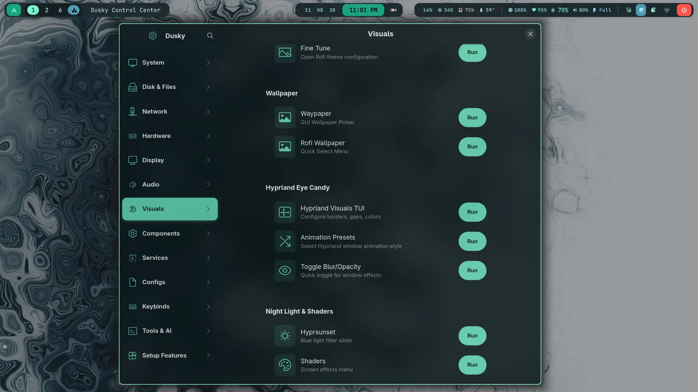
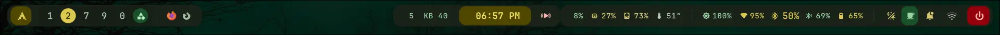
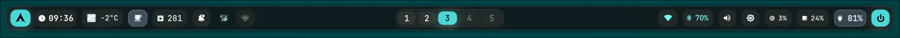
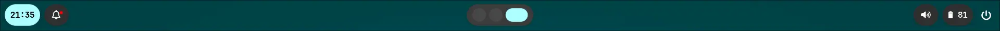

<div align="center">

# Dusky

**A complete, batteries-included Arch Linux + Hyprland desktop.**

The raw power and minimalism of Arch, with the install experience of a standard distro.
~900 MB idle RAM. Unified Matugen theming across the entire system, browser included.

[](LICENSE)
[](https://archlinux.org/)
[](https://hyprland.org/)
[](https://github.com/dusklinux/dusky/actions/workflows/lint.yml)
[](https://github.com/dusklinux/dusky/stargazers)
[](https://discord.gg/Nv2a7yTBQS)

[**Install**](#-installation) ·
[**Features**](#overview) ·
[**Video tutorial**](https://youtu.be/OzeFAY_8T8Y) ·
[**Discord**](https://discord.gg/Nv2a7yTBQS) ·
[**Wallpapers**](https://github.com/dusklinux/images) ·
[**Contributing**](.github/CONTRIBUTING.md)



</div>

---

This repository is the result of 8 months of tinkering, breaking, fixing and polishing.
It's a labor of love designed to feel as easy to install as a "standard" distribution, but
with the raw power and minimalism of Arch. **Please consider starring ⭐ this repo** as a
token of support.

## Table of contents

- [Getting help](#-getting-help)
- [Waybar layouts](#waybar-layouts)
- [Theming & acknowledgments](#-theming--acknowledgments)
- [Prerequisites & hardware](#️-prerequisites--hardware)
- [Installation](#-installation)
- [The Orchestra script](#the-orchestra-script)
- [Usage & keybinds](#️-usage--keybinds)
- [Troubleshooting](#-troubleshooting)
- [Overview — the full feature list](#overview)
- [Performance and system](#performance-and-system)
- [Graphics and gaming](#graphics-and-gaming)
- [Usability and theming](#usability-and-theming)
- [Contributing](#-contributing)
- [Acknowledgments](#acknowledgments)
- [License](#license)

---

## 💬 Getting help

If you need help with installation, troubleshooting or just want to hang out, join the
Discord server — it's where most support happens, and hardware-specific problems usually
get solved there in minutes.

[**Join the Discord Server**][discord]

[discord]: https://discord.gg/Nv2a7yTBQS

### 📺 Updated demo video now out on YouTube with all major features covered

Since the release of this video, around 5 major features have been added — scroll down to
the [overview](#overview) section for details.

[**Watch now**][video]

[video]: https://youtu.be/JmgvSdEIK8c

### 🖼️ If you're here just for the wallpapers

You can get all of them (1050+ wallpapers) from my [images repo][images].

[images]: https://github.com/dusklinux/images

---

## Waybar layouts

To get this out of the way, because I'm getting so many questions about Waybar:

**YES, YOU CAN HAVE A HORIZONTAL WAYBAR.** You'll be asked which side you want it on —
bottom, top, left or right. Horizontal and vertical are both available: take your pick
during setup, and it's easily toggleable from Rofi as well.

Here's what it looks like:








---

## 🎨 Theming & Acknowledgments

A massive shoutout to [@Ubaidullah-Web-Dev](https://github.com/Ubaidullah-Web-Dev) for his
amazing project that enables website theming on Gecko-based browsers like Firefox! This
configuration wouldn't have been possible without him.

⭐ **Support the Developer:** If you like the look of this setup, please head over and drop
a star on his repository:
👉 [MatugenFox on GitHub](https://github.com/Ubaidullah-Web-Dev/MatugenFox)

### Dusky Control Center

There's also a brand new Dusky Control Center that acts as a system overview GUI for
settings and features. It's exhaustive in its scope — almost anything you want to
set or change can be done from this one-stop-shop intuitive GUI app. I'll keep adding more
quality-of-life features to it over time.


---

## ⚠️ Prerequisites & Hardware

### Filesystem

This setup is strictly optimized for the **BTRFS filesystem**. (It should also work on
ext4, but that's not recommended.)

- **Why?** ZSTD compression, copy-on-write (CoW) to prevent data corruption, and you also
  get instant snapshots.

### Hardware config (Intel / NVIDIA / AMD)

The setup scripts are written to auto-detect your hardware and set the appropriate
environment variables. In case your hardware is not detected or has some issues, you're
advised to configure the following files to set your environment variables.

> [!NOTE]
>
> Configure the UWSM env files to set your GPU environment variables.
>
> 1. Open the files at `~/.config/uwsm/env` and `~/.config/uwsm/env-hyprland`
>
> 2. Replace Intel/NVIDIA/AMD-specific variables with your hardware equivalents.

### Dual booting

- Compatible with Windows or other Linux distros.

- **Bootloader:** Defaults to `systemd-boot` for UEFI (boots up to 5s faster). Defaults to
  `GRUB` for BIOS.

---

## 💿 Installation

[**Watch the video tutorial**][Watch Video Tutorial]

[Watch Video Tutorial]: https://youtu.be/OzeFAY_8T8Y

**Best for:** Users who already have a fresh, unconfigured Arch Linux installation with
Hyprland, set up either via the `archinstall` script or through a manual install. If you
have not installed yet, use the Arch ISO and ensure you select **Btrfs** as the filesystem
and **Hyprland** as the window manager.

After installing Arch, boot into the OS and then run the steps below in the terminal.

> [!IMPORTANT]
> Step 1 force-checks-out tracked files directly into your home directory, **overwriting
> existing files with the same paths without prompting**. If you have configs you care
> about in `~/.config`, back them up first.

### 🆕 Dusky ISO is now available — it's an offline installer

```
https://drive.google.com/drive/folders/1P368khN1p-IfzWoaDnPyQNEcpkKBsOte?usp=sharing
```

### Step 1: Clone dotfiles (bare repo method)

I use a bare git repository method to drop files exactly where they belong in your home
directory.

Make sure you're connected to the internet and git is installed:

```bash
sudo pacman -Syu --needed git
```

Clone the repo:

```bash
git clone --bare --depth 1 https://github.com/dusklinux/dusky.git $HOME/dusky
```

Deploy the files on your system:

```bash
git --git-dir=$HOME/dusky/ --work-tree=$HOME checkout -f
```

> [!NOTE]
>
> This will immediately list a few errors at the top, but don't worry — that's expected
> behaviour. The errors will go away on their own after Matugen generates colors and
> cycles through a wallpaper.

### Step 2: Run the Orchestra

Run the master script to install dependencies, themes, and services. This will take a
while, because it sets up everything. You'll be prompted to say yes/no during setup, so
don't leave it running unattended.

```bash
~/user_scripts/arch_setup_scripts/ORCHESTRA.sh
```

---

## The Orchestra script

`ORCHESTRA.sh` is a "conductor" that manages ~80 subscripts.

- **Smart:** It detects installed packages and skips them.

- **Safe:** You can re-run it as many times as you like without breaking things.

- **Time:** Expect 30–60 minutes. We use `paru` to install a few AUR packages, and
  compiling from source takes time. Grab a coffee!

---

## ⌨️ Usage & Keybinds

The steepest learning curve will be the keybinds. I have designed them to be intuitive,
but feel free to change them in the config.

> [!TIP]
>
> Press `CTRL` + `SHIFT` + `SPACE` to open the Keybinds Cheatsheet. You can click commands
> in this menu to run them directly!

It's been tested to work on other Arch-based distros with Hyprland installed (fresh
installed), like CachyOS.

---

## 🔧 Troubleshooting

If a script fails (which can happen on a rolling release distro):

1. **Don't panic.** The scripts are modular. The rest of the system usually installs fine.

2. **Check the output.** Identify which subscript failed. They're located in
   `~/user_scripts/arch_setup_scripts/scripts/`.

3. **Run it manually.** You can try running that specific subscript individually — this
   usually gives a much clearer error than the full run does.

4. **Re-run the Orchestra.** It's idempotent and safe to re-run:
   `~/user_scripts/arch_setup_scripts/ORCHESTRA.sh`

5. **AI help.** Copy the script content and the error message into ChatGPT/Gemini. It can
   usually pinpoint the exact issue (missing dependency, changed package name, etc.).

6. **Still stuck?** Ask on [Discord][discord], or
   [open a bug report](https://github.com/dusklinux/dusky/issues/new?template=bug_report.yml).
   Please include your GPU vendor, filesystem, and install method — those three things
   resolve most reports.

---

## Overview

> [!NOTE]
> I've purposely decided not to use Quickshell for anything, in the interest of keeping
> this as lightweight as possible. Quickshell can quickly add to RAM and slow down your
> system. Therefore everything is user-friendly TUI, to keep it snappy and lightweight
> while delivering a whole host of features. Read below for most of them.

### Utilities

- **Music recognition** — look up what music is playing.

- **Circle-to-search** type feature, using Google Lens.

- **TUI for changing Hyprland's appearance** — gaps, shadow color, blur strength, opacity
  strength and a lot more.

- **Local AI LLM inference** via an Ollama sidebar (terminal-based, incredibly resource
  efficient).

- **Keybind TUI setter** that auto-checks for conflicts and unbinds any existing keybind in
  the default Hyprland `keybinds.conf`.

- **Easily switch SwayNC's side** to either left or right.

- **`airmon` wifi script** for wifi testing / password cracking.
  ⚠️ Only use this on access points that you own. I'm not legally responsible if you use it
  for nefarious purposes — see [SECURITY.md](.github/SECURITY.md).

- **Live disk I/O monitoring** — see live read/write disk speed during copying, and infer
  whether copying has actually finished. Useful for flash drives and external drives.

- **Quick audio input/output switching** with a keybind. If you have Bluetooth headphones
  connected, you can quickly switch to speakers without disconnecting.

- **Mono/stereo audio toggling.**

- **Touchpad gestures** for volume/brightness, locking the screen, invoking SwayNC,
  play/pause, and muting. (Requires a laptop or a touchpad for PC.)

- **Battery notifier** for laptops — customize it to show notifications at certain levels.

- **Toggleable power saver mode.**

- **System cleanup (cache purge)** — removes unwanted files to reclaim storage.

- **USB sounds** — get notified when USB devices are plugged in or unplugged.

- **FTP server auto setup.**

- **Tailscale auto setup.**

- **OpenSSH auto setup**, with or without Tailscale.

- **Cloudflare WARP auto setup**, toggleable right from Rofi.

- **VNC setup for iPhones** (wired).

- **Dynamic fractional scaling script** so you can scale your display with a keybind.

- **Toggle window transparency, blur and shadow** with a single keybind.

- **Hypridle TUI configuration.**

- **WiFi connection script** at `~/user_scripts/network_manager/dusky_network.sh` (with a
  TUI at `tui_dusky_network.py`).

- **Sysbench benchmarking script.**

- **Color picker.**

- **Neovim, preconfigured.** You can also use your own later on, or install LazyVim or any
  other Neovim rice.

- **GitHub repo integration** so you can easily create your own repo to back up all files.
  This uses a bare repo, so your specific existing files — listed in `~/.git_dusky_list` —
  will back up to GitHub. You can add more files or remove existing ones from that text
  file.

- **BTRFS compression ratio** — scans your OS files to see how much space ZSTD compression
  is saving you.

- **Drive manager** — easily lock/unlock encrypted drives from the terminal using
  `unlock media` or `lock media`. It automatically mounts your drives at a specified path,
  and unmounts when you lock it. This requires you to first configure
  `~/user_scripts/drives/drive_manager/drives.toml` with your drives' UUIDs.

- **NTFS fix** — NTFS drives have a tendency to not unlock if the drive was previously
  disconnected without unmounting first, because of corrupted metadata. There's a script
  that fixes this: `~/user_scripts/drives/ntfs_fix.sh`.

### Rofi menus

- Emoji
- Calculator
- Matugen theme switcher
- Animation switcher
- Power menu
- Clipboard
- Wallpaper selector
- Shader menu
- System menu

...and a lot more that would take forever to list. Trust me, these dotfiles are the shit —
try 'em out.

### GUI keybind-invokable sliders

- Volume control
- Brightness control
- Nightlight / hyprsunset intensity

### Speech

**Speech to text**

- Whisper — for CPU
- Parakeet — for NVIDIA GPUs (might also work on AMD, not sure)

**Text to speech**

- Kokoro, for both CPU and GPU

### Miscellaneous

- **Mechanical keypress sounds** — toggleable with a keybind or from Rofi.

- **Wlogout** is drawn using a dynamic script that respects your fractional scaling.

---

## Performance and system

- **Lightweight** — ~900 MB RAM usage and ~5 GB disk usage, fully configured.

- **ZSTD & ZRAM** — compression enabled by default to save storage and triple your
  effective RAM (great for low-spec machines).

- **Native optimization** — AUR helpers configured to build with CPU-native flags (up to
  20% performance boost).

- **UWSM environment** — optimized specifically for Hyprland.

## Graphics and gaming

- **Fluid animations** — tuned physics and momentum for a "liquid" feel. I've spent days
  fine-tuning this.

- **GPU passthrough guide** — zero latency (native performance) for dual-GPU setups using
  Looking Glass.

- **Instant shaders** — switch visual shaders instantly via Rofi.

- **Android support** — automated Waydroid installer script.

- **FPS limiter** and gaming package setup.

## Usability and theming

- **Universal theming** — Matugen powers a unified light/dark mode across the system.

- **Dual workflow** — designed for both GUI-centric (mouse) and terminal-centric
  (keyboard) users.

- **Accessibility** — text-to-speech (TTS) and speech-to-text (STT) capabilities
  (hardware dependent).

- **Keybind cheatsheet** — press `CTRL` + `SHIFT` + `SPACE` anytime to see your controls.

---

<div align="center">

**Enjoy the experience!**

If you run into issues, check the detailed Obsidian notes included in the repo (~2 MB) at
`~/Documents/pensive/`.

</div>

---

## 🤝 Contributing

Contributions are very welcome — bug reports, scripts, docs fixes, typo corrections, and
testing on hardware nobody else has.

- **[Contributing guide](.github/CONTRIBUTING.md)** — development setup, shell and Python
  conventions, how to add a setup subscript. **Read the development setup section first:**
  Dusky deploys via a bare repo into `$HOME`, so editing it safely is not obvious.
- **[Code of Conduct](.github/CODE_OF_CONDUCT.md)**
- **[Security policy](.github/SECURITY.md)** — including what you should know about the
  privileged scripts, networking helpers, and wireless tooling before installing.
- **[Support](.github/SUPPORT.md)** — where to ask questions.
- **[Changelog](CHANGELOG.md)**

| I want to... | Go here |
|---|---|
| Report a bug | [Bug report](https://github.com/dusklinux/dusky/issues/new?template=bug_report.yml) |
| Request a feature | [Feature request](https://github.com/dusklinux/dusky/issues/new?template=feature_request.yml) |
| Ask a question | [Discord][discord] |
| Report a vulnerability | [Privately, here](https://github.com/dusklinux/dusky/security/advisories/new) |

---

## Acknowledgments

Thank you to all the contributors!

- **SDDM** is a modified version of the SilentSDDM project by
  [@uiriansan](https://github.com/uiriansan) — this is a great project, kindly star it on
  GitHub: [SilentSDDM][repo_linkk]

- **Firefox theming** is powered by
  [MatugenFox](https://github.com/Ubaidullah-Web-Dev/MatugenFox) by
  [@Ubaidullah-Web-Dev](https://github.com/Ubaidullah-Web-Dev).

[repo_linkk]: https://github.com/uiriansan/SilentSDDM/

## License

Released under the [MIT License](LICENSE).

<div align="center">

If Dusky is useful to you, **a star ⭐ genuinely helps.**

</div>
